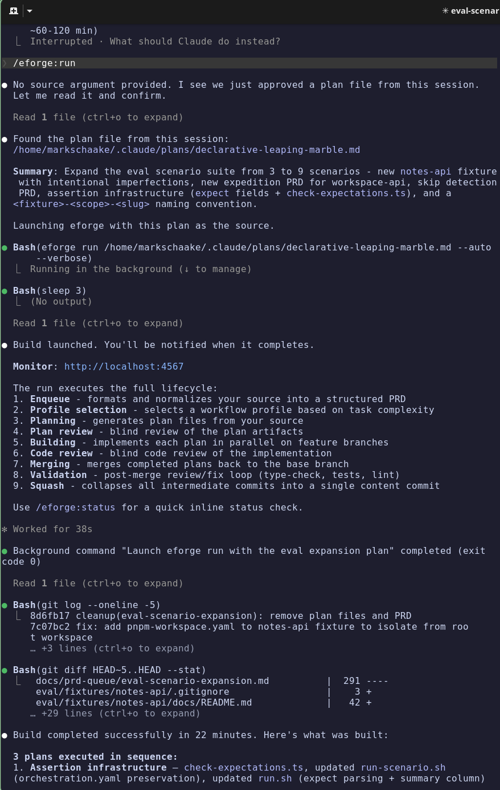
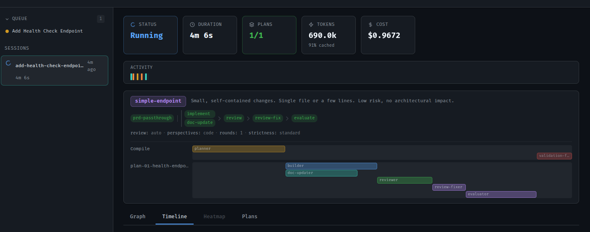
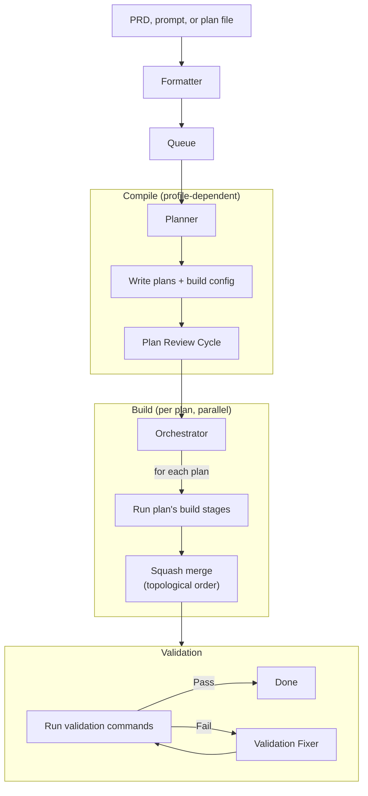
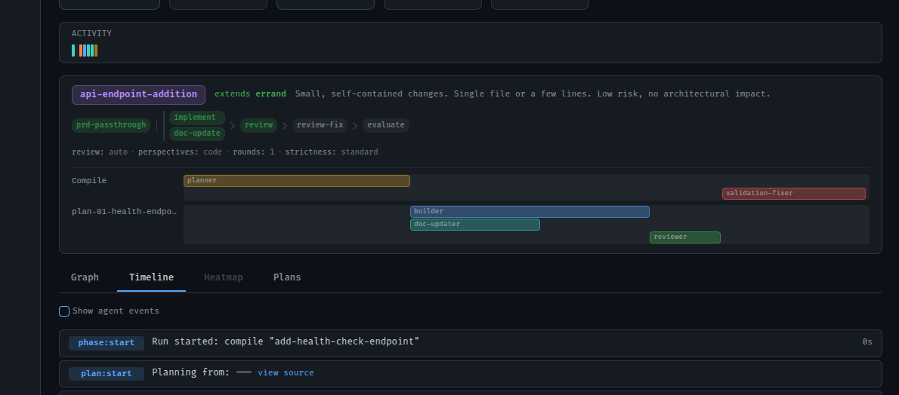
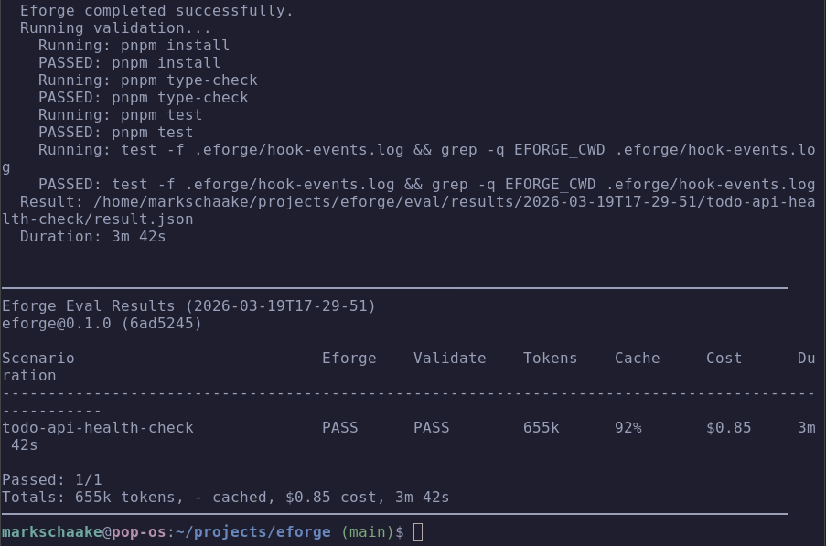

# eforge

An autonomous build engine with blind review. Express intent, `eforge` plans, implements, reviews, and validates - no supervision required.





## Install

**Prerequisites:** Node.js 22+, Anthropic API key or [Claude subscription](https://claude.ai/upgrade)

### Claude Code Plugin (recommended)

```
/plugin marketplace add eforge-run/eforge
/plugin install eforge@eforge
```

The first invocation downloads `eforge` automatically via npx - no global install needed. Plan interactively in Claude Code, then hand off to `eforge` for build, review, and validation.

| Skill | Description |
|-------|-------------|
| `/eforge:build` | Enqueue PRD; daemon auto-builds (compile + build + validate) |
| `/eforge:status` | Check build progress |
| `/eforge:config` | Initialize or edit `eforge.yaml` with interactive guidance |

### Standalone CLI

```bash
npx eforge build "Add a health check endpoint"
```

Or install globally with `npm install -g eforge`.

## Quick Start

Give `eforge` a prompt, a markdown file, or a full PRD - it handles the rest:

```bash
eforge build plans/my-feature-prd.md
eforge build "Add a health check endpoint"
```

By default, `eforge build` enqueues the PRD and the daemon automatically picks it up for compile, build, and validation. Use `--foreground` to run the full pipeline in the current process instead. `eforge` plans the work, builds it in an isolated worktree, runs a blind code review with a fresh-context agent, evaluates the reviewer's suggestions, merges, and validates. Every phase produces a git commit so the full lifecycle is traceable in history.

## How It Works



- **Compile** - Profile-dependent. The planner explores the codebase, selects a workflow profile (errand = passthrough, excursion = plan + review, expedition = architecture + module planning + cohesion review), and writes plan files. Each plan carries its own build stage sequence and review config in `orchestration.yaml`. Plans go through a blind review cycle before building starts.
- **Build** - Each plan runs its own build stages in an isolated git worktree. The default is `implement → review-cycle`, where the review cycle runs a blind code reviewer, a fixer that applies suggestions, and an evaluator that accepts strict improvements while rejecting intent changes. Plans with documentation changes use `[implement, doc-update] → review-cycle` (parallel group). Test and TDD workflows are also available. Completed plans squash-merge to the base branch in topological dependency order.
- **Validation** - Runs configured commands (type-check, tests, linting) after all plans merge. If validation fails, a fixer agent attempts minimal repairs automatically.



## Status

`eforge` is a personal tool - source is public so you can read, learn from, and fork it. Not accepting issues or PRs.

## CLI Usage

```bash
eforge build plans/my-feature-prd.md    # enqueue + auto-build via daemon
eforge build --foreground plans/my-feature-prd.md  # run in foreground (no daemon)
eforge build --queue                     # process queued PRDs
eforge enqueue plans/my-feature-prd.md   # add to queue (daemon auto-builds by default)
eforge status                            # check running builds
eforge monitor                           # open web dashboard
eforge config show                       # print resolved config
```

`eforge run` is a backwards-compatible alias for `eforge build`.

All commands support `--help`. Notable flags: `--auto` (bypass approval gates), `--verbose` (stream agent output), `--dry-run` (compile only), `--foreground` (run in foreground instead of delegating to daemon).

## Configuration

`eforge` is configured via `eforge.yaml` (searched upward from cwd), environment variables, and auto-discovered files. By default, the daemon auto-builds after enqueue (`prdQueue.autoBuild: true`). See [docs/config.md](docs/config.md) for the full reference including profiles, plugins, MCP servers, and [docs/hooks.md](docs/hooks.md) for event hooks.

## Architecture

`eforge` is **library-first**. The engine (`src/engine/`) is a pure TypeScript library that communicates exclusively through typed `EforgeEvent`s via `AsyncGenerator` - it never writes to stdout. The CLI and web monitor are thin consumers that iterate the event stream and render.

Agent runners use the `AgentBackend` interface - all SDK interaction is isolated behind a single adapter (`src/engine/backends/claude-sdk.ts`). New surfaces (CI, TUI, web) consume the same event stream.

A real-time web monitor records all events to SQLite and serves a dashboard over SSE, auto-starting with `build` commands. Recording is decoupled from the web server - events are always persisted, even with `--no-monitor` or `enqueue`.

## Evaluation

An end-to-end eval harness lives in `eval/`. It runs `eforge` against embedded fixture projects and validates the output compiles and tests pass.

```bash
./eval/run.sh                        # Run all scenarios
./eval/run.sh todo-api-health-check  # Run one scenario
./eval/run.sh --dry-run              # Smoke-test the harness
```

See `eval/scenarios.yaml` for the scenario manifest and `eval/fixtures/` for the test projects.



## Development

```bash
pnpm dev          # Run via tsx (pass args after --)
pnpm build        # Bundle with tsup
pnpm type-check   # Type check
pnpm test         # Run unit tests
```

## Name

**E** from the [Expedition-Excursion-Errand (EEE) methodology](https://www.markschaake.com/posts/expedition-excursion-errand/) + **forge** - shaping code from plans.

## License

Apache-2.0
