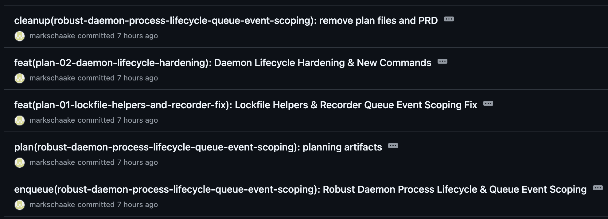

# eforge

[](https://www.npmjs.com/package/@eforge-build/eforge)
[](https://www.npmjs.com/package/@eforge-build/pi-eforge)

> **Public docs:** [https://eforge.build/docs](https://eforge.build/docs) - Getting started, concepts, configuration, and the canonical reference docs for users and agents. Agent-readable artifacts at [/llms.txt](https://eforge.build/llms.txt).

An open source agentic build system. Detailed plans go in. A planner sizes the work and shapes the pipeline - small intent runs through a fast path, large intent compiles into a dependency graph of sub-plans that build in parallel across isolated worktrees and merge in topological order. Implementation, blind review, and validation are always separated across agents and stages. The build phase runs in the background while you plan the next thing.

Drive eforge from Pi, Claude Code, or the CLI. Pipeline stages delegate to either pi-agent-core or the Claude Agent SDK - the interface you drive and the harness that executes are independent. Pi is the recommended eforge execution harness for new users: provider-flexible, local, inspectable agent orchestration where runtime choice, cost, and token efficiency stay visible. The Anthropic Claude Agent SDK remains supported as an Anthropic-specific secondary path for users who intentionally choose it.

Harness engineering - the discipline of designing everything around an LLM that makes it a reliable system - applies at two levels here: each pipeline stage delegates to a harness for its agent loop, and the pipeline itself is a higher-order harness across planning, building, review, and validation.

The name: **E** from the [Expedition-Excursion-Errand methodology](https://www.markschaake.com/posts/expedition-excursion-errand/) + **forge** - shaping code from plans.


> **Status:** This is a young project moving fast. Used daily to build real features (including itself), but expect rough edges - bugs are likely, change is expected, and YMMV. Source is public so you can read, learn from, and fork it. Not accepting issues or PRs at this time.

## What is an Agentic Build System?

Traditional build systems transform source code into artifacts. An agentic build system transforms *specifications* into source code - then verifies its own output.

The key insight: a single AI agent writing and reviewing its own code will almost always approve it. Quality requires **separation of concerns** - distinct agents for planning, building, reviewing, and evaluating.

An agentic build system applies build-system thinking to this multi-agent pipeline. Each piece below is either a guide (steering agents before they act) or a sensor (verifying what they produced) - the two control types that organize [harness engineering](https://martinfowler.com/articles/harness-engineering.html).

- **Spec-driven** (guide) - Input is a requirement, not a code edit. The system decides *how* to implement it.
- **Multi-stage pipeline** (structure) - Planning, implementation, review, and validation are separate stages with separate agents, not one conversation.
- **Blind review** (sensor) - The reviewer operates without builder context (see below).
- **Dependency-aware orchestration** (structure) - Large work decomposes into modules with a dependency graph. Plans build in parallel across isolated git worktrees, merging in topological order.
- **Adaptive complexity** (guide) - The system assesses scope and selects the right workflow: a one-file fix doesn't need architecture review, and a cross-cutting refactor shouldn't skip it.

## Use Cases

Plan a feature interactively, then hand it off to eforge with `/eforge:build`. A daemon picks up the plan and runs planning, building, blind review, and validation autonomously. A web monitor (port assigned deterministically per project in the 4567-4667 range) tracks progress, cost, and token usage in real time.

Because the coding agent you drive from and the agent library eforge delegates to are independent, a few ways this plays out:

- **Plan and execute in Pi.** Drive eforge from Pi and delegate to pi-agent-core across OpenAI, Anthropic, OpenRouter, local models, and more.
- **Use Claude Code as the host surface.** Drive eforge from Claude Code while choosing the execution harness separately in your active profile.
- **Mix planning and build runtimes.** Plan in Pi with one provider, then execute specific tiers through another provider or through the Anthropic-specific Claude Agent SDK when that API-priced tradeoff makes sense.
- **Run builds on local models when API spend matters.** Switch to a profile that delegates to a local model like Qwen 3.6 27B via pi-agent-core - work keeps moving with no per-token API cost.


eforge also runs standalone. By default, `eforge build` enqueues and a daemon processes it. Use `--foreground` to run in the current process instead.

## How It Works

**Formatting and enqueue** - eforge accepts input from multiple sources: a CLI prompt, rough notes, a session plan, a playbook, or a detailed PRD file. Playbooks and session plans are reusable input artifacts that the daemon compiles to ordinary build source via `@eforge-build/input` before reaching the engine queue. The engine always receives normalized build source and does not know whether that source originated from a playbook, session plan, wrapper app, CLI prompt, or PRD file. The normalized PRD is committed to a queue directory on the current branch; the daemon watches this queue and picks up new PRDs to build.

**Workflow profiles** - The planner assesses complexity and selects a profile:
- **Errand** - Small, self-contained changes. Passthrough compile, fast build.
- **Excursion** - Multi-file features. Planner writes a plan, blind review cycle, then build.
- **Expedition** - Large cross-cutting work. Architecture doc, module decomposition, cohesion review across plans, parallel builds in dependency order.

**Blind review** - The reviewer is an inferential sensor: an LLM judging output in a fresh context with no builder knowledge. Separating generation from evaluation [dramatically improves quality](https://www.anthropic.com/engineering/harness-design-long-running-apps) - solo agents tend to approve their own work regardless. A fixer applies suggestions, then an evaluator accepts strict improvements while rejecting intent changes. The goal is fidelity to the plan - minimizing drift and slop so the code that lands is what was specified, not a reinterpretation.

**Parallel orchestration** - Each plan builds in an isolated git worktree. Expeditions run multiple plans in parallel, merging in topological dependency order. Post-merge validation runs with auto-fix.


**Queue and merge** - Completed builds merge back to the base branch as merge commits via `--no-ff`, preserving the full branch history while keeping first-parent history clean. When the next build starts from the queue, the planner re-evaluates against the current codebase - so plans adapt to changes that landed since they were enqueued.



For a deeper look at the engine internals, see the [architecture docs](docs/architecture.md). For context on the workflow shift that motivated eforge, see [The Handoff](https://www.markschaake.com/posts/the-handoff/).

## Install

**Prerequisites:** Node.js 22+, [Pi](https://github.com/earendil-works/pi-mono), [Claude Code](https://claude.ai/code), or an npm-capable shell, plus an LLM provider credential for your chosen runtime - a provider-specific API key or OAuth token for the recommended `pi` harness, or an Anthropic API key for the supported secondary `claude-sdk` harness. Starting June 15, 2026, Anthropic says Claude Agent SDK and `claude -p` usage no longer count toward Claude plan limits; eligible plans may receive a separate monthly Agent SDK credit, usage beyond that credit is billed at standard API rates when extra usage is enabled, otherwise requests stop, and API-key users remain pay-as-you-go. See https://support.claude.com/en/articles/15036540-use-the-claude-agent-sdk-with-your-claude-plan.

Pi package (recommended):

```bash
pi install npm:@eforge-build/pi-eforge
/eforge:init
```

Add `-l` to `pi install` if you want to write to project settings (`.pi/settings.json`) instead of your global Pi settings:

```bash
pi install -l npm:@eforge-build/pi-eforge
```

Claude Code plugin:

```
/plugin marketplace add eforge-build/eforge
/plugin install eforge@eforge
/eforge:init
```

The main `@eforge-build/eforge` npm package is the standalone CLI and daemon runtime. The Pi integration is published separately as `@eforge-build/pi-eforge`.

The `/eforge:init` command creates `eforge/config.yaml` with sensible defaults and adds `.eforge/` to your `.gitignore`. If you already have user-scope profiles in `~/.config/eforge/profiles/`, it offers to activate one of those instead of creating a new project profile. Otherwise it walks you through a Quick setup (one harness/provider with suggested tier models, including an optional separate implementation model) or a Mix-and-match flow (different harness, provider, or model per tier). In Claude Code, use the recommended Pi path when you want Claude Code as the host surface while builds execute through a Pi profile; choose `claude-sdk` only when you intentionally want the Anthropic Claude Agent SDK. In Pi the harness is pinned to `pi` and you pick from available providers and models. For further customization, run `/eforge:config --edit`.

The Pi package also provides native interactive commands for agent runtime profile management (`/eforge:profile`, `/eforge:profile-new`) and config viewing (`/eforge:config`) with interactive overlay UX. Both the Claude Code plugin and the Pi extension expose `/eforge:plan` for structured planning conversations - exploring scope, code impact, architecture, design decisions, documentation, and risks - before handing off to `/eforge:build`. Both surfaces also expose `/eforge:playbook` for creating, editing, running, and managing reusable automation playbooks that encode recurring workflows as named, version-controlled templates.

Standalone CLI:

```bash
npx @eforge-build/eforge build "Add rate limiting to the API"
npx @eforge-build/eforge build plans/my-feature-prd.md

# Run a saved playbook
npx @eforge-build/eforge play docs-sync

# Manage playbooks
npx @eforge-build/eforge playbook list
npx @eforge-build/eforge playbook run docs-sync --after q-abc
npx @eforge-build/eforge playbook promote tech-debt-sweep
```

Or install globally: `npm install -g @eforge-build/eforge`

For standalone use, run `/eforge:init` (in Claude Code or Pi) to create both `eforge/config.yaml` and an active agent runtime profile under `eforge/profiles/<name>.yaml`. A profile configures one harness, model, and effort level per build tier (planning → implementation → review → evaluation). A minimal Pi-first profile looks like:

```yaml
# eforge/profiles/pi-openrouter.yaml
agents:
  tiers:
    planning:
      harness: pi
      model: anthropic/claude-opus-4-6
      effort: high
      pi:
        provider: openrouter
    implementation:
      harness: pi
      model: anthropic/claude-sonnet-4-6
      effort: medium
      pi:
        provider: openrouter
    review:
      harness: pi
      model: anthropic/claude-opus-4-6
      effort: high
      pi:
        provider: openrouter
    evaluation:
      harness: pi
      model: anthropic/claude-opus-4-6
      effort: high
      pi:
        provider: openrouter
```

Claude Code can still be the host surface while this Pi profile executes builds. For the supported secondary Claude Agent SDK path, set `harness: claude-sdk` and use Anthropic model IDs such as `claude-opus-4-7` or `claude-sonnet-4-6`. Starting June 15, 2026, Anthropic says Claude Agent SDK and `claude -p` usage no longer count toward Claude plan limits; eligible plans may receive a separate monthly Agent SDK credit, usage beyond that credit is billed at standard API rates when extra usage is enabled, otherwise requests stop, and API-key users remain pay-as-you-go. See https://support.claude.com/en/articles/15036540-use-the-claude-agent-sdk-with-your-claude-plan, and see [docs/config.md](docs/config.md) for the full schema.

## Configuration

eforge supports three config tiers, merged lowest to highest priority:

| Tier | Path | Committed? | Purpose |
|------|------|-----------|---------|
| User | `~/.config/eforge/config.yaml` | No | Cross-project, personal |
| Project | `eforge/config.yaml` | Yes | Team-canonical |
| Project-local | `.eforge/config.yaml` | No (gitignored) | Dev-personal override, highest priority |

The project-local tier (`.eforge/`) is automatically gitignored by `/eforge:init`. Use it for personal tuning that should not be committed - it deep-merges over the project and user tiers. Agent runtime profiles, custom workflow profiles, hooks, MCP servers, plugins, and native eforge extensions are all configurable. Native extensions are TypeScript/JavaScript modules discovered from `~/.config/eforge/extensions/`, `eforge/extensions/`, and `.eforge/extensions/`; they load in the daemon Node process without a sandbox, capture registration provenance, run `onEvent` handlers, append `onAgentRun` prompt context, dispatch `registerProfileRouter` selectors before queued builds, and require `extensions.trustProjectExtensions: true` before checked-in project/team extensions run. Use `eforge extension new <name>` to scaffold one, `eforge extension list/show/validate/test` to inspect and dry-run it, and `eforge extension reload` to refresh daemon discovery. Scope precedence and lookup behavior live in `@eforge-build/scopes`; reusable input artifact protocols (playbooks, session plans) live in `@eforge-build/input`. The build engine consumes normalized build source and does not know whether the source originated from a playbook, session plan, wrapper app, CLI prompt, or PRD file. Agent runtime profiles follow the same three-tier pattern: `eforge/profiles/` (project scope), `~/.config/eforge/profiles/` (user scope), and `.eforge/profiles/` (project-local scope, highest precedence). Playbooks follow the same pattern using `eforge/playbooks/`, `~/.config/eforge/playbooks/`, and `.eforge/playbooks/` respectively - higher-precedence tiers shadow lower ones by name. Use `eforge playbook list` to see available playbooks with their source and shadow chain, `eforge playbook run <name>` (or the shortcut `eforge play <name>`) to enqueue one, and `eforge playbook edit <name>` to modify it in `$EDITOR`. `eforge playbook promote` moves a playbook from project-local to project scope (staged for commit); `eforge playbook demote` moves it back. See [docs/config.md](docs/config.md), [docs/extensions.md](docs/extensions.md), and [docs/hooks.md](docs/hooks.md).

## Development

```bash
pnpm build        # Bundle all workspace packages
pnpm test         # Run unit tests (vitest)
pnpm type-check   # Type check without emitting
```

### npx convention

The eforge plugin uses `npx -y @eforge-build/eforge` to invoke the CLI. This ensures the plugin works for all users regardless of install method - global install, npx, or local development. The `-y` flag auto-confirms install prompts, which is required because the MCP server runs headless and cannot prompt interactively.

### Developer workflow

When developing eforge locally, `pnpm build` compiles the CLI to `dist/cli.js` and makes `eforge` available on PATH via the `bin` entry in `package.json`. After making changes to the engine or CLI, rebuild with `pnpm build` so the daemon picks up the latest code.

To restart the daemon after a local rebuild, use `/eforge:restart` from Claude Code. This calls the daemon's MCP tool to safely stop and restart, checking for active builds first.

For the eforge repository itself, the `/eforge-daemon-restart` project-local skill rebuilds from source and restarts the daemon in one step.

## Evaluation

See [eforge-build/eval](https://github.com/eforge-build/eval) for the end-to-end evaluation harness.

## License

eforge is licensed under [Apache-2.0](LICENSE).

### Third-party harness licenses

eforge's harness abstraction allows different AI providers. Each harness carries its own license terms:

- **Claude Agent SDK** (`@anthropic-ai/claude-agent-sdk`) is proprietary software owned by Anthropic PBC. By using eforge with this harness, you agree to Anthropic's [Commercial Terms](https://www.anthropic.com/legal/commercial-terms) (API users) or [Consumer Terms](https://www.anthropic.com/legal/consumer-terms) (Free/Pro/Max users), plus the [Acceptable Use Policy](https://www.anthropic.com/legal/aup). See [Anthropic's legal page](https://code.claude.com/docs/en/legal-and-compliance) for details. Starting June 15, 2026, Anthropic says Claude Agent SDK and `claude -p` usage no longer count toward Claude plan limits; eligible plans may receive a separate monthly Agent SDK credit, usage beyond that credit is billed at standard API rates when extra usage is enabled, otherwise requests stop, and API-key users remain pay-as-you-go. See https://support.claude.com/en/articles/15036540-use-the-claude-agent-sdk-with-your-claude-plan.

  **Note:** If you are building a product or service on top of eforge, Anthropic requires API key authentication through [Claude Console](https://platform.claude.com/) - OAuth tokens from Free, Pro, or Max plans may not be used for third-party products.

- **Pi harness** (`@earendil-works/pi-ai`, `@earendil-works/pi-agent-core`, `@earendil-works/pi-coding-agent`) - a fully open-source harness alternative supporting 20+ LLM providers (OpenAI, Google, Mistral, Groq, xAI, Bedrock, Azure, OpenRouter, and more). All three packages are [MIT licensed](https://github.com/earendil-works/pi-mono/blob/main/LICENSE) from the [pi-mono](https://github.com/earendil-works/pi-mono) monorepo.

eforge's Apache 2.0 license applies to eforge's own source code. It does not extend to or override the license terms of its dependencies.
