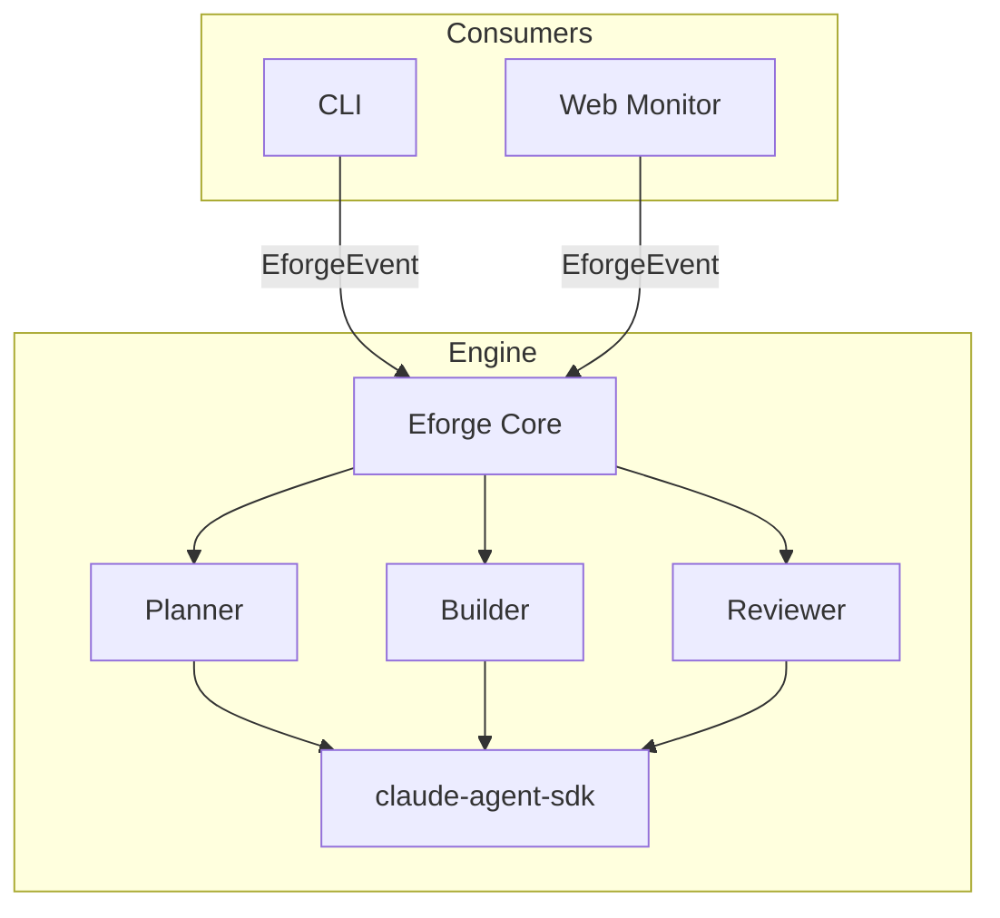

# eforge

Autonomous plan-build-review CLI for code generation, built on the [Claude Agent SDK](https://docs.anthropic.com/en/docs/agents-and-tools/claude-agent-sdk).

The name combines **E** from the [Expedition-Excursion-Errand (EEE) methodology](https://www.markschaake.com/posts/expedition-excursion-errand/) — a scope-aware planning framework that right-sizes AI workflows — with **forge**, reflecting the tool's role in shaping code from plans. eforge assesses your task's scope (errand, excursion, or expedition) and adapts its planning and execution strategy accordingly.

eforge extracts battle-tested workflows from Claude Code plugins into a standalone tool that runs independently — no Claude Code required.

## Architecture

**Library-first**: A pure, event-driven engine (`src/engine/`) yields typed `EforgeEvent`s via `AsyncGenerator`. Thin consumer layers render, persist, or stream events as appropriate.



**Three-agent loop**:

1. **Planner** — one-shot. Explores codebase, writes plan files. Asks clarifying questions when encountering ambiguity.
2. **Builder** — multi-turn. Turn 1: implement plan → commit. Turn 2: evaluate reviewer's fixes.
3. **Reviewer** — one-shot, blind. Reviews committed code independently, leaves fixes unstaged.

For multi-plan sets, an orchestrator resolves dependencies, computes execution waves, and runs plans in parallel using git worktrees.

## Install

```bash
pnpm install
pnpm build
```

## Usage

```bash
# Generate plans from a PRD or description
eforge plan docs/my-feature.md
eforge plan "Add a health check endpoint"

# Plan + build in one step
eforge run docs/my-feature.md

# Execute plans (implement + review loop)
eforge build my-plan-set

# Review existing code against plans
eforge review my-plan-set

# Check running builds
eforge status
```

### Flags

| Flag | Description |
|------|-------------|
| `--auto` | Bypass approval gates |
| `--verbose` | Stream agent output |
| `--dry-run` | Validate without executing |
| `--no-monitor` | Disable web monitor |
| `--no-plugins` | Disable plugin loading |

## Configuration

eforge is configured via `eforge.yaml` (searched upward from cwd), environment variables, and auto-discovered files.

### `eforge.yaml`

All fields are optional. Defaults are shown:

```yaml
plugins:
  enabled: true               # Auto-discover Claude Code plugins
  # include:                  # Allowlist — only load these (plugin identifiers)
  #   - "git@schaake-cc-marketplace"
  # exclude:                  # Denylist — skip these from auto-discovery
  #   - "ui@schaake-cc-marketplace"
  # paths:                    # Additional local plugin directories
  #   - /path/to/custom-plugin

agents:
  maxTurns: 30                # Max agent turns before stopping
  permissionMode: bypass      # 'bypass' or 'default'
  settingSources:             # Which Claude Code settings to load
    - project                 # Loads CLAUDE.md and project settings

build:
  parallelism: <cpu-count>    # Max parallel plan executions
  # worktreeDir: /custom/path # Override worktree base directory
  # postMergeCommands:        # Commands to run after each merge
  #   - "pnpm install"

plan:
  outputDir: plans            # Where plan artifacts are written

langfuse:
  # publicKey: lf_pk_...      # Or set LANGFUSE_PUBLIC_KEY env var
  # secretKey: lf_sk_...      # Or set LANGFUSE_SECRET_KEY env var
  host: https://cloud.langfuse.com  # Or set LANGFUSE_BASE_URL env var
```

### MCP Servers

MCP servers are auto-loaded from `.mcp.json` in the project root (same format Claude Code uses). All agents receive the same MCP servers.

```json
{
  "mcpServers": {
    "brain": {
      "command": "npx",
      "args": ["brain-mcp-server"],
      "env": { "BRAIN_DB": "/path/to/db" }
    }
  }
}
```

### Plugins

Plugins are auto-discovered from `~/.claude/plugins/installed_plugins.json`. Both user-scoped (global) and project-scoped plugins matching the working directory are loaded. Plugins provide skills, hooks, and MCP servers to eforge's agents.

Use `plugins.include`/`plugins.exclude` in `eforge.yaml` to filter, or `--no-plugins` to disable entirely.

## Evaluation

An end-to-end eval harness lives in `eval/`. It runs eforge against embedded fixture projects and validates the output compiles and tests pass.

```bash
./eval/run.sh                        # Run all scenarios
./eval/run.sh todo-api-health-check  # Run one scenario
./eval/run.sh --dry-run              # Smoke-test the harness
```

See `eval/scenarios.yaml` for the scenario manifest and `eval/fixtures/` for the test projects.

## Development

```bash
pnpm dev          # Run via tsx (pass args after --)
pnpm build        # Bundle with tsup
pnpm type-check   # Type check
pnpm test             # Run unit tests
```

## License

UNLICENSED
