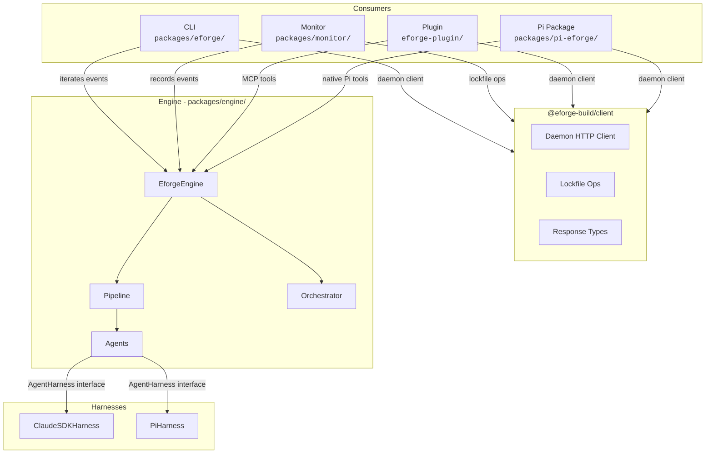
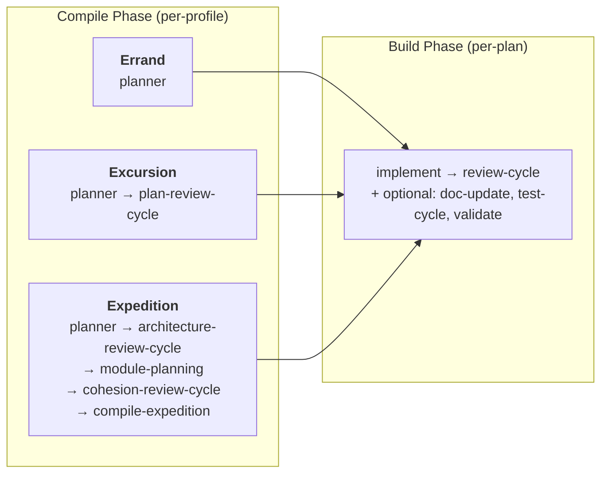
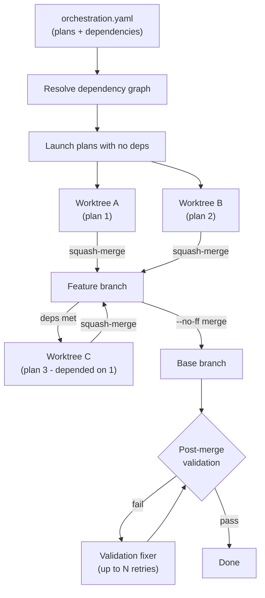

# Architecture

eforge is **library-first**. The engine is a pure TypeScript library that communicates through typed `EforgeEvent`s via `AsyncGenerator` - it never writes to stdout. CLI, web monitor, Claude Code plugin, and Pi package are thin consumers of the same event stream.

## System Layers

### Engine

`packages/engine/` is the library core. The public API is the `EforgeEngine` class, which exposes methods for compiling, building, enqueueing, and queue processing - all returning `AsyncGenerator<EforgeEvent>`.

### CLI

`packages/eforge/` is a thin consumer. Parses arguments via Commander, iterates the engine's event stream, and renders to the terminal. Also manages the daemon process and handles interactive clarification prompts.

### Monitor

`packages/monitor/` provides the web dashboard. Events are recorded to SQLite via transparent middleware - this runs even with `--no-monitor`. The web server serves a React UI (`packages/monitor-ui/`) over SSE, runs as a detached process, and survives CLI exit.

### Plugin

`eforge-plugin/` is the Claude Code integration. It exposes MCP tools that communicate with the daemon via `mcp__eforge__eforge_*` tool calls for init, build, queue, status, config, and daemon operations. The `eforge_init` tool uses MCP elicitation to present an interactive form for project onboarding and operates locally (no daemon needed) for file creation.

### Pi Package

`packages/pi-eforge/` is the native Pi extension. It exposes native Pi tools that communicate with the daemon via HTTP API for init, build, queue, status, config, and daemon management. Native Pi overlay commands handle agent runtime profile management (`/eforge:profile`, `/eforge:profile-new`) and config viewing (`/eforge:config`) with interactive TUI overlays, while skill-based slash commands (`/eforge:build`, `/eforge:init`, `/eforge:plan`, `/eforge:recover`, `/eforge:restart`, `/eforge:status`, `/eforge:update`) provide the same operational surface as the Claude Code plugin, keeping both consumers in parity. The Claude Code MCP proxy and the Pi extension both use `@eforge-build/client` (`packages/client/`) for the daemon HTTP client and response types - a zero-dep TypeScript package that is the canonical source for the daemon wire protocol. Routes are centralised there too: `API_ROUTES` plus a typed helper per route (`apiEnqueue`, `apiCancel`, `apiHealth`, ...) live under `packages/client/src/api/`, and the daemon (`packages/monitor/src/server.ts`), CLI, MCP proxy, Pi extension, and monitor-ui all dispatch off the same constants so a route rename surfaces as a type error.

## Event System

`EforgeEvent` is a discriminated union. All event types follow a `category:action` naming pattern. Major categories:

Prefixes carry scope unambiguously:

| Category | Scope | Purpose |
|----------|-------|---------|
| `session:*` | Run-wide envelope (`sessionId`) | Session lifecycle boundaries |
| `phase:*` | Per-command (compile or build) (`runId`) | Phase lifecycle boundaries |
| `config:*` | Run-wide | Config-load diagnostics (`config:warning` for malformed fields, unknown keys, stale markers) |
| `planning:*` | Compile-phase activity, one set per phase (`plans: PlanFile[]`) | Planning, plan review, architecture review, cohesion review, submission, error, and load-time `planning:warning` diagnostics. The `planning:complete` event also carries an optional `planConfigs: Array<{ id; build; review }>` field with per-plan build stage and review profile configs - persisted in SQLite so the monitor can reconstruct stage breakdowns after worktrees are cleaned up. The `planning:pipeline` event carries the planner's scope classification, compile pipeline, default build stages, default review profile, and rationale. |
| `plan:*` | Per-plan artifact lifecycle (`planId`) | Per-plan build (`plan:build:*`), per-plan merge (`plan:merge:*`), per-plan schedule readiness (`plan:schedule:ready`) |
| `merge:finalize:*` | Run-wide feature-branch finalization | Final merge of the feature branch to the base branch (`merge:finalize:start`, `merge:finalize:complete`, `merge:finalize:skipped`) |
| `schedule:start` | Run-wide (session-scoped, `planIds: string[]`) | Orchestration kickoff |
| `expedition:*` | Wave / module orchestration (`wave` / `moduleId`) | Expedition-specific planning phases |
| `agent:*` | Per-agent invocation (`agentId`) | Agent lifecycle and streaming |
| `validation:*` | Run-wide | Post-merge validation |
| `queue:*` / `enqueue:*` | Run-wide | PRD queue operations |
| `prd_validation:*` | Run-wide | PRD validation (`prd_validation:start`, `prd_validation:complete`) |
| `gap_close:*` | Run-wide | PRD validation gap closing (`gap_close:start`, `gap_close:complete`) |
| `reconciliation:*` | Run-wide | Reconciliation (`reconciliation:start`, `reconciliation:complete`) |
| `cleanup:*` | Run-wide | Cleanup (`cleanup:start`, `cleanup:complete`) |
| `approval:*` | Run-wide | Approval flow (`approval:needed`, `approval:response`) |

The CLI composes async generator middleware around the engine's event stream - transformers that stamp session/run IDs, fire hooks, and record to SQLite without altering the events themselves.

## Pipeline

The engine uses a two-phase pipeline. Each phase is a sequence of named stages - async generators registered in a global stage registry.

- **Compile stages** run once per build. The stage list is declared per-profile.
- **Build stages** run once per plan. The stage list is per-plan, stored in `orchestration.yaml`.

### Compile stages

| Stage | Description |
|-------|-------------|
| `planner` | Agent explores codebase, selects profile, submits plan set via `submit_plan_set` or `submit_architecture` custom tool - engine writes plan files and `orchestration.yaml` from validated payload. The `AgentHarness` translates bare tool names into the harness-visible identifier (Claude SDK prefixes `mcp__eforge_engine__`; Pi uses the bare name). |
| `plan-review-cycle` | Blind review of plans against PRD, with fix and evaluate loop |
| `architecture-review-cycle` | Reviews architecture doc for module boundary soundness and integration contracts |
| `module-planning` | Writes detailed plans for each module using architecture context |
| `cohesion-review-cycle` | Reviews cross-module plan cohesion for consistency and integration gaps |
| `compile-expedition` | Compiles module plans into final plan files and orchestration |

### Build stages

| Stage | Description |
|-------|-------------|
| `implement` | Builder agent codes the plan, runs verification, commits changes. When the planner emits a `shards` block under `agents.builder`, the stage fans out to N parallel builder invocations within the same worktree (each scoped to a `roots`/`files` partition), then a coordinator phase pops any per-shard retry stashes, enforces scope, runs verification once, and produces the single per-plan commit. |
| `review-cycle` | Composite: expands to `review` -> `review-fix` -> `evaluate` |
| `doc-update` | Updates documentation to reflect implementation changes |
| `test-write` | Writes tests from the plan spec (TDD - runs before `implement`) |
| `test-cycle` | Composite: expands to `test` -> `test-fix` -> `evaluate` |
| `validate` | Runs validation commands (compile, test, lint) |

Build stages support parallel groups - arrays in the stage list run concurrently. For example, `[['implement', 'doc-update'], 'review-cycle']` runs implement and doc-update in parallel, then review-cycle after both complete.

## Workflow Profiles

Profiles control which compile stages run. The planner assesses input complexity and selects a profile, or the user can specify one explicitly.

**Errand** - Small, self-contained changes. Compile: `[planner]`. The planner generates a single simple plan or skips if nothing to do.

**Excursion** - Multi-file feature work. Compile: `[planner, plan-review-cycle]`. Single planning pass covers all files and dependencies.

**Expedition** - Large cross-cutting work. Compile: `[planner, architecture-review-cycle, module-planning, cohesion-review-cycle, compile-expedition]`. Decomposes work into modules, each planned independently with architecture and cohesion review across the set.

Custom profiles can be defined in `eforge/config.yaml` with `extends` chains for incremental customization. See [config.md](config.md) for details.

## Agents

Agents are stateless async generators. Each accepts options (including an `AgentHarness`) and yields `EforgeEvent`s. Agents never import AI SDKs directly - all LLM interaction goes through the `AgentHarness` interface.

Two harness implementations exist:
- **ClaudeSDKHarness** - uses `@anthropic-ai/claude-agent-sdk`
- **PiHarness** - uses pi-mono for multi-provider support (OpenAI, Google, Mistral, and more)

Agent roles by function:

| Function | Roles |
|----------|-------|
| **Planning** | formatter, planner, module-planner, staleness-assessor, prd-validator, dependency-detector |
| **Building** | builder, doc-updater, test-writer, tester |
| **Review** | reviewer, parallel-reviewer, review-fixer, plan-evaluator, cohesion-reviewer, architecture-reviewer |
| **Recovery** | validation-fixer, merge-conflict-resolver, gap-closer, recovery-analyst |

Per-role configuration (model, thinking mode, effort level, budget, tool filters) is set via `eforge/config.yaml` under `agents.roles`. See [config.md](config.md).

### Blind review

Quality requires separating generation from evaluation. The reviewer operates without builder context - it sees only the code diff, not the builder's reasoning. The review-fixer applies suggested fixes as unstaged changes. The evaluator then judges each fix against the original plan intent, accepting strict improvements and rejecting changes that alter intent. This same three-step pattern (blind review -> fix -> evaluate) applies to plan review, architecture review, and cohesion review.

## Orchestration

`orchestration.yaml` (written during compile) defines plans with a dependency graph. The orchestrator uses a **greedy scheduling algorithm** - each plan launches as soon as all its dependencies have merged, without waiting for a full "wave" to complete.

Each plan builds in an **isolated git worktree**. Worktrees live in a sibling directory to avoid polluting the main repo. Plans run as soon as their dependencies are met - since plan execution is IO-bound (LLM calls), no throttle is needed.

When a plan completes and merges, the orchestrator immediately checks if any pending plans now have all dependencies satisfied, and launches them. Plans squash-merge back to the feature branch as they finish - a plan only merges after all its dependencies have merged. If a merge conflict occurs, the merge-conflict-resolver agent attempts resolution using context from both plans. After all plans merge, the feature branch merges to the base branch via `--no-ff`, creating a merge commit that preserves the full branch history while keeping the base branch's first-parent history clean.

**PRD validation gap closing** - When PRD validation finds gaps between the spec and implementation, the validator assesses completion percentage and per-gap complexity (trivial, moderate, significant). A viability gate checks the completion percentage against a configurable threshold (default 75%) - if too much work remains, the build fails immediately rather than attempting a doomed fix-forward. When viable, the gap closer runs a two-stage pipeline: a plan-generation agent (maxTurns: 20) produces a targeted markdown plan scoped to the gaps, then that plan is executed through `runBuildPipeline` with `implement` and `review-cycle` stages - giving the builder continuation/handoff support and blind review. All gap-close build events use `planId: 'gap-close'`, which the monitor UI renders as a distinct "PRD Gap Close" swimlane. If plan generation fails, the gap close completes non-fatally without attempting execution. If changes are made, post-merge validation re-runs to verify the fixes.

**Post-merge validation** runs commands from `orchestration.yaml` (planner-generated) and `eforge/config.yaml` `postMergeCommands` (user-configured). On failure, the validation-fixer agent attempts repairs up to a configurable retry limit.

Build state is persisted to disk, enabling **resume** after interruption. On resume, completed plans are skipped and in-progress plans restart.

## Queue and Daemon

PRDs are enqueued as `.md` files with YAML frontmatter in `eforge/queue/`. Frontmatter carries metadata like title, priority, dependencies, and status. The queue resolves processing order via topological sort on dependencies, then by priority and creation time.

The **daemon** (`eforge daemon start`) is a long-running process that watches the queue directory. When a new PRD appears, the daemon claims it via an atomic lock file (prevents double-processing across concurrent workers), runs a staleness check against the current codebase, and processes it through the compile-build pipeline.

**Auto-build** mode (default) automatically processes PRDs on enqueue. The daemon spawns a worker process for each build, tracking progress via SQLite. Failed builds pause auto-build until manually restarted. The daemon shuts down after a configurable idle timeout.

When a build fails, the queue parent's finalize handler runs the recovery-analyst agent inline (synchronously, before the PRD is moved) against the still-present `state.json`. The `git mv` of the PRD to `failed/` and both sidecar files (`<prdId>.recovery.md`, `<prdId>.recovery.json`) are staged and committed in a single atomic `forgeCommit` call - there is no window where `failed/` has a PRD without sidecars. The recovery-analyst operates with `tools: 'none'` and runs under a 90-second timeout; on any error or timeout, a `manual` verdict sidecar is written anyway. The sidecar schema is v2, which adds optional `partial` and `recoveryError` fields to the verdict for degraded-context cases. Recovery can also be triggered manually via the `eforge_recover` MCP tool (Claude Code plugin), the `recover` Pi tool, or `eforge recover` CLI - useful for backfilling sidecars on PRDs already in `failed/` before this architecture was in place. When `state.json` is missing (manual backfill scenario), `buildFailureSummary` synthesizes a partial summary from monitor.db events and git history, setting `partial: true` on the result. The resulting sidecar can be read back through `eforge_read_recovery_sidecar` / `readRecoverySidecar`. Once a verdict has been reviewed, `applyRecovery(setName, prdId)` on `EforgeEngine` enacts it: `retry` git-moves the PRD back to the queue and removes both sidecars (one atomic `forgeCommit`); `split` routes the agent's successor PRD body through `enqueuePrd` with `depends_on: []` — stripping any agent-emitted frontmatter before writing so the successor always starts with clean, dependency-free frontmatter — and commits it while leaving the failed PRD and sidecars in place; `abandon` removes all three paths under `eforge/queue/failed/`; `manual` is a no-op that returns `noAction: true`. The apply path is exposed as `POST /api/recover/apply` on the daemon, the `eforge_apply_recovery` MCP tool (Claude Code plugin and Pi), and the `eforge apply-recovery <setName> <prdId>` CLI subcommand. The `/api/queue` endpoint post-filters `dependsOn` before responding: terminal items (`failed`, `skipped`) never expose a `dependsOn` field, and live items (`pending`, `running`) expose only `dependsOn` IDs that match other live items in the same response - mirroring `resolveQueueOrder`'s runtime semantics so the UI's view of dependencies is always consistent with what the scheduler actually acts on.

## Monitor

The web monitor tracks cost, token usage, and progress in real time on a dynamically assigned port.

**Recording** is decoupled from the dashboard. Every `EforgeEvent` is written to SQLite regardless of whether the web server is running. This means event history is always available for inspection.

The **web server** runs as a detached process that survives CLI exit. It polls SQLite for new events and pushes them to the dashboard via Server-Sent Events (SSE). The server stays alive after the last active session ends so browser users can inspect results before it exits.

The **console panel** in the monitor UI exposes four lower tabs: `Log` (raw event stream), `Changes` (per-plan file diffs), `Graph` (plan dependency graph), and `Plan` (planner decisions). The `Plan` tab renders three sections from the event log - Classification (mode badge from `planning:pipeline`), Pipeline (compile/build/review config), and Plans (per-plan build stage breakdown and review profile from `planning:complete`'s `planConfigs`). The `/api/orchestration/:sessionId` endpoint prefers the durable `planConfigs` from the `planning:complete` event row over reading from the filesystem, so per-plan stage breakdowns remain accurate for completed sessions after worktrees have been cleaned.
