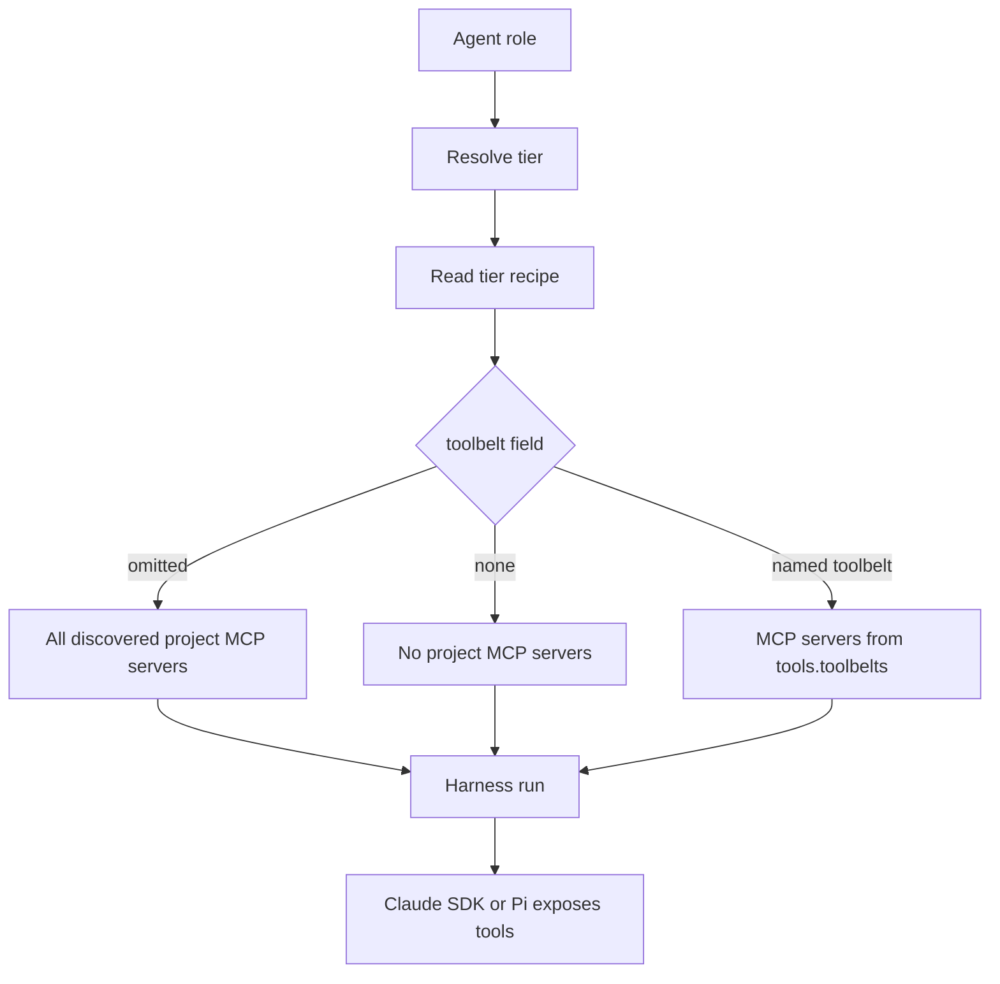

# Profile Toolbelts Design

## Status

Design proposal for the `TOOLBELTS_01` work unit. This document defines the MVP model for MCP-backed toolbelts in agent runtime profiles. It is intentionally conservative: it optimizes for simple configuration, predictable runtime behavior, and maintainable UX.

**Implementation status:** Runtime filtering and observability are implemented. The `tools.toolbelts` registry and per-tier `toolbelt` field are schema-valid, statically validated, and runtime-enforced. Toolbelt selection and resolved MCP server names are observable in the monitor UI agent detail surface and in profile list/show output. The canonical Playwright UI profile example (TOOLBELTS_06) is deferred.

## Goals

- Let agent runtime profiles describe what kind of work they are optimized for.
- Let each agent tier opt into one named MCP-backed toolbelt.
- Keep tool configuration portable across the Claude SDK and Pi harnesses.
- Preserve current `.mcp.json` behavior for existing projects.
- Make future implementation units clear and bounded.

## Non-goals

- No Pi extension support in toolbelts.
- No Claude plugin support in toolbelts.
- No multiple toolbelts per tier.
- No toolbelt composition or `extends`.
- No per-role toolbelt assignment.
- No automatic profile selection.
- No embedding MCP server command definitions inside profiles.
- No backend-visible MCP tool names in user config.
- No live MCP server startup as part of normal config validation.

## User-facing model

The MVP has two user-facing additions:

1. **Profile metadata** — optional descriptive fields that explain when to choose a profile.
2. **Toolbelts** — named bundles of MCP server references, selected by a tier through one singular `toolbelt` field.

### Example

```yaml
# eforge/config.yaml
tools:
  toolbelts:
    browser-ui:
      description: Browser automation for UI implementation and review.
      mcpServers:
        - playwright
```

```yaml
# eforge/profiles/ui.yaml
description: UI-heavy feature work with browser validation.
whenToUse:
  - Frontend features
  - Layout bugs
  - Screenshot-driven UI fixes
tags:
  - ui
  - frontend
  - browser

agents:
  tiers:
    planning:
      harness: claude-sdk
      model: claude-opus-4-7
      effort: high
      toolbelt: none

    implementation:
      harness: claude-sdk
      model: claude-sonnet-4-6
      effort: medium
      toolbelt: browser-ui

    review:
      harness: claude-sdk
      model: claude-opus-4-7
      effort: high
      toolbelt: browser-ui

    evaluation:
      harness: claude-sdk
      model: claude-opus-4-7
      effort: high
      toolbelt: none
```

```json
// .mcp.json
{
  "mcpServers": {
    "playwright": {
      "command": "npx",
      "args": ["-y", "@playwright/mcp@latest"]
    }
  }
}
```

## Relationship to Native TypeScript Extensions

Toolbelts and native TypeScript extensions are complementary but intentionally separate concepts:

- **Toolbelts** are declarative MCP capability bundles selected by agent runtime profiles. They answer: "Which project MCP servers should this tier expose?"
- **Extensions** are imperative TypeScript modules that observe or influence eforge lifecycle behavior. They answer: "What should eforge do when something happens?"

Toolbelts do not execute code and do not perform automatic profile selection. Extensions may inspect profile metadata, tags, and toolbelt assignments when making decisions such as per-build profile routing, but extensions should not redefine toolbelts or become a hidden profile/config layer.

The effective tool surface for an agent run should be understood as:

```text
engine-internal tools
+ profile/toolbelt-selected project MCP tools
+ extension-contributed custom tools
- explicit allowed/disallowed filters
```

Toolbelt filtering applies only to project MCP servers from `.mcp.json`. It must not filter engine-internal submission tools, harness built-ins, or extension-contributed custom tools.

## Proposed schema

### Profile metadata

Profiles may include these optional top-level fields:

```yaml
description: UI-heavy feature work with browser validation.
whenToUse:
  - Frontend features
  - Layout bugs
tags:
  - ui
  - frontend
```

These fields are descriptive only in the MVP. They should improve profile list/show UX and prepare for future recommendation flows, but they do not trigger automatic profile selection.

### Toolbelt registry

Toolbelt definitions live in merged config under `tools.toolbelts`:

```yaml
tools:
  toolbelts:
    browser-ui:
      description: Browser automation for UI work.
      mcpServers:
        - playwright
```

Each toolbelt has:

- `description` — required or strongly recommended human-readable summary.
- `mcpServers` — non-empty list of MCP server names from `.mcp.json`.

MCP server command definitions remain in `.mcp.json`; toolbelts reference server names only.

### Tier assignment

Each tier may select at most one toolbelt:

```yaml
agents:
  tiers:
    implementation:
      harness: pi
      model: anthropic/claude-sonnet-4-6
      effort: medium
      pi:
        provider: openrouter
      toolbelt: browser-ui
```

Supported values:

| Tier field | Meaning |
|---|---|
| omitted | Preserve current behavior: pass all discovered project MCP servers to this tier's harness. |
| `toolbelt: none` | Pass no project MCP servers to this tier's harness. |
| `toolbelt: <name>` | Pass only MCP servers listed by the named toolbelt. |

`none` is a reserved value and cannot be used as a user-defined toolbelt name.

## Runtime resolution

At build time, eforge should resolve MCP availability per agent run using the selected tier's toolbelt.



Important boundary: toolbelt filtering applies only to project MCP servers loaded from `.mcp.json`. It must not filter engine-internal custom tools such as planner submission tools.

## Harness behavior

### Claude SDK

Claude SDK accepts MCP server configs directly. MCP tools are visible to the model using Claude's MCP naming convention:

```text
mcp__<serverName>__<toolName>
```

For example, a Playwright MCP server may expose tools with names like:

```text
mcp__playwright__browser_navigate
```

The user should never need to write these names in profile or toolbelt config.

### Pi

Pi receives MCP servers through eforge's MCP bridge. Bridged MCP tools are visible using Pi's current naming convention:

```text
mcp_<serverName>_<toolName>
```

For example:

```text
mcp_playwright_browser_navigate
```

Again, user config should reference only the MCP server name (`playwright`), not backend-visible tool names.

## Implementation implications

This design document does not implement behavior, but later implementation units should account for these constraints.

### Config parsing

`packages/engine/src/config.ts` currently parses config files and profile files through the same `PartialEforgeConfig` path. Later schema work should decide whether profile metadata belongs in the shared config shape or in profile-specific parsing metadata. The MVP UX is simplest if profile files can carry metadata directly and profile list/show can surface it.

### MCP server filtering

`EforgeEngine.create()` currently loads `.mcp.json` once and passes a single `mcpServers` map into `buildAgentRuntimeRegistry()`. The registry currently memoizes harnesses by harness/provider, not by effective MCP server set.

Later runtime implementation must avoid cross-tier MCP leakage. Viable approaches include:

1. Include the effective MCP server set in the harness memoization key.
2. Move project MCP server selection from harness construction into per-run `AgentRunOptions`.

The second option may be cleaner long-term because MCP availability is a property of the agent run, not the provider itself. However, it is a larger interface change.

### Engine-internal tools

Claude SDK wraps eforge custom tools in an internal MCP server named `eforge_engine`, exposing tools as `mcp__eforge_engine__<tool>`. Pi registers eforge custom tools directly by bare name.

Toolbelt filtering must not remove these internal tools. Toolbelts only filter project MCP servers from `.mcp.json`.

## Validation model

Validation should be layered.

### Schema validation

Checks shape and type correctness:

- `tools.toolbelts` is an object.
- each toolbelt has valid fields.
- `mcpServers` is a non-empty string list.
- tier `toolbelt` is a string when present.
- `none` is reserved.

### Static project validation

Checks references without starting MCP servers:

- tier `toolbelt: <name>` references an existing toolbelt.
- toolbelt `mcpServers` entries reference server names present in `.mcp.json`.
- `toolbelt: none` is accepted as an explicit opt-out.
- omitted `toolbelt` is accepted for backward compatibility.

If `.mcp.json` is missing and a named toolbelt references MCP servers, validation should produce an actionable error.

### Future doctor/live validation

A future command may start MCP servers and list tools. That should not be required for normal config validation because MCP startup may be slow, flaky, or environment-dependent.

A future doctor command could report:

- MCP server starts successfully.
- tools can be listed.
- final visible tool names for Claude SDK and Pi.
- runtime warnings from failed MCP server startup.

## UX expectations

### Profile list/show

Profile UX should surface metadata and tier toolbelt assignments without requiring backend-specific tool names.

Example summary:

```text
Profile: ui
Description: UI-heavy feature work with browser validation.
Use when: Frontend features, layout bugs, screenshot-driven UI fixes
Tags: ui, frontend, browser

Tier toolbelts:
  planning: none
  implementation: browser-ui
  review: browser-ui
  evaluation: none
```

### Config validation errors

Errors should be specific and actionable:

```text
agents.tiers.implementation.toolbelt references "browser-ui", but no tools.toolbelts.browser-ui is defined.
```

```text
tools.toolbelts.browser-ui references MCP server "playwright", but .mcp.json has no mcpServers.playwright entry.
```

### Build/debug observability

Build/debug output should expose resolved MCP selection at the tier/agent level:

```text
Agent: builder
Tier: implementation
Harness: pi
Toolbelt: browser-ui
MCP servers: playwright
```

The monitor/debug payloads should include enough information to diagnose missing tools without requiring users to know the Claude SDK or Pi naming conventions.

## Compatibility

The omitted `toolbelt` behavior is the primary backward-compatibility guarantee. Existing projects that use `.mcp.json` should continue to see all project MCP servers unless they opt into toolbelt selection.

`toolbelt: none` is an explicit behavior change requested by the user for a tier. It should be obvious in profile display and debug output.

## Risks and mitigations

| Risk | Mitigation |
|---|---|
| Config becomes too complex. | One toolbelt per tier; no composition; no backend-visible tool names. |
| Harness-specific behavior leaks into user config. | MCP-only; users reference MCP server names only. |
| Existing `.mcp.json` users break. | Omitted `toolbelt` preserves current all-MCP behavior. |
| Engine internal tools are accidentally filtered. | Define toolbelt filtering as project MCP server filtering only. |
| Tiers sharing a provider leak tool availability across runs. | Later runtime implementation must account for effective MCP server set in caching or per-run options. |
| Static validation becomes slow/flaky. | Do not start MCP servers during normal config validation; reserve live checks for future doctoring. |
| Users cannot tell which tools are available. | Add profile/build/debug observability for selected toolbelt and MCP server names. |

## Future extensions

These are intentionally deferred:

- per-role `toolbelt` overrides;
- multiple toolbelts per tier;
- toolbelt composition via `extends`;
- generated per-tool allowlists;
- automatic profile recommendation;
- Pi extension-backed toolbelts;
- Claude plugin-backed toolbelts;
- live `eforge toolbelt doctor` command.

The MVP should prove that MCP-backed, single-toolbelt tier assignment is useful and understandable before expanding the model.
