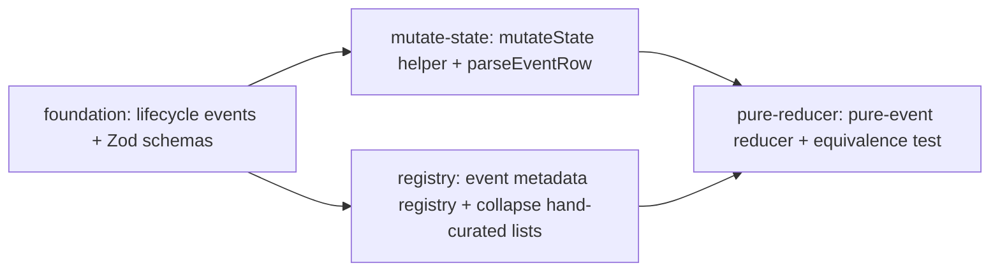

# Architecture: Event-Source Spine

## Vision

Make events the **single source of truth** for eforge's runtime state. Today the engine emits an `EforgeEvent` stream and persists it, but several state mutations bypass the event log and write directly to `state.json`. Three independent consumers (CLI display, Pi MCP progress, monitor reducer) re-implement event interpretation. There is no runtime schema validation at the SSE/DB boundary, no central metadata registry, and a hand-maintained allowlist of "daemon-persistable" event types. This expedition closes that gap: typed schemas at every boundary, one registry that declares per-event scope/persistence/projection, and a single mutation entry point (`mutateState`) so engine state and UI state are computed by *literally the same projection function* over identical event sequences.

## Core Principles

1. **Single source of truth for events.** `events.schemas.ts` defines the wire-protocol shape; `EforgeEvent` is `z.infer`-derived. The hand-rolled discriminated-union literal is deleted.
2. **Single source of truth for event metadata.** `event-registry.ts` declares `{ scope, persist, project?, summary? }` per variant. `DAEMON_EVENT_TYPES` and `DAEMON_IGNORED_EVENT_TYPES` are derived/replaced by registry presence.
3. **Single mutation entry point in the engine.** `mutateState(state, event): EforgeState` is the only in-engine path that mutates state; it records the event to the event log and applies the registry's `project` function. Direct field assignment outside `state.ts` is grep-detectable.
4. **Engine reducer = UI reducer.** Both run the same `eventRegistry[type].project` functions. The replay-equivalence test makes this a build gate.
5. **Validate at boundaries, additive on the wire.** SSE/DB rows pass through `parseEventRow` (Zod with log-and-skip on failure). New event variants are additive only — no removals or renames in this expedition.
6. **Closed registry.** The four chosen registry fields are intentionally minimal. No prompt-text coupling. Speculative fields rejected in review.

## Shared Data Model

### New event variants added to `EforgeEvent`

```ts
// plan lifecycle
{ type: 'plan:status:change', planId, from, to, reason, timestamp }
{ type: 'plan:error:set',     planId, error, timestamp }
{ type: 'plan:error:clear',   planId, timestamp }

// merge worktree lifecycle
{ type: 'merge:worktree:set',   path, timestamp }
{ type: 'merge:worktree:clear', timestamp }
```

### Registry shape (`packages/client/src/event-registry.ts`)

```ts
type EventMeta<E extends EforgeEvent> = {
  scope: 'session' | 'daemon';
  persist: boolean;
  project?: (state: EforgeState, event: E) => EforgeState;
  summary?: (event: E) => string;
};

export const eventRegistry: { [K in EforgeEvent['type']]: EventMeta<Extract<EforgeEvent, { type: K }>> } = { ... };

// Build-time exhaustiveness gate
type _Exhaustive = Exclude<EforgeEvent['type'], keyof typeof eventRegistry> extends never ? true : never;
const _check: _Exhaustive = true;
```

### Mutation contract

```ts
// packages/engine/src/state.ts
export function mutateState(state: EforgeState, event: EforgeEvent): EforgeState {
  // 1. record to event log (existing writer, not new infra)
  // 2. apply registry projection: eventRegistry[event.type].project?.(state, event) ?? state
  // 3. return new state (functional, not in-place)
}
```

### Bootstrap contract

```ts
// packages/engine/src/orchestrator.ts initializeState()
// IF event log non-empty: replay rows through registry → fresh state.json snapshot
// ELSE: loadState(stateDir) (legacy fallback)
```

## Integration Contracts

### Module boundaries

- **`@eforge-build/client` gains two new modules** (no new packages): `events.schemas.ts` (Zod schemas + discriminated union) and `event-registry.ts` (metadata record). Both exported from the package barrel.
- **`@eforge-build/engine`** consumes `mutateState` internally; orchestrator and worktree-manager funnel all state mutations through it.
- **`@eforge-build/monitor` (daemon)** replaces `hydrateEventData` with `parseEventRow` (Zod-validated, log-and-skip). `DAEMON_EVENT_TYPES` derived from registry.
- **`@eforge-build/monitor-ui`** reducer + daemon-reducer delegate to `eventRegistry[type].project`. The 12 `handle-*.ts` files fold into registry projections.
- **CLI `display.ts`** and `eventToProgress` consume `summary` from registry. Rich-rendering paths (spinners, panels) stay where they are.

### Wire format

- Additive-only: 5 new variants. No removals, no renames. Old clients treat unknown variants as no-ops (matches the registry's `project?` undefined ⇒ ignored convention).
- `DAEMON_API_VERSION` bumps **18 → 19** in `packages/client/src/api-version.ts` so older clients see version-mismatch and prompt-to-upgrade.

### Storage

- `monitor.db` schema unchanged on disk. The set of *written* types becomes a strict superset (registry-derived) of today's allowlist.
- `state.json` becomes a cache of a projection. Daemon may overwrite it after replay reconstruction.

## Shared File Registry

| File | Modules | Region Strategy |
|------|---------|-----------------|
| `packages/client/src/events.ts` | foundation | Owned solely by foundation (deletes literal union, re-exports `z.infer` type, removes "Pure TypeScript" comment) |
| `packages/client/src/events.schemas.ts` | foundation | NEW file, owned by foundation |
| `packages/client/src/event-registry.ts` | registry | NEW file, owned by registry; foundation does NOT touch it |
| `packages/client/src/index.ts` (barrel) | foundation, registry | foundation appends `EforgeEventSchema` export; registry appends `eventRegistry` export — non-overlapping append regions |
| `packages/client/src/api-version.ts` | foundation | foundation owns the bump 18→19 (couples to new variants in the schema) |
| `packages/engine/src/state.ts` | mutate-state | Owned solely by mutate-state (adds `mutateState`, folds in `updatePlanStatus`) |
| `packages/engine/src/orchestrator.ts` | mutate-state | mutate-state rewrites `initializeState()` (lines 99-145) for event-log replay |
| `packages/engine/src/orchestrator/plan-lifecycle.ts` | mutate-state | mutate-state owns this file (replaces direct mutations at 47-68, 51, 91, 94) |
| `packages/engine/src/worktree-manager.ts` | mutate-state | mutate-state owns this file (replaces direct mutations at 237, 246, 254 + corresponding "set" sites) |
| `packages/monitor/src/server.ts` | mutate-state | mutate-state owns the `hydrateEventData` → `parseEventRow` swap (lines 94-114) |
| `packages/monitor/src/db.ts` | registry | registry replaces literal `DAEMON_EVENT_TYPES` (149-193) with derived value |
| `packages/monitor-ui/src/lib/reducer.ts` | pure-reducer | pure-reducer deletes inference heuristics, delegates to registry |
| `packages/monitor-ui/src/lib/daemon-reducer/index.ts` | pure-reducer | pure-reducer deletes `DAEMON_IGNORED_EVENT_TYPES` (line 122) |
| `packages/monitor-ui/src/lib/daemon-reducer/handle-*.ts` | registry, pure-reducer | registry creates the projections inside `event-registry.ts`; pure-reducer deletes the now-redundant handler files |
| `packages/eforge/src/cli/display.ts` | registry | registry replaces 140-branch switch (126+) with registry summary lookup |
| `packages/client/src/event-to-progress.ts` | registry | registry replaces hand-rolled summary lookup with `eventRegistry[t]?.summary?.(event)` |
| `AGENTS.md` | foundation, mutate-state | foundation adds "Event types and schemas are co-located" convention; mutate-state adds "State mutation is single-entry-point" convention. Append-style, non-overlapping. |
| `docs/roadmap.md` | pure-reducer | pure-reducer removes line 32 ("Typed SSE events in client package") at expedition close |

### Region Declarations

**`packages/client/src/index.ts`** (barrel):
- `foundation`: `// --- eforge:region foundation ---` exporting `EforgeEventSchema` from `./events.schemas.js` and re-confirming `EforgeEvent` from `./events.js`
- `registry`: `// --- eforge:region registry ---` exporting `eventRegistry` from `./event-registry.js`

**`AGENTS.md`** (Conventions section):
- `foundation`: appends "Event types and schemas are co-located" bullet
- `mutate-state`: appends "State mutation is single-entry-point" bullet

**`packages/monitor-ui/src/lib/daemon-reducer/handle-*.ts`** files:
- `registry`: copies/inlines projection logic into `eventRegistry[].project` definitions
- `pure-reducer`: deletes the now-orphan handler files after registry consumes their logic

The mutation surgery files (`state.ts`, `plan-lifecycle.ts`, `worktree-manager.ts`, `orchestrator.ts`, `server.ts`) are owned solely by `mutate-state`; no shared regions because they require coordinated single-author edits.

## Technical Decisions

### 1. Schemas live in a separate file (not inline in `events.ts`)

`events.schemas.ts` is mechanical (one Zod object per variant + discriminated union). `events.ts` retains its grep-discoverability role as the public-facing types entry. Two files to touch when adding a variant; the registry already requires a third, and exhaustiveness type-checking makes drift impossible.

### 2. `EforgeEvent = z.infer<typeof EforgeEventSchema>` (not hand-rolled with schemas as decoration)

Two sources of truth diverge. The point of bringing Zod in is to collapse to one. Slight IDE-hover noise mitigated by descriptive variant `type` discriminants and per-variant schema names.

### 3. Registry shape: `{ scope, persist, project?, summary? }` — flat record, four fields

- `scope: 'session' | 'daemon'` replaces the heuristic "if name starts with `daemon:` it's daemon."
- `persist: boolean` replaces `DAEMON_EVENT_TYPES` allowlist.
- `project?` replaces `DAEMON_IGNORED_EVENT_TYPES` exclusion-by-listing.
- `summary?` replaces the 140-branch CLI switch and `eventToProgress` summary table.

YAGNI on `version`/`category`/`description`/`prompt`/`ui-icon`. Registry must not gain prompt-text coupling.

### 4. Build-time exhaustiveness via `Exclude<...> extends never`

Forces a `pnpm type-check` failure when a variant is added without a registry entry. Caught at the same gate that catches type errors. Runtime checks rejected because they push failure to test/start time.

### 5. `mutateState` returns a new state (not in-place mutation)

Matches the reducer shape used in monitor-ui (functional projection) so engine and UI run literally the same projection function — that's the invariant the equivalence test hinges on. Slightly more verbose at the call site; vastly clearer about what the operation does.

### 6. Event log is the source of truth; `state.json` is a cache

On `initializeState()`, prefer event-log reconstruction. Fall back to `state.json` when the log is unavailable (legacy sessions). After replay, write fresh snapshot. Removing the fallback is out of scope.

### 7. `parseEventRow` failure mode: log-and-skip per row

`parseEventRow(row): EforgeEvent | null`. On Zod failure: daemon-log warning with row id, raw payload prefix, Zod error path; return `null`. Callers filter nulls. Throw-and-die rejected — fails closed too aggressively for back-compat row replay.

### 8. Plan sequencing: A → (B ∥ C) → D

A defines variants B emits and C registers. B and C are file-disjoint enough to merge cleanly via plan-merge. D needs both new events flowing (B) and registry `project` functions (C) before reducer rewrite is meaningful.

### 9. Replay equivalence: deep equality (`toEqual`), not byte equality

`state.json` write order is incidental (Map iteration, key insertion). Byte equality would force canonicalization across both writers — mechanical work that doesn't strengthen the invariant.

### 10. Naming

- `EforgeEventSchema` (matches `EforgeEvent`)
- `eventRegistry` (lowercase value, not type)
- `parseEventRow` replaces `hydrateEventData` (reflects "parse with validation" not "patch missing fields")
- `mutateState` (alternatives `apply`/`dispatch`/`commit` carry baggage)

### 11. Reverse "Pure TypeScript — no Zod" comment in-place at `events.ts:4`

Plan A deletes the comment block and replaces it with a one-line pointer to `events.schemas.ts`. Future contributors discover the convention from the file itself.

## Quality Attributes

- **Replay correctness:** acceptance criterion #1 (replay-equivalence test) is a build gate. Multiple recorded sessions used as fixtures (one with merge, one with errors, one with recovery) to broaden coverage.
- **Single emission point:** acceptance criterion #2 (zero direct-mutation grep hits outside `state.ts`) is mechanical.
- **No hand-maintained metadata:** type-check fails if a new variant is added without a registry entry; type-check fails if a registry entry references a non-existent variant.
- **Back-compat:** `parseEventRow` preserves `hydrateEventData`'s timestamp/type field-patching so legacy rows still parse. The replay-equivalence test runs against at least one session recorded on `main`.
- **Performance:** `parseEventRow` Zod cost benchmarked during Plan B with a 10k-event recorded session; if > ~500ms total parse-and-replay, consider lazy validation.
- **Runtime decision survival:** `agent:start { thinkingCoerced, thinkingOriginal }` reaches the monitor UI hover (project convention; prior refactors regressed this).

## Risks

### High — orchestrator mutation surgery

The single largest semantic risk. Rerouting every state mutation through `mutateState` and registry projection means a missed call site silently drops state changes.
- **Mitigation:** Acceptance criterion #2 (grep-zero direct mutations) + criterion #1 (replay equivalence). Plan B's diff is the highest-scrutiny commit. Multiple recorded session fixtures broaden equivalence coverage.

### High — partial application across plans A → B/C → D

If plans land partially, intermediate states may have schemas without emission, or emission without registry entries.
- **Mitigation:** Plan-merge orchestration handles inter-plan integration (the reason this is an expedition). Type-check gate catches "variant emitted without registry" at PR time. Do not split A–D into separate PRDs unless forced; if forced, **each successor must carry the full acceptance-criteria list forward**.

### Medium — `parseEventRow` Zod cost

Every event row hydrated for replay or SSE bootstrap goes through Zod validation.
- **Mitigation:** Benchmark with 10k-event session in Plan B. Compile schema once at module load. Consider `safeParse` fast-path if needed.

### Medium — back-compat for old rows

Older sessions stored events with `type` only in row columns. `parseEventRow` must patch first, then Zod-validate.
- **Mitigation:** Acceptance criterion #10 is the gate. Documented explicitly in `parseEventRow` docstring.

### Medium-low — registry coupling drift

"Config object grows tentacles" is the well-known failure mode.
- **Mitigation:** Registry header comment codifies "metadata about the event variant, not consumer-specific policy." Reject `prompt:` and similar fields in review.

### Low — `state.json` snapshot writeback overwrites good snapshot with subtly wrong replay

If replay has a Map-iteration-order bug, daemon overwrites user's last good `state.json`.
- **Mitigation:** Plan B writes `state.json.bak` before first overwrite (delete after a few weeks; out of scope).

### Low — runtime decision fields regression

`agent:start { thinkingCoerced, thinkingOriginal }` must survive end-to-end.
- **Mitigation:** Plan A's schema for `agent:start` includes both fields with explicit Zod types. Plan A unit test asserts schema accepts payload with both. Plan D verifies UI hover renders them.

## Acceptance Criteria (Expedition-Level Gate)

The expedition succeeds only if **all** hold. If plans split mid-build, every successor carries the full list.

### Functional / behavioral

1. **Pure-event replay equivalence test passes.** `packages/monitor-ui/test/event-replay-equivalence.test.ts` reconstructs an `EforgeState` structurally equal (Vitest `toEqual`) to a recorded session's `state.json`. Test must fail on `main` and pass after merge.
2. **No direct state.json mutations outside `state.ts`.** Grep for direct assignments to `state.completedPlans`, `plan.status`, `plan.error`, `state.mergeWorktreePath` outside `packages/engine/src/state.ts` returns zero hits.
3. **`EforgeEvent` is `z.infer`-derived.** Hand-rolled discriminated-union literal in `events.ts` is gone. `events.schemas.ts` is the single source.
4. **Registry exhaustiveness enforced at type-check.** Adding/removing an `EforgeEvent` variant without updating `eventRegistry` fails `pnpm type-check`.
5. **Hand-curated event lists are gone.** `DAEMON_EVENT_TYPES` literal at `packages/monitor/src/db.ts:149-193` derived from registry. `DAEMON_IGNORED_EVENT_TYPES` at `packages/monitor-ui/src/lib/daemon-reducer/index.ts:122` collapsed into "absence of `project`". Grep for both constant names returns zero hits.
6. **Reducer no longer uses inference heuristics.** Plan status comes from `plan:status:change` events, not `plan:build:start` presence.
7. **`hydrateEventData` is gone.** `parseEventRow` replaces it with explicit log-and-skip on schema failure, preserving back-compat field-patching.
8. **Runtime decision fields survive end-to-end.** `agent:start { thinkingCoerced, thinkingOriginal }` reaches the monitor UI's agent-stage hover.
9. **Resume from event log works.** Delete `.eforge/state.json`, restart daemon mid-build, observe state reconstructed from events alone.
10. **Existing recorded sessions still parse and replay.** Replay-equivalence test runs against at least one pre-expedition `main` session.
11. **No regression in monitor UI behavior.** Replay matches pre-expedition reducer output, modulo new lifecycle events appearing where heuristics filled in.

### Surface / interface

12. **`DAEMON_API_VERSION` bumped 18 → 19** in `packages/client/src/api-version.ts`. Version-pinning test passes.
13. **`@eforge-build/client` exports new public surface:** `EforgeEventSchema`, `eventRegistry`. `EforgeEvent` type remains structurally compatible.
14. **The "Pure TypeScript — no Zod" comment at `events.ts:4` is replaced** with a one-line pointer to `events.schemas.ts`.

### Roadmap

15. **`docs/roadmap.md:32` removed** when the expedition merges (work is complete).

## Module Plan Sequencing



Modules `mutate-state` and `registry` run in parallel after `foundation`. Module `pure-reducer` waits on both.
