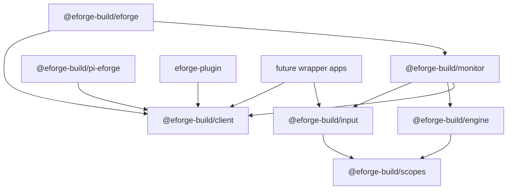

# Architecture: Input Package for Playbooks and Session Planning

## Vision and Goals

Cleanly separate three concerns currently tangled inside `@eforge-build/engine`:

1. **Scope/path resolution** — locating eForge-scoped files across `user`, `project-team`, and `project-local` tiers.
2. **Reusable input artifacts** — playbooks and session plans that compile to ordinary build source.
3. **Agentic build pipeline** — the queue/plan/build/review/validate engine.

After this work:

- `@eforge-build/scopes` is the foundational package for scoped file lookup and precedence.
- `@eforge-build/input` owns reusable input-artifact protocols (playbooks, session plans).
- `@eforge-build/engine` is focused on the build pipeline. It consumes normalized PRD/build source and does not know whether the source originated from a playbook, session plan, wrapper app, or hand-written PRD file.

This aligns with the roadmap’s Integration & Maturity direction: clearer consumer-facing integration boundaries while keeping the build engine input-agnostic so future wrapper apps can reuse the input protocols without depending on engine internals.

## Core Architectural Principles

1. **Engine remains input-agnostic.** `@eforge-build/engine` MUST NOT depend on `@eforge-build/input`. Any input-layer convenience (playbook compilation, session-plan normalization) happens at the boundary (daemon route, CLI normalization step) before reaching engine queue helpers.
2. **Scopes is generic and low-level.** `@eforge-build/scopes` defines canonical scope names and directories and provides two generic lookup primitives (named-set resolution and layered-singleton lookup). It owns no domain schema, parser, daemon, queue, or engine concept.
3. **Engine retains config domain semantics.** Although `@eforge-build/scopes` locates `config.yaml` files in canonical merge order, engine still owns config parsing, schema validation, profile schema validation, `mergePartialConfigs()`, active-profile semantics, and `resolveConfig()`.
4. **Session-plan support is deterministic library + boundary normalization, not full CRUD.** Skill prompts continue to drive the conversational `/eforge:plan` workflow. Library logic kicks in only when a session-plan source path is being enqueued — to detect, parse, and format the plan into ordinary build source — and to support deterministic helpers (parse/serialize, dimension selection, readiness, legacy boolean migration).
5. **No backward-compatibility cruft.** Internal imports that referenced `@eforge-build/engine/playbook` or `@eforge-build/engine/set-resolver` are updated cleanly to the new package paths. No re-export shims or deprecation re-exports — the codebase rips them out per the project policy on backward compatibility.
6. **Wrapper-app boundary stays explicit.** Scheduling, triggers, approvals, notifications, and richer workflow orchestration are explicitly out of scope here and out of scope for engine/core eForge in general.

## Package Topology

Allowed dependency edges:

- `@eforge-build/engine` MAY depend on `@eforge-build/scopes`. MUST NOT depend on `@eforge-build/input`.
- `@eforge-build/input` MAY depend on `@eforge-build/scopes`. MUST NOT depend on `@eforge-build/engine`.
- `@eforge-build/monitor` MAY depend on `@eforge-build/input`, `@eforge-build/engine`, and `@eforge-build/client`.
- `@eforge-build/eforge` (CLI), `@eforge-build/pi-eforge`, `eforge-plugin` SHOULD continue to use `@eforge-build/client` for daemon-backed flows. Direct imports from `@eforge-build/input` are allowed only for in-process normalization paths that do not have a daemon equivalent.

A pre-merge sanity check: `pnpm -r ls --depth -1` plus targeted `package.json` inspection ensures no edge violates the rules above (notably engine ↛ input).

## @eforge-build/scopes Package

### Canonical Scopes

| Scope | Directory | Notes |
|-------|-----------|-------|
| `user` | `~/.config/eforge/` | XDG-style global per-user config (per existing project conventions) |
| `project-team` | discovered project-team `eforge/` directory | committed shared config |
| `project-local` | `[project]/.eforge/` | gitignored project-local state and overrides |

Precedence (highest to lowest): `project-local > project-team > user`.

### Required Exports

- `Scope` — type alias `'user' | 'project-team' | 'project-local'` and a `SCOPES` ordered constant (lowest-to-highest precedence).
- `getScopeDirectory(scope, opts)` — returns absolute directory path for a scope, mirroring current engine behavior for user/project-team/project-local discovery.
- `resolveLayeredSingletons(filename, opts)` — for layered-singleton lookups like `config.yaml`. Returns existing scope file paths in canonical merge order `user → project-team → project-local` (lowest to highest precedence). Caller owns parsing and merge semantics.
- `resolveNamedSet(directory, opts)` — for named-set lookups like `profiles/` and `playbooks/`. Returns a map `name → { scope, path }` where same-name entries shadow lower-precedence tiers (highest precedence wins).
- `listNamedSet(directory, opts)` — convenience listing of unique names with their winning scope and path.

`opts` for these helpers should accept `cwd` (project root override) and any inputs already used by the existing engine resolver so engine refactor is a near drop-in. Implementation should be carved from `packages/engine/src/set-resolver.ts` and the relevant directory-discovery helpers in `packages/engine/src/config.ts`.

### Out of Scope for Scopes

- No config schema, profile schema, or playbook schema.
- No domain-specific merge semantics (engine still owns `mergePartialConfigs`).
- No knowledge of daemon, queue, or build pipeline.

## @eforge-build/input Package

### Playbooks

Move all playbook code (currently in `packages/engine/src/playbook.ts`) into `packages/input/src/playbook.ts`. Required exports:

- `parsePlaybook(content)` — parse markdown + frontmatter to typed playbook.
- `serializePlaybook(playbook)` — serialize back to markdown.
- `listPlaybooks(opts)` — tier-aware listing using `@eforge-build/scopes` named-set resolution.
- `loadPlaybook(name, opts)` — load winning playbook by name.
- `writePlaybook(name, scope, content, opts)` — write to a specific scope directory.
- `movePlaybook(name, fromScope, toScope, opts)` / `copyPlaybook(...)` — promote/demote and duplicate across scopes.
- `validatePlaybook(playbook)` — schema validation.
- `playbookToBuildSource(playbook)` — compile a playbook into ordinary build-source markdown. This replaces today’s `playbookToSessionPlan()` from the engine. Function rename is intentional to clarify that the engine consumes generic build source — but if a rename creates churn in too many call sites, retaining the existing name `playbookToSessionPlan` and re-exporting under the new name is acceptable provided callers in monitor/CLI move to the new name.

Behavioral parity with the current engine implementation is required: existing playbook tests must pass after the move, modulo import paths.

### Session Plans

New deterministic library at `packages/input/src/session-plan.ts`. Required exports:

- `parseSessionPlan(content)` / `serializeSessionPlan(plan)` — round-trip the existing session-plan markdown protocol used in `packages/pi-eforge/skills/eforge-plan/SKILL.md` and `eforge-plugin/skills/plan/plan.md`. Frontmatter fields: `session`, `topic`, `status`, `planning_type`, `planning_depth`, `required_dimensions`, `optional_dimensions`, `skipped_dimensions`, `open_questions`, `profile`. Body is a sequence of dimension sections.
- `listActiveSessionPlans(opts)` — list `.eforge/session-plans/*.md` from project-local scope only (session plans are project-local-only state).
- `selectDimensions(plan)` — returns `{ required, optional, skipped }` with the resolved set after applying `planning_type`/`planning_depth` and any explicit overrides in frontmatter.
- `checkReadiness(plan)` — returns `{ ready: boolean, missingDimensions: string[] }` using the existing rule: every required dimension must either have substantive body content or be listed in `skipped_dimensions` with a reason. Placeholder-only sections do not count.
- `migrateBooleanDimensions(plan)` — legacy compatibility helper for older boolean-dimension frontmatter shape.
- `sessionPlanToBuildSource(plan)` — format the session plan as ordinary build source (markdown PRD body) suitable for the engine queue.

### Boundary Normalization

- `normalizeBuildSource({ sourcePath, content })` — if `sourcePath` matches the `.eforge/session-plans/*.md` shape, parse and convert to ordinary build source via `sessionPlanToBuildSource`; otherwise return the original `content` and `sourcePath` unchanged.
- The matcher MUST be conservative: only normalize files whose path matches `**/.eforge/session-plans/*.md`. Arbitrary markdown PRDs must pass through untouched.
- The normalizer is the single chokepoint for session-plan handling at the boundary — both daemon and in-process CLI paths use it to avoid divergent behavior.

### Out of Scope for Input

- No daemon HTTP client (use `@eforge-build/client`).
- No engine queue knowledge (engine queue helpers live in `@eforge-build/engine`).
- No new session-plan CRUD/tool API surface — that is reserved for a follow-up change.
- No conversational planning logic — that remains in skill prompts.

## Engine Integration Contract

`packages/engine/src/config.ts` is refactored to depend on `@eforge-build/scopes`:

- Replace local user/project-team/project-local directory discovery with `getScopeDirectory()`.
- Replace local `config.yaml` discovery with `resolveLayeredSingletons('config.yaml')`. Engine consumes the returned files in merge order, parses each, and applies its existing `mergePartialConfigs()` and migration logic.
- Replace local profile-set listing with `resolveNamedSet('profiles')` / `listNamedSet('profiles')` for active-profile resolution. Active-profile schema validation and selection semantics stay in engine.
- Delete `packages/engine/src/set-resolver.ts` after extraction.
- Delete `packages/engine/src/playbook.ts` after extraction.
- Update `packages/engine/src/index.ts` to remove playbook re-exports and any wording that implies playbooks are part of the engine API. The barrel comment that currently describes itself as re-exporting "the playbook public API and shared set-resolver" is replaced.
- Update engine `package.json` to add `@eforge-build/scopes` as a workspace dependency.

Any engine call site that previously imported playbook helpers from within engine (e.g., test setup or internal references) must be updated to import from `@eforge-build/input`. This is allowed only for tests and helpers that are not part of engine runtime — engine runtime code MUST NOT import from `@eforge-build/input`.

## Monitor / Daemon Integration Contract

`packages/monitor/src/server.ts`:

- Replace dynamic imports of `@eforge-build/engine/playbook` with static or dynamic imports of `@eforge-build/input` for `list`, `show`, `save`, `enqueue`, `promote`, `demote`, `validate`, `copy` routes.
- The `/api/playbook/enqueue` route uses `playbookToBuildSource()` from `@eforge-build/input` (or its existing equivalent) and continues to call `enqueuePrd()` from `@eforge-build/engine` for queue insertion. The route shape on the wire does not change.
- Build-source enqueue paths that accept a source file path call `normalizeBuildSource()` from `@eforge-build/input` before handing the source to engine queue helpers. This applies to the daemon’s session-plan-aware enqueue flow.
- Update monitor `package.json` to add `@eforge-build/input` as a workspace dependency. Keep existing `@eforge-build/engine` and `@eforge-build/client` dependencies.

`@eforge-build/client`:

- No new routes are added in this expedition. Existing playbook route shapes remain unchanged.
- `DAEMON_API_VERSION` does not need to bump because the wire contract is unchanged. If during implementation a route shape must change, bump per the existing rule in `packages/client/src/api-version.ts`.

## CLI / Pi / Plugin Integration Contract

`packages/eforge/src/cli/`:

- Direct engine imports of `playbook`/`set-resolver`, if any remain, are updated to `@eforge-build/input` / `@eforge-build/scopes`. CLI continues to prefer typed client helpers from `@eforge-build/client` for daemon-backed flows.
- In-process CLI build/enqueue paths apply `normalizeBuildSource()` from `@eforge-build/input` when a session-plan file path is passed directly so behavior matches daemon-mode enqueue.

`packages/pi-eforge/`:

- Native playbook commands continue to use `@eforge-build/client` helpers for daemon-backed list/run/promote/demote/etc.
- Skill wording (`packages/pi-eforge/skills/eforge-playbook/`, `eforge-plan/`) is reviewed and updated only where it currently implies playbooks are an engine concept — updating it to call them input-layer artifacts.
- Skill parity (`scripts/check-skill-parity.mjs`) must continue to pass; any wording change applied to one side is mirrored on the other.

`eforge-plugin/`:

- Skill wording (`eforge-plugin/skills/playbook/`, `plan/`) is updated in parallel with Pi to maintain parity.
- Plugin version bumps in `eforge-plugin/.claude-plugin/plugin.json` per the project convention when the plugin changes wording or behavior.

## Test Strategy

Tests are kept with the code they verify. There are no test-only modules.

- `test/set-resolver.test.ts` → relocated/updated to import from `@eforge-build/scopes`. Coverage: directory discovery, named-set shadowing, missing-tier behavior. Add coverage for the new layered-singleton lookup and merge-order semantics.
- `test/playbook.test.ts` → updated to import from `@eforge-build/input`. Existing assertions must continue to pass after extraction.
- `test/playbook-api.test.ts` and `test/cli-playbook.test.ts` → updated imports only; behavior unchanged.
- New tests in the input package (or top-level `test/`) for session-plan parse/serialize round-trip, dimension selection, readiness rules (substantive content vs placeholder vs skipped), legacy boolean migration, and `sessionPlanToBuildSource` formatting.
- New tests for `normalizeBuildSource` matcher (`.eforge/session-plans/*.md` matches; arbitrary `*.md` does not match) and pass-through behavior for non-session-plan content.
- Existing engine tests (e.g., `test/config.test.ts`) must continue to pass and should be reviewed to ensure user/project-team/project-local lookup behavior, active-profile semantics, and config merge order are unchanged after the engine swap to `@eforge-build/scopes` helpers.

## Shared File Registry

This refactor has clean module-by-module file ownership. No file is edited by more than one module, so no `eforge:region` declarations are required.

| File | Owning Module | Purpose |
|------|---------------|---------|
| `packages/scopes/**` (all new) | scopes-package | new package source, tests, config |
| `packages/input/**` (all new) | input-package | new package source, tests, config |
| `packages/engine/src/config.ts` | engine-integration | swap to `@eforge-build/scopes` helpers |
| `packages/engine/src/index.ts` | engine-integration | remove playbook exports / barrel comment |
| `packages/engine/src/playbook.ts` | engine-integration | delete after extraction |
| `packages/engine/src/set-resolver.ts` | engine-integration | delete after extraction |
| `packages/engine/package.json` | engine-integration | add `@eforge-build/scopes` workspace dep |
| `test/playbook.test.ts` | engine-integration | redirect imports |
| `test/playbook-api.test.ts` | engine-integration | redirect imports |
| `test/set-resolver.test.ts` | engine-integration | redirect imports |
| `test/cli-playbook.test.ts` | daemon-cli-wiring | redirect imports if needed |
| `packages/monitor/src/server.ts` | daemon-cli-wiring | route updates + normalization |
| `packages/monitor/package.json` | daemon-cli-wiring | add `@eforge-build/input` workspace dep |
| `packages/eforge/src/cli/**` | daemon-cli-wiring | imports + in-process normalization |
| `packages/eforge/package.json` | daemon-cli-wiring | add input dep if needed |
| `packages/pi-eforge/**` (skills) | daemon-cli-wiring | wording-only updates if needed |
| `eforge-plugin/**` (skills + plugin.json) | daemon-cli-wiring | wording + version bump |
| `README.md` | docs-boundary | reposition input vs engine |
| `docs/architecture.md` | docs-boundary | new package boundary section |
| `docs/config.md` | docs-boundary | scope semantics + layered singleton vs named set |
| `docs/roadmap.md` | docs-boundary | wrapper-app guardrail |
| `packages/scopes/README.md` | docs-boundary (or scopes-package if simple) | scope semantics and lookup primitives |
| `packages/input/README.md` | docs-boundary (or input-package if simple) | playbook + session-plan input protocols |

The two package READMEs may be authored by their owning module if scoped to “package overview only”; deeper boundary-hardening lives in `docs-boundary`.

## Quality Attributes

- **Type safety**: new package boundaries fully typed; `pnpm type-check` passes after each module merge.
- **Behavioral parity**: existing playbook user-facing behavior unchanged; existing config/profile resolution unchanged; daemon route wire shapes unchanged.
- **Test coverage**: scope precedence, named-set shadowing, layered-singleton lookup order, playbook behavior post-extraction, session-plan parse/readiness/source formatting, normalization matcher.
- **Build hygiene**: `pnpm build`, `pnpm type-check`, `pnpm test` all pass after the final module merges. No `dist/` or `node_modules/` checked in. New packages bundle via `tsup` mirroring the existing `packages/client` / `packages/engine` configuration.
- **Doc accuracy**: `README.md`, `docs/architecture.md`, `docs/config.md`, and `docs/roadmap.md` describe the new boundary precisely. The architecture doc names the dependency direction (engine ↛ input) explicitly.

## Risks and Mitigations

| Risk | Mitigation |
|------|------------|
| Config behavior drift after swapping to `@eforge-build/scopes` | Keep `mergePartialConfigs` and active-profile semantics in engine. Cover layered-singleton order and named-set shadowing with tests. Smoke-test active-profile resolution. |
| Package dependency cycle (engine accidentally imports input) | Enforce import direction by convention and a lightweight check in `engine-integration` (e.g., grep test or `package.json` review). Engine MUST NOT list `@eforge-build/input` as a dep. |
| Runtime publish/install gap for new packages | New packages added to `pnpm-workspace.yaml` glob (already `packages/*`), to `scripts/publish-all.mjs` or equivalent, and to bundling via `tsup`. Verified by `pnpm build` and a CLI smoke test. |
| Internal import breakage | Update all callers in the same module that touches the boundary. No re-export shims. |
| Session-plan normalization over-matches | Match strictly on `**/.eforge/session-plans/*.md`. Add a passthrough test for arbitrary `*.md` to lock the contract. |
| Skill parity drift between Pi and Claude plugin | `scripts/check-skill-parity.mjs` is part of `pnpm test`; any wording change applied to one side is mirrored on the other. |

