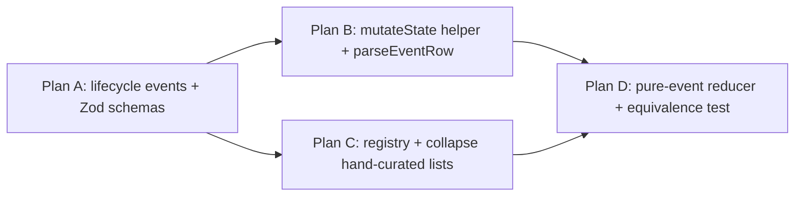

# Event-source spine expedition: lifecycle events + Zod schemas + metadata registry + pure-event reducer

## Problem / Motivation

eforge today is *partially* event-sourced. The engine emits an `EforgeEvent` stream and persists it, and the monitor UI reduces events to render state — but several state mutations bypass the event log and write directly to `state.json`, so reducer code has to fall back on inference heuristics (e.g. "if `plan:build:start` was emitted, the plan must be running") to fill in the gaps. Three independent consumers (CLI display, Pi MCP progress, monitor reducer) re-implement event interpretation. There is no runtime schema validation at the SSE / DB boundary, no central metadata registry, and a hand-maintained allowlist of "daemon-persistable" event types. Together this produces a recurring class of divergence bugs.

### Current state on `main` (verified)

- `packages/client/src/events.ts` — hand-rolled discriminated union; line 4 carries an explicit "Pure TypeScript — no Zod" comment block (this expedition reverses that stance).
- `packages/client/src/events.schemas.ts` and `packages/client/src/event-registry.ts` — neither exists yet; both are net-new files.
- `packages/engine/src/state.ts` — exports `loadState`, `saveState`, `isResumable`, and `updatePlanStatus` (mutates in place, no event emission). No `mutateState` helper exists; one must be added and `updatePlanStatus` folded into it.
- `packages/engine/src/orchestrator/plan-lifecycle.ts:47-68, 51, 91, 94` — direct mutations of `plan.error` and `plan.status`.
- `packages/engine/src/worktree-manager.ts:237, 246, 254` — three direct `state.mergeWorktreePath = undefined` mutations.
- `packages/engine/src/orchestrator.ts:99-145` — `initializeState()` reads only `state.json`; no event-log reconstruction.
- `packages/monitor/src/server.ts:94-114` — `hydrateEventData` patches missing `timestamp`/`type` fields from row columns; no schema validation; try/catch fallback returns partial objects.
- `packages/monitor/src/db.ts:149-193` — `DAEMON_EVENT_TYPES` is a hand-maintained literal with 23 entries (region marker `plan-01-types-and-daemon-emission`).
- `packages/monitor-ui/src/lib/reducer.ts` — no `IGNORED` array, but inference branches like `case 'plan:build:start': return { ...state, status: 'running' }` exist.
- `packages/monitor-ui/src/lib/daemon-reducer/index.ts:122` — `DAEMON_IGNORED_EVENT_TYPES` with **4 entries** (`queue:start`, `queue:prd:stale`, `queue:prd:commit-failed`, `enqueue:commit-failed`).
- `packages/monitor-ui/src/lib/daemon-reducer/` — 12 `handle-*.ts` files implementing per-event projections that should fold into the registry.
- `packages/eforge/src/cli/display.ts:126+` — exhaustive `switch (event.type)` with ~140 case branches for rendering summaries.
- `packages/pi-eforge/extensions/eforge/index.ts:43-50` — imports `eventToProgress` from `@eforge-build/client` (line 44). The summary helper itself lives in the client package; the Pi extension is just a consumer.
- `packages/client/src/api-version.ts:17` — `DAEMON_API_VERSION = 18`. v18 changelog: "GET /api/daemon-events SSE no longer replays historical events on initial connect..." (this is unrelated to the spine).
- `docs/roadmap.md:32` — explicitly lists "Typed SSE events in client package — Extract `EforgeEvent` wire-protocol types from `packages/engine/src/events.ts` into `@eforge-build/client`." This expedition completes that roadmap item.

### Risk-relevant project conventions

- **Splitting the expedition:** if any of plans A–D are split into separate PRDs mid-build, each successor must carry forward the full acceptance-criteria list, not just the slice it owns.
- **Surface runtime agent decisions in monitor UI:** `agent:start` events carrying `thinkingCoerced` / `thinkingOriginal` must reach the agent-stage hover. Prior refactors dropped these fields; this expedition must not regress that.
- **Closed prompts; data-driven model nudges:** the registry must not gain prompt-text coupling. A contributor adding a `prompt:` field would violate the convention.

## Goal

Make events the **single source of truth** for state, with typed schemas at every boundary and one registry that declares per-event scope/persistence/projection. `state.json` becomes a cache of a projection rather than a source. Three originally-distinct workstreams (lifecycle event variants, metadata registry, Zod boundaries) are entangled enough that they ship as one coordinated expedition.

## Approach

### Architecture Impact

#### New module boundaries

- **`@eforge-build/client` gains two new modules:**
  - `events.schemas.ts` — Zod schemas, `EforgeEventSchema = z.discriminatedUnion('type', [...])`. The schema file becomes the wire-protocol source of truth.
  - `event-registry.ts` — `eventRegistry: Record<EforgeEvent['type'], { scope: 'session' | 'daemon'; persist: boolean; project?: (state, event) => state; summary?: (event) => string }>`. The registry is the metadata source of truth.
- **`events.ts` becomes a thin re-export.** It imports `EforgeEventSchema` from `events.schemas.ts` and exports `EforgeEvent = z.infer<typeof EforgeEventSchema>`. The "Pure TypeScript — no Zod" comment at line 4 is removed and replaced with a one-line note pointing to the schema file.
- **No new packages.** All additions live inside the existing `@eforge-build/client` package boundary.

#### Changed contracts

1. **State mutation contract (engine-internal).**
   - Before: orchestrator and worktree-manager assign directly to state fields. `updatePlanStatus` exists but is one of several entry points and emits no events.
   - After: `mutateState(state, event)` is the *only* in-engine entry point that mutates state. It records the event (in-memory + via the existing event-log writer), then applies the registry's `project` function. Direct assignment outside `state.ts` is a grep-detectable violation (acceptance criterion #2).
   - This is an internal contract; not exposed across the package boundary. No breaking change for downstream consumers.

2. **Event wire format (cross-package, additive).**
   - Five new variants are added to `EforgeEvent`. Old clients that don't recognize them treat them as unknown and skip — this is the same default behavior the registry will codify (`project?` undefined ⇒ ignored).
   - No variants are removed or renamed. No payload field is renamed or retyped within an existing variant.
   - **Therefore: additive on the wire, but the new variants are part of the protocol surface, so `DAEMON_API_VERSION` is bumped (1) so older clients see a version-mismatch and prompt-to-upgrade rather than silently miss new lifecycle events, and (2) so the test enforcing the version pinning passes.**

3. **DB persistence allowlist.**
   - Before: `DAEMON_EVENT_TYPES` literal hand-maintained in `packages/monitor/src/db.ts:149-193` (23 entries today).
   - After: derived at module-load from `eventRegistry` (filter `scope === 'daemon' && persist === true`). The `monitor.db` schema is unchanged on disk; what gets *written* to it is the same set or a strict superset (any new daemon-lifecycle events the registry adds).

4. **Reducer projection contract (monitor-ui).**
   - Before: reducer matches on `event.type`, with inference heuristics filling in state changes that have no dedicated event.
   - After: reducer delegates to `eventRegistry[event.type].project(state, event)`. Variants without `project` are no-ops by construction. Heuristics deleted.

#### Changed data flow

- **Mutation path:** `caller → mutateState(state, event) → event log writer + project(state, event) → state`. The reducer in monitor-ui uses the same `project` functions, so engine state and UI state are computed by identical code over identical event sequences.
- **Bootstrap path:** `orchestrator.initializeState() → if event log non-empty: replay through reducer; else: load state.json (back-compat)`. `state.json` becomes a cache, not a source.
- **SSE path: unchanged.** Out of scope for this expedition.

#### System-level invariants this introduces

- **Event log is replay-correct.** Acceptance criterion #1 (replay-equivalence test) makes this a build gate.
- **No hand-maintained event metadata.** Type-check fails if a new variant is added to the union without a registry entry. Type-check fails if a registry entry references a variant that doesn't exist.
- **Single emission point for state mutation.** Grep-enforced by acceptance criterion #2.

#### Public-surface and operational changes

- **Public API (HTTP / SSE):** no route changes; new event variants appear in event payloads. `DAEMON_API_VERSION` bumps from 18 → 19.
- **Public types (`@eforge-build/client` exports):** `EforgeEvent` shape is now `z.infer`-derived; structurally identical to today (additive variants only) so consumers don't break. `EforgeEventSchema` is newly exported. `eventRegistry` is exported (for registry consumers like `display.ts` and `eventToProgress`).
- **CLI behavior:** unchanged externally; internally driven by registry summaries.
- **Daemon operational behavior:** unchanged. No new endpoints, no new background work. Resume path is more robust (event-log reconstruction).
- **Storage:** `monitor.db` schema unchanged. `state.json` files in user `.eforge/` directories remain readable; daemon may overwrite them with rebuilt snapshots.

#### Reverses an existing convention

- The "Pure TypeScript — no Zod" stance documented at `packages/client/src/events.ts:4` is intentionally reversed. The reversal is documented in-place (Plan A) so a future contributor doesn't try to "restore" the convention.

### Design Decisions

#### 1. Schemas live in a separate file, not inline in `events.ts`

**Choice:** `events.schemas.ts` is the source of truth. `events.ts` re-exports `EforgeEvent = z.infer<typeof EforgeEventSchema>` and the schema itself.
**Why:** Splitting keeps the schema file mechanical (one Zod object per variant + the discriminated union) and lets `events.ts` retain its role as the public-facing types entry point for grep-discoverability. Inlining mixes wire-protocol policy with type re-exports and makes the schemas harder to scan as a unit.
**Trade-off:** Two files to touch when adding a variant instead of one. Acceptable: the registry already requires touching a third file, and the type-check exhaustiveness gate makes drift impossible.

#### 2. `EforgeEvent` is `z.infer`-derived, not a hand-rolled union with schemas as decoration

**Choice:** Delete the literal discriminated-union; `EforgeEvent = z.infer<typeof EforgeEventSchema>`.
**Why:** Two sources of truth diverge. The point of bringing Zod in is to collapse to one. Decoration-only ("schemas validate, types are hand-rolled") preserves the divergence risk we're trying to remove.
**Trade-off:** Some IDE-hover ergonomics get slightly noisier (Zod-inferred unions are less readable than hand-rolled ones). Mitigated by descriptive variant `type` discriminants and per-variant schema names.

#### 3. Registry shape: `{ scope, persist, project?, summary? }`

**Choice:** Four fields, all flat, no nesting.
**Why each field exists:**
- `scope: 'session' | 'daemon'` — distinguishes which event log the variant belongs to. Replaces the heuristic "if name starts with `daemon:` it's daemon."
- `persist: boolean` — opt-in to `monitor.db` storage. Replaces the `DAEMON_EVENT_TYPES` allowlist.
- `project?: (state, event) => state` — optional reducer projection. Variants without it are no-ops in state reconstruction. Replaces the `DAEMON_IGNORED_EVENT_TYPES` exclusion-by-listing.
- `summary?: (event) => string` — optional human-readable line. Consumed by CLI `display.ts` and `eventToProgress`. Variants without it fall through to the consumer's existing rich rendering paths (spinners, panels), unchanged.

**Why not more fields (e.g. `version`, `category`, `description`):** YAGNI. We can add fields when a consumer needs them; adding them speculatively is exactly the "registry that does too much" failure mode.
**Why a flat record, not a class hierarchy:** Records are easier to grep, easier to type-check exhaustively, and don't force an inheritance shape on every variant.

#### 4. Build-time exhaustiveness via `Exclude<...> extends never`

**Choice:** `type _Exhaustive = Exclude<EforgeEvent['type'], keyof typeof eventRegistry> extends never ? true : never;` paired with a `const _check: _Exhaustive = true;` line.
**Why:** Forces a `pnpm type-check` failure (not a runtime failure, not a lint failure) when a variant is added without a registry entry. Caught at the same gate that catches type errors.
**Alternative considered:** Runtime check at module load — rejected because it pushes the failure to test/start time and doesn't show up at PR-time without explicit test coverage.

#### 5. `mutateState` returns a new state, does not mutate in place

**Choice:** `mutateState(state: EforgeState, event: EforgeEvent): EforgeState`. Returns the projected state.
**Why:** Matches the reducer shape used in monitor-ui (functional projection), which means engine and UI run *literally the same projection function* per variant — that's the invariant the equivalence test hinges on. In-place mutation would require two implementations.
**Trade-off:** Callers must reassign (`state = mutateState(state, event)`). Slightly more verbose at the call site; vastly clearer about what the operation does.
**Side effect:** Records the event to the in-memory + persisted event log as part of the call. The event log writer is the existing `EforgeEngine` writer, not a new one.

#### 6. Event log is the source of truth; `state.json` is a cache

**Choice:** On `initializeState()`, prefer event-log reconstruction. Fall back to `state.json` when the log is unavailable (legacy sessions). Once events have been replayed, write a fresh `state.json` snapshot.
**Why:** Partial event sourcing is the headline failure pattern this expedition closes. Half-measures keep producing divergence bugs. The fallback is the only back-compat concession.
**When to remove the fallback:** Out of scope here. Revisit after a few weeks of new sessions have flowed through.

#### 7. Zod validation failure mode: log-and-skip per row

**Choice:** `parseEventRow(row)` returns `EforgeEvent | null`. On schema failure, it logs (daemon-log warning with row id, raw payload prefix, Zod error path) and returns `null`. Callers filter nulls.
**Why:** A single malformed historical row should not poison the whole stream. Logging gives forensic value; returning a partial/typed-as-`any` object would re-introduce exactly the kind of unsafe boundary the spine is closing.
**Alternative considered:** Throw and let the SSE stream die. Rejected — fails-closed too aggressively for back-compat row replay.

#### 8. Plan sequencing inside the expedition: A → (B ∥ C) → D

**Choice:** Plan A (events + schemas) blocks B and C. B (mutateState + parseEventRow) and C (registry + collapse hand-curated lists) can run in parallel. Plan D (pure-event reducer + equivalence test) blocks on both.
**Why:** A defines the variants B emits and C registers. B and C are file-disjoint enough to merge cleanly via plan-merge. D needs both the new events flowing (B) and the registry's `project` functions (C) before its reducer rewrite is meaningful.
**Single-PRD vs expedition:** Splitting A/B/C/D into separate PRDs would force each to rebase against the next or ship half-finished — and each would have to carry the full acceptance-criteria list forward. The expedition wrapper is exactly the right tool for this entanglement.

#### 9. Replay equivalence: deep equality, not byte equality

**Choice:** The equivalence test compares `EforgeState` via deep structural equality (Vitest's `toEqual`).
**Why:** `state.json` write order is incidental (Map iteration, key insertion). Byte equality would force us to canonicalize ordering across both writers, which is mechanical work that doesn't strengthen the invariant. Deep equality is what we actually mean by "the reducer reconstructs the same state."

#### 10. Naming

- `EforgeEventSchema` (the discriminated union schema) — matches `EforgeEvent` (the type).
- `eventRegistry` (lowercase, since it's a value, not a type).
- `parseEventRow` — replaces `hydrateEventData`. The new name reflects "parse with validation" rather than "patch missing fields."
- `mutateState` — locally clear; alternatives (`apply`, `dispatch`, `commit`) all carry baggage from other systems.

#### 11. The "no Zod" comment at `events.ts:4` is reversed in-place

**Choice:** Plan A deletes the comment and replaces it with a one-liner pointing to `events.schemas.ts`.
**Why:** Future contributors discover the convention from the file itself. Reversing the convention silently leaves the next contributor wondering whether the schema file was added against the documented stance.

### Plans Inside the Expedition

The expedition decomposes into four plans, sequenced by an explicit dependency chain. Each plan is a coherent unit eforge can build and merge before the next starts.

#### Plan A — Lifecycle Events + Zod Foundation

Add the missing event variants and stand up Zod schemas for the existing union, but don't yet route mutations through the helper or replace the TS union end-to-end.

**Adds:**
- New event variants in the union: `plan:status:change`, `plan:error:set`, `plan:error:clear`, `merge:worktree:set`, `merge:worktree:clear`.
- `packages/client/src/events.schemas.ts` (new file): one Zod schema per variant, plus `EforgeEventSchema = z.discriminatedUnion('type', [...])`.
- `EforgeEvent` becomes `z.infer<typeof EforgeEventSchema>`. The hand-rolled union literal is deleted.
- The "Pure TypeScript — no Zod" comment at `events.ts:4` is removed and replaced with a pointer to `events.schemas.ts`.

**Why first:** The full event set + schemas must exist before the registry (Plan C) can index them, and before the orchestrator (Plan B) can emit through the helper.

#### Plan B — Route Mutations Through `mutateState`

With the events defined and validated, replace direct `state.json` mutations with a single helper.

**Changes:**
- `packages/engine/src/state.ts`: add `mutateState(state, event)` that records-then-applies. Single emission point. Fold `updatePlanStatus` into it.
- `packages/engine/src/orchestrator/plan-lifecycle.ts:47-68, 51, 91, 94`: route every mutation through `mutateState`.
- `packages/engine/src/worktree-manager.ts:237, 246, 254`: same.
- `packages/engine/src/orchestrator.ts:99-145` (resume): rebuild from event log if available, fall back to `state.json`.
- Replace `hydrateEventData` (`packages/monitor/src/server.ts:94-114`) with `parseEventRow` that runs Zod schema validation, with a clear log-and-skip failure mode.

**Why second:** Engine surgery, validated against the schemas from Plan A. The existing reducer continues to work via inference until Plan D removes the heuristics.

#### Plan C — Event Metadata Registry

With the full event set settled, build the registry.

**Adds:**
- `packages/client/src/event-registry.ts` (new): one entry per `EforgeEvent` variant, declaring `{ scope, persist, project?, summary? }`.
- Build-time exhaustiveness check: `Exclude<EforgeEvent['type'], keyof typeof eventRegistry>` must be `never`.

**Removes / collapses:**
- `DAEMON_EVENT_TYPES` (`packages/monitor/src/db.ts:149-193`) is derived from the registry.
- `DAEMON_IGNORED_EVENT_TYPES` (`packages/monitor-ui/src/lib/daemon-reducer/index.ts:122`, 4 entries) collapses into "absence of `project`".
- CLI `display.ts:126+` and the `eventToProgress` helper in `@eforge-build/client` consume `summary` from the registry rather than switching on `event.type` themselves (rich rendering — spinners, multi-line panels — stays where it is).

**Why third:** The registry's value depends on a stable event set (Plan A) and on the new lifecycle events being emitted (Plan B). Doing it earlier means a follow-up registration pass.

#### Plan D — Pure-Event Reducer + Equivalence Test

Final cleanup and the cross-workstream acceptance gate.

**Changes:**
- Reducer (`packages/monitor-ui/src/lib/reducer.ts`) handles `plan:status:change` etc. directly via the registry's `project` functions. Inference heuristics (`plan:build:start` ⇒ `running`) are deleted.
- Daemon-reducer projections fold into `event-registry.ts`.
- Add `packages/monitor-ui/test/event-replay-equivalence.test.ts`: given a recorded session's event log, the reducer reconstructs an `EforgeState` structurally equal to the session's `state.json`. **This test must fail on `main` and pass after the expedition merges.**

**Why last:** Locks in the invariant that events are the source of truth.

#### Dependency chain

Plans B and C are independent of each other and can run in parallel after A. Plan D requires both.

### Code Impact

File-by-file change list. **Bold** marks files that should be touched with care due to high blast radius.

#### `@eforge-build/client` (new + reshaped)

- **NEW** `packages/client/src/events.schemas.ts` — one Zod object per event variant, plus `EforgeEventSchema = z.discriminatedUnion('type', [...])`. ~200–300 LOC.
- **NEW** `packages/client/src/event-registry.ts` — `eventRegistry` record with one entry per variant, plus the `_Exhaustive` type-check line. ~150–250 LOC depending on how many variants get a `project` (most session-scoped variants will).
- `packages/client/src/events.ts` — replace the hand-rolled discriminated union with `export type EforgeEvent = z.infer<typeof EforgeEventSchema>` plus `export { EforgeEventSchema } from './events.schemas.js'`. Remove the "Pure TypeScript — no Zod" comment at line 4; replace with a one-line pointer. **Add the five new event variants** to `events.schemas.ts` first; the type appears here automatically via `z.infer`.
- `packages/client/src/api-version.ts:17` — bump to `19`. Update the changelog comment to cite the new variants and the schema-validated parse boundary.
- The `eventToProgress` helper in `@eforge-build/client` (currently exported and consumed by the Pi extension) — replace its hand-rolled summary lookup with `eventRegistry[event.type]?.summary?.(event)`. Rich-rendering branches (multi-line panels) stay; only the summary string source changes.
- Client barrel — add `EforgeEventSchema` and `eventRegistry` to public exports.

#### `@eforge-build/engine`

- `packages/engine/src/state.ts` — add `mutateState(state, event): EforgeState`. Fold the existing `updatePlanStatus` into it (callers updated). Keep `loadState`, `saveState`, `isResumable`. The function records the event to the engine's event log (existing writer; not new infra) and applies `eventRegistry[event.type].project(state, event)`.
- `packages/engine/src/orchestrator/plan-lifecycle.ts:47-68, 51, 91, 94` — replace direct mutations and the `updatePlanStatus` calls with `state = mutateState(state, ...)` calls emitting the new lifecycle events.
- `packages/engine/src/worktree-manager.ts:237, 246, 254` — replace the three `state.mergeWorktreePath = undefined` lines with `state = mutateState(state, { type: 'merge:worktree:clear' })`. Same pattern at the corresponding "set" sites (find via grep around the same file).
- **`packages/engine/src/orchestrator.ts:99-145`** — `initializeState()` rewritten: prefer event-log replay (instantiate the reducer from the registry, replay rows, write a fresh `state.json`); fall back to `loadState(stateDir)` only if the event log is empty or unavailable.

#### `@eforge-build/monitor` (daemon)

- **`packages/monitor/src/server.ts:94-114`** — replace `hydrateEventData` with `parseEventRow(row)` returning `EforgeEvent | null`. On Zod failure, emit a daemon-log warning with row id and Zod error path, then return `null`. Callers filter nulls. Preserves the timestamp/type back-compat patching.
- `packages/monitor/src/db.ts:149-193` — replace the literal `DAEMON_EVENT_TYPES = [...]` with `const DAEMON_EVENT_TYPES = Object.entries(eventRegistry).filter(([, m]) => m.scope === 'daemon' && m.persist).map(([t]) => t)`. Region marker `plan-01-types-and-daemon-emission` updated or removed.

#### `@eforge-build/monitor-ui`

- `packages/monitor-ui/src/lib/reducer.ts` — delete inference heuristics (`case 'plan:build:start': ... return { ...state, status: 'running' }` patterns). Replace with a single `eventRegistry[event.type]?.project?.(state, event) ?? state`.
- `packages/monitor-ui/src/lib/daemon-reducer/index.ts:122` — delete `DAEMON_IGNORED_EVENT_TYPES` (4 entries) and the surrounding filter logic. Same registry-driven dispatch as above.
- `packages/monitor-ui/src/lib/daemon-reducer/handle-*.ts` (12 files) — folded into `eventRegistry[].project` definitions in `event-registry.ts`. Most can be deleted entirely; any non-trivial logic (e.g. `handle-recovery.ts`, `handle-runs.ts`) moves into the registry as the `project` function, possibly via a thin import to keep `event-registry.ts` from ballooning.
- **NEW** `packages/monitor-ui/test/event-replay-equivalence.test.ts` — fixture-based test consuming a recorded session's event log + final `state.json`. Asserts deep equality. Should fail on `main` (commits as red); turns green at the end of Plan D.

#### CLI

- `packages/eforge/src/cli/display.ts:126+` — replace the 140-branch `switch (event.type)` summary-rendering paths with `eventRegistry[event.type]?.summary?.(event)`. Rich rendering paths (spinners, panels) stay where they are.

#### Pi extension

- `packages/pi-eforge/extensions/eforge/index.ts:43-50` — no in-file change to the import; the `eventToProgress` function in `@eforge-build/client` now consumes the registry, so behavior changes transparently. Verify no in-file summary fallbacks duplicate registry summaries.

#### Tests touched / added

- **NEW** `packages/monitor-ui/test/event-replay-equivalence.test.ts` (acceptance criterion #1).
- `packages/client/test/api-version.test.ts` — version assertion updates from 18 → 19 (acceptance criterion #12).
- `packages/monitor/src/__tests__/*` — anything covering `hydrateEventData` adapts to `parseEventRow` (likely existing tests for back-compat patching behavior; check during Plan B).
- Engine tests at `test/` — anything that asserts state shape after a status transition: confirm new `plan:status:change` events appear; assert state continues to match.

### Documentation Impact

Specific files and sections that go stale or need an update.

#### Inline code comments (the "documentation that lives with the code")

- **`packages/client/src/events.ts:4`** — the "Pure TypeScript — no Zod" comment block is the explicit convention this expedition reverses. Plan A deletes it and replaces it with a one-line pointer to `events.schemas.ts`. Acceptance criterion #14 enforces this.
- **`packages/client/src/api-version.ts:17`** — bump comment for v19 cites the new lifecycle event variants and the schema-validated parse boundary. The existing v18 comment line stays as historical context (the file has been carrying these as a changelog).
- **`packages/monitor/src/db.ts:149-193`** — the region marker `plan-01-types-and-daemon-emission` and any inline comment explaining "this is the allowlist of daemon-persistable types" gets deleted/replaced when the array is derived from the registry.
- **`packages/engine/src/state.ts`** — `mutateState`'s docstring states the invariant: "single state-mutation entry point in the engine; emits the event to the engine's event log and applies the registry projection." This is the place a future contributor will land; the docstring is load-bearing.
- **Reducer files** (`reducer.ts`, `daemon-reducer/*`) — any header comment explaining "events listed in `IGNORED` are no-ops by design" goes away with the array.

#### `AGENTS.md`

The current `AGENTS.md` has a "Conventions" section. Two additions worth making in Plan A:

- "**State mutation is single-entry-point.** All in-engine state mutations go through `mutateState(state, event)` in `packages/engine/src/state.ts`. Direct field assignment outside that file is a build-time grep violation."
- "**Event types and schemas are co-located.** `EforgeEvent` is `z.infer`-derived from `EforgeEventSchema` in `packages/client/src/events.schemas.ts`. The metadata registry (`event-registry.ts`) is the single source for per-variant scope, persistence, projection, and summary text. Add new variants in three places: schemas, registry, emission site — the type-checker enforces the registry update."

#### `docs/roadmap.md`

- **Line 32**: "Typed SSE events in client package — Extract `EforgeEvent` wire-protocol types from `packages/engine/src/events.ts` into `@eforge-build/client`." This expedition completes the work. Per the roadmap convention ("Future only — remove items once they ship"), this line is removed when the expedition merges. Acceptance criterion #15 enforces this.
- Skim once more during Plan A and Plan D for any items the registry/replay-equivalence work newly enables. None expected, but worth checking.

#### `README.md`

- Skim during Plan D. The README likely doesn't reference event-sourcing internals (it's user-facing), but if there's an architecture section or a "how state is reconstructed" line, update it. Default expectation: no change.

#### Tests as specification

- **NEW** `packages/monitor-ui/test/event-replay-equivalence.test.ts` is itself a piece of documentation: it specifies the property "events are the source of truth." Comment the test thoroughly with the invariant statement.

#### What does **not** need updating

- **Public README of `@eforge-build/client`**, if any — the public type surface is structurally compatible (additive variants, schema/registry are *new* exports, not replacements).
- **`CHANGELOG.md`** — managed by the release flow; not touched by this work.
- **`docs/`** beyond `roadmap.md` — no other doc references `EforgeEvent`, `state.json`, or the reducer's heuristics by name. Recheck during Plan D.

### Risks

#### High — surgery on the orchestrator's mutation paths

The single largest semantic risk in the expedition. The orchestrator runs builds; rerouting every state mutation through `mutateState` and then through registry projection means a missed call site silently drops state changes.

- **Mitigation:** Acceptance criterion #2 (zero direct-mutation grep hits) is mechanical. Combine with criterion #1 (replay equivalence) to catch projection drift end-to-end. Plan B's diff is the highest-scrutiny commit in the expedition.
- **Latent failure mode:** a registry `project` that *differs* from the existing in-engine reducer in one variant. The equivalence test catches this *if* the variant appears in the recorded session used as fixture. Use multiple recorded sessions (one with merge, one with errors, one with recovery) to broaden coverage.
- **Confidence:** medium-high. The design-decision to make engine and UI run *literally the same* `project` function is the single biggest risk reducer here.

#### High — partial application across plans A → B/C → D

If A merges, then a reviewer pauses, an intermediate state ships in which:
- Schemas exist for events that aren't emitted yet (A merged, B not started) — harmless.
- New variants emitted (B partial) but registry doesn't know them yet (C not done) — type-check fails by acceptance criterion #4 design, so this is caught before merge.
- Heuristics still in reducer (D not done) — fine, equivalence test fails at D's gate as designed.

- **Mitigation:** Plan-merge orchestration handles inter-plan integration; that's specifically why this is an expedition. Don't split A–D into separate PRDs unless forced — and if forced, *each successor must carry forward the full acceptance-criteria list*.
- **Specific failure mode to watch:** B and C run in parallel and both touch `event-registry.ts` indirectly — B by emitting new variants, C by registering them. Sequence the registry entries to land *before* the emission goes live, even if the schemas land first.

#### Medium — `parseEventRow` Zod cost on hot paths

Every event row hydrated from `monitor.db` for replay or SSE bootstrap goes through Zod's discriminated-union validation. For long-running sessions with thousands of events, this is non-trivial work.

- **Mitigation steps to consider during Plan B:**
  1. Compile the schema once at module load (Zod does cache parse plans, but verify).
  2. Benchmark with a 10k-event recorded session: parse-and-replay total time. If > ~500 ms, consider lazy parsing (validate on shape mismatch only) or a `safeParse` fast-path.
- **Confidence:** medium. Zod's discriminated unions are reasonably fast (O(1) variant lookup on the discriminant), but worth measuring before declaring done.

#### Medium — back-compat for old event rows missing top-level `type`/`timestamp`

Older sessions stored events with `type` only in row columns (not in JSON). `hydrateEventData` patches them. `parseEventRow` must do the same *and then* run Zod, in that order.

- **Mitigation:** Acceptance criterion #10 (existing recorded sessions still parse and replay) is the gate. Use a session from `main` as the equivalence fixture.
- **Failure mode:** patching writes a synthetic `type` field that the schema rejects (e.g. an old event variant that's been renamed). This expedition commits to *no removals or renames*, so it should not occur. Document explicitly in Plan B's `parseEventRow` docstring.

#### Medium–low — registry coupling drift over time

The registry centralizes scope/persist/project/summary. As features evolve, contributors may want to add fields ("priority", "category", "ui-icon"). This is the well-known "config object grows tentacles" failure.

- **Mitigation:** Plan A's `event-registry.ts` is small and the four chosen fields are intentionally minimal (see design-decision #3). When a contributor proposes a new field, they should ask "is this metadata about the *event variant*, or is it consumer-specific policy that belongs in the consumer?" Codify this as a one-line comment at the top of `event-registry.ts`.
- **Project-convention tie-in:** the registry must not gain prompt-text coupling. A contributor adding a `prompt:` field would violate the "closed prompts" convention; reject in review.

#### Low — `state.json` snapshot writeback after replay

After event-log replay reconstructs state, the daemon writes a fresh `state.json`. If the replay has a subtle bug (e.g. Map iteration order), this overwrites the user's last good snapshot with a slightly-wrong one.

- **Mitigation:** Plan B writes a `state.json.bak` before overwriting, the first time replay runs against a non-empty pre-existing `state.json`. Delete the backup once a few weeks have passed (out of scope).
- Alternatively, only write `state.json` after a successful build cycle, not at boot. Decide during Plan B implementation; flag as a TODO if the simpler option (write at boot) is taken.

#### Low — runtime decision fields surviving end-to-end (acceptance criterion #8)

The `agent:start { thinkingCoerced, thinkingOriginal }` requirement comes from prior refactors that dropped these fields. The spine must not regress that.

- **Mitigation:** Plan A's schema for `agent:start` includes both fields with explicit Zod types. Plan C's registry `summary` consumer for `agent:start` does not strip them. Plan D's reducer attaches them to the relevant agent stage in state. Acceptance criterion #8 verifies end-to-end.
- **Specific test:** add a unit test in Plan A asserting the schema accepts a payload carrying both fields. Add a UI test (or manual-pass note) in Plan D asserting the hover renders them.

### Profile Signal

**Recommended profile: Expedition.**

Rationale:
- **4 internal plans with a real dependency graph.** A → (B ∥ C) → D. Each plan is itself a coherent change that an Excursion-sized profile could build, but the value depends on all four landing together — exactly the case where eforge's plan-merge orchestration earns its keep.
- **Cross-cutting impact across packages.** Engine, monitor, monitor-ui, client, CLI, and Pi all touch the registry; the engine alone gains a new mutation contract. That's the "4+ independent subsystems" criterion for Expedition.
- **High blast radius for a missed edit.** The grep-zero acceptance criteria (#2 direct mutations, #5 hand-curated lists) plus type-check exhaustiveness (#4) plus end-to-end equivalence (#1) are exactly the kind of multi-front gate Expedition profiles are designed for.

#### When this would *not* be an Expedition

- If we only did Plan A (schemas + new variants) — that's an Excursion. But A in isolation doesn't deliver the event-source invariants; it's setup for the rest.
- If the registry was the only piece (Plan C) — also Excursion-sized, but with the same "no payoff alone" problem.

#### Risk if downgraded to Excursion

The single largest risk listed in `## Risks` is "partial application across plans A → B/C → D." An Excursion-sized container would have to either ship one plan at a time as four separate PRDs (which forces each to rebase or ship half-finished) or treat the work as one monolithic PRD without plan-merge coordination — losing the parallelism between B and C.

## Scope

### In scope

- **New event variants** in `EforgeEvent`:
  - `plan:status:change { planId, from, to, reason }`
  - `plan:error:set { planId, error }` / `plan:error:clear { planId }`
  - `merge:worktree:set { path }` / `merge:worktree:clear`
- **Zod schemas** for the full event union: new `packages/client/src/events.schemas.ts` becomes the source of truth; `EforgeEvent` becomes `z.infer<typeof EforgeEventSchema>`. The hand-rolled discriminated-union literal in `events.ts` is deleted.
- **`mutateState(state, event)` helper** in `packages/engine/src/state.ts` as the single emission point. All direct `plan.status` / `plan.error` / `state.completedPlans` / `state.mergeWorktreePath` mutations in orchestrator + worktree-manager are routed through it. The existing `updatePlanStatus` is folded into `mutateState` (not kept as a parallel API).
- **Resume from event log** in `orchestrator.ts:99-145`: prefer event-log reconstruction; fall back to `state.json` only when the log is unavailable.
- **`hydrateEventData` → `parseEventRow`** in `packages/monitor/src/server.ts`: same back-compat patching, but with Zod validation and an explicit log-and-skip failure path.
- **Event metadata registry** in new `packages/client/src/event-registry.ts`: one entry per variant declaring `{ scope, persist, project?, summary? }`. Build-time exhaustiveness via `Exclude<EforgeEvent['type'], keyof typeof eventRegistry> extends never`.
- **Collapse hand-curated lists into the registry:**
  - `DAEMON_EVENT_TYPES` literal in `packages/monitor/src/db.ts:149-193` derived from `eventRegistry` filtered by `scope === 'daemon' && persist === true`.
  - `DAEMON_IGNORED_EVENT_TYPES` (4 entries today, in `packages/monitor-ui/src/lib/daemon-reducer/index.ts:122`) collapses into "absence of `project`" in the registry.
  - CLI `display.ts:126+` 140-branch switch and the `eventToProgress` helper in `@eforge-build/client` consume `summary` from the registry. *Rich rendering — spinners, multi-line panels — stays where it is; only summary text is registry-driven.*
- **Pure-event reducer** in `packages/monitor-ui/src/lib/reducer.ts` and the daemon-reducer files: handles `plan:status:change` etc. directly via the registry's `project` functions. Inference heuristics (`plan:build:start` ⇒ `running`) deleted.
- **Replay-equivalence test** at `packages/monitor-ui/test/event-replay-equivalence.test.ts`: reducer reconstructs an `EforgeState` structurally equal to a recorded session's `state.json` from the event log alone. Must fail on `main`, pass after the expedition.
- **`DAEMON_API_VERSION` bump** from 18 → 19 in `packages/client/src/api-version.ts` once for the whole expedition.

### Out of scope

- **SSE bootstrap handshake** — separate effort.
- **Single-source row ↔ API types** (`RunRecord` cleanup, SQL alias dedup) — separate effort.
- **Async daemon mutation route audit** — separate effort.
- **Wire format changes** — additive variants only; no event removals or renames; old `monitor.db` rows still parse.
- **Transport changes** — SSE remains; no WebSockets.
- **Queue/scheduler control flow** — only the *events it emits* are touched if any new lifecycle events overlap.
- **Pi extension MCP progress format** — registry-consumed, not redesigned.
- **`docs/roadmap.md` rewrite** — this expedition advances the existing "Typed SSE events in client package" item (line 32); the item itself is removed only when the expedition merges.
- **Removing the `state.json` fallback from the resume path** — out of scope per design-decision #6.
- **Eliminating `parseEventRow`'s back-compat field-patching** — revisit after a few weeks of new sessions; out of scope here.

### Boundaries

- **Engine boundary:** all state mutation funnels through `state.ts`. Orchestrator code never assigns to state fields directly.
- **Client package boundary:** `events.schemas.ts` and `event-registry.ts` live in `@eforge-build/client`. They are the single import target for event types and metadata across engine, monitor, monitor-ui, CLI, and Pi.
- **Persistence boundary:** what the daemon writes to `monitor.db` is a strict subset of `EforgeEvent` declared by `eventRegistry[*].persist === true`. Nothing outside that subset reaches disk.

### Relation to roadmap

- Advances `docs/roadmap.md:32` ("Typed SSE events in client package — extract `EforgeEvent` wire-protocol types from `packages/engine/src/events.ts` into `@eforge-build/client`"). The extraction lands here; the line is removed when the expedition merges (acceptance criterion #15).

## Acceptance Criteria

The expedition succeeds only if **all** of the following hold. If plans A–D are split mid-build, every successor must carry the full list forward, not just the slice it owns.

### Functional / behavioral

1. **Pure-event replay equivalence test passes.**
   Given a recorded session's persisted event log, the reducer reconstructs an `EforgeState` that is **structurally equal** (Vitest `toEqual`) to the session's `state.json`. The test must fail on `main` and pass after the expedition merges. Test path: `packages/monitor-ui/test/event-replay-equivalence.test.ts`.

2. **No direct state.json mutations outside `state.ts`.**
   Grep for direct assignments to `state.completedPlans`, `plan.status`, `plan.error`, and `state.mergeWorktreePath` outside `packages/engine/src/state.ts` returns zero hits.

3. **`EforgeEvent` is `z.infer`-derived.**
   The hand-rolled discriminated-union literal in `events.ts` is gone. `events.schemas.ts` is the single source.

4. **Registry exhaustiveness enforced at type-check.**
   Removing or adding an `EforgeEvent` variant without updating `eventRegistry` fails `pnpm type-check` with a registry-related error (the `_Exhaustive extends never` line).

5. **Hand-curated event lists are gone.**
   - `DAEMON_EVENT_TYPES` literal at `packages/monitor/src/db.ts:149-193` is gone (derived from `eventRegistry`).
   - `DAEMON_IGNORED_EVENT_TYPES` (4 entries) at `packages/monitor-ui/src/lib/daemon-reducer/index.ts:122` is gone (registry-driven via `project?` presence).
   Grep for those constant names returns zero hits.

6. **Reducer no longer uses inference heuristics.**
   Plan status comes from `plan:status:change` events, not from `plan:build:start` presence. Heuristic branches in `packages/monitor-ui/src/lib/reducer.ts` and `daemon-reducer/*` are deleted.

7. **`hydrateEventData` is gone.**
   `parseEventRow` is its replacement, with explicit log-and-skip on schema failure (see design-decision #7). `parseEventRow` preserves the back-compat field-patching from `hydrateEventData` (timestamp/type from row columns when JSON is missing them) so legacy rows still parse.

8. **Runtime decision fields survive end-to-end.**
   An `agent:start` event carrying `thinkingCoerced` and `thinkingOriginal` reaches the monitor UI's agent-stage hover. This is a hard requirement — prior refactors regressed this and the project convention is explicit about it.

9. **Resume from event log works.**
   Delete `.eforge/state.json`, restart the daemon mid-build, observe state reconstructed from events alone with no functional regression in the monitor UI.

10. **Existing recorded sessions still parse and replay.**
    Backward compatibility for older `monitor.db` rows preserved by `parseEventRow`'s field patching. The replay-equivalence test (#1) runs against at least one session recorded on `main` (pre-expedition).

11. **No regression in monitor UI behavior.**
    Replay a recorded session through the new reducer; visual and functional state matches the pre-expedition reducer's output for the same event sequence — modulo the new lifecycle events appearing where heuristics used to fill in (which is a *correctness* improvement, not a regression).

### Surface / interface

12. **`DAEMON_API_VERSION` bumped from 18 → 19** in `packages/client/src/api-version.ts`. The version-pinning test passes against the new value. The bump comment cites the new lifecycle event variants and the schema-validated parse boundary.

13. **`@eforge-build/client` exports the new public surface:** `EforgeEventSchema` (the Zod schema), `eventRegistry` (the metadata record). Existing exports (`EforgeEvent` type) remain structurally compatible.

14. **The "Pure TypeScript — no Zod" comment at `events.ts:4` is replaced** with a one-line pointer to `events.schemas.ts`.

### Roadmap

15. **`docs/roadmap.md:32` ("Typed SSE events in client package — Extract `EforgeEvent` wire-protocol types from `packages/engine/src/events.ts` into `@eforge-build/client`")** is removed when the expedition merges. The work is complete.
