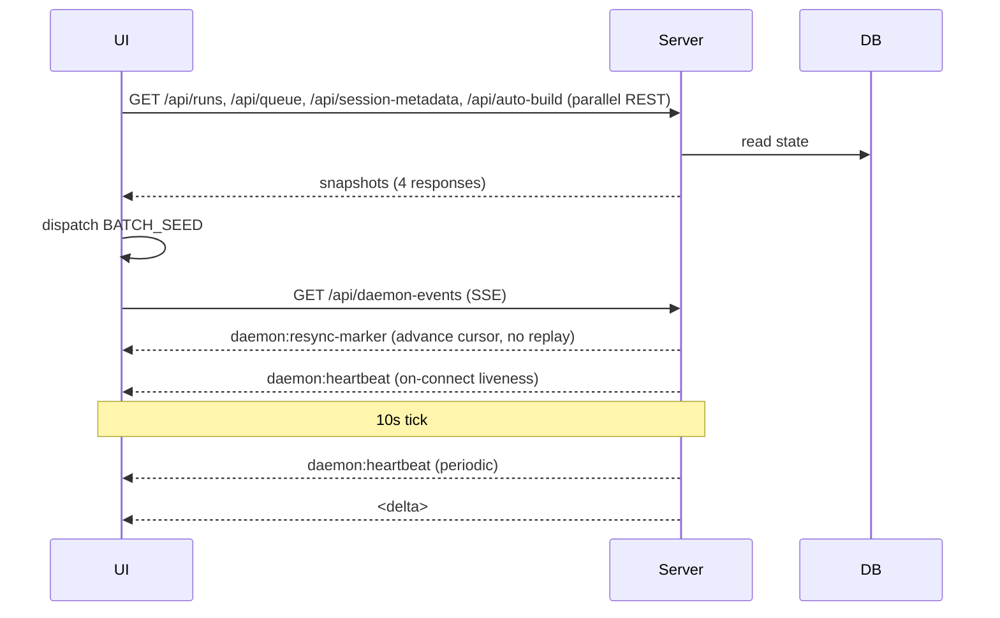

# Replace `daemon:resync-marker` and on-connect heartbeat with a `stream:hello` SSE handshake primitive

## Problem / Motivation

The monitor's SSE bootstrap currently relies on two ad-hoc workarounds that have produced a recurring class of replay-vs-snapshot collision bugs:

- **`daemon:resync-marker`** (commit `c7e6f5d`, shipped under `DAEMON_API_VERSION = 18`): on a fresh connect to `/api/daemon-events`, `serveDaemonEventsSSE()` in `packages/monitor/src/server.ts` (line 382) emits a single `daemon:resync-marker` block (when the daemon-event log is non-empty) so the client's `lastEventId` advances to the current tail.
- **On-connect heartbeat** (commit `eb34d7b`): still emitted on the empty-log branch (`server.ts:391–398`) so a fresh-install client gets liveness within ~100 ms even when the resync marker is suppressed. Regression guard at `daemon-sse-resync.test.ts:193` ("emits only an on-connect heartbeat when no daemon events exist").

What v18 did *not* touch:

- **Per-session SSE (`/api/events/:sessionId`)** has no skip-history behavior. Client side, `packages/monitor-ui/src/hooks/use-eforge-events.ts:99–110` works around this with a manual `lastBatchEventId` skip-filter against the REST `runState` snapshot.

So v18 doubled-down on `daemon:resync-marker` rather than retiring it.

In addition, **`daemon:resync-marker` leaks into `daemonReducer`'s activity ring buffer** at `packages/monitor-ui/src/lib/daemon-reducer.ts:126–134`, because the centralised activity-append unconditionally records every non-heartbeat event — surfacing as a stray entry in the Daemon Activity panel.

### Pre-existing state on `main` (v18 partial fix already shipped)

This work is **not** introducing skip-history for the first time; it is *replacing the v18 mechanism* with a designed-in primitive and *extending the same property* to per-session SSE.

#### Current state of the two workarounds in `packages/monitor/src/server.ts`

- `serveSSE()` (per-session, lines 298–330): replays historical events filtered by optional `Last-Event-ID`. No resync marker. No bootstrap frame. Client side, `use-eforge-events.ts:99–110` does the dance manually — fetches REST `runState`, tracks `lastBatchEventId` from the batch, then skips replayed events whose SSE id ≤ that batch id.
- `serveDaemonEventsSSE()` (cross-session, lines 332–403): on initial connect (no `Last-Event-ID`) emits `daemon:resync-marker` (line 382, with `id: maxDaemonEventId`). Then unconditionally emits one `daemon:heartbeat` frame (lines 391–398, no `id:`) so the liveness pill flips green immediately. With `Last-Event-ID` present, replays only deltas.

#### Client side already has the surface to consolidate onto

- `packages/client/src/session-stream.ts` exports `subscribeToSession()` and `subscribeToDaemonEvents()` over a shared `subscribeToStream()` core. Both already support `onNamedEvent(name, data)` — named SSE events with an `event:` field route through this callback rather than `onEvent`. `stream:hello` would be the canonical first named event.
- `onReconnect` callback (already wired) re-runs REST snapshot fetch on every successful reconnect — `use-daemon-events.ts:73–81` uses it. The handshake's `snapshot` field would replace this REST round-trip on the daemon stream where the snapshot is small enough.
- Per-session: `use-eforge-events.ts` does its own REST `runState` snapshot + `lastBatchEventId` skip-filter. The handshake replaces this with: server emits `stream:hello { cursor }`, client passes cursor as `Last-Event-ID` on reconnect, no per-batch id tracking.

#### Consumers that subscribe to SSE streams (must all migrate)

- `packages/monitor-ui/src/hooks/use-eforge-events.ts` (per-session — REST + manual skip)
- `packages/monitor-ui/src/hooks/use-daemon-events.ts` (daemon-wide — uses `onReconnect` for re-seed)
- `packages/eforge/src/cli/mcp-proxy.ts:271` (per-session, CLI MCP proxy)
- `packages/pi-eforge/extensions/eforge/index.ts:318` (per-session, Pi extension)
- `test/session-stream.test.ts` and friends (assert current SSE behavior)

#### API version

`DAEMON_API_VERSION = 18` in `packages/client/src/api-version.ts`. v18's note explicitly documents the resync-marker semantics — bumping to v19 (or from whatever the spine has bumped it to, if running in parallel) will replace that paragraph and cite `stream:hello` + the removal of `daemon:resync-marker`.

#### Existing tests that lock in the old (v18) behavior

- `packages/monitor/src/__tests__/daemon-sse-resync.test.ts` — three blocks asserting `daemon:resync-marker` content, on-connect-heartbeat content (empty-log branch), and Last-Event-ID replay. **Must be rewritten in `stream:hello` terms, not deleted** — these are the regression guards for v18 behavior we're inheriting.
- `test/daemon-events-stream.test.ts` — daemon-events end-to-end.
- `test/session-stream.test.ts` — client-side `subscribeToSession` lifecycle, lastEventId handling.

#### Constraints

- Additive on the wire — old recorded sessions remain replayable; no event removals/renames in this refactor.
- The handshake helper becomes the *only* way to subscribe; reject `EventSource` leakage out of `@eforge-build/client` in review.
- Bump `DAEMON_API_VERSION` once; consumers run under `verifyApiVersion` gate (so old/new client and daemon must restart together).
- The acceptance criterion "`daemon:resync-marker` is gone" means deleting newly-shipped code from v18, which raises regression risk. The existing `daemon-sse-resync.test.ts` is the regression guard for v18 behavior — it must be rewritten in `stream:hello` terms (covering both stream types), not deleted.

#### Adapt to current codebase state at build time

The codebase may have evolved between the time this plan was written and the time the build runs. The implementor must read the current state and adapt — do not introduce parallel helpers or shadow types:

- **Event-row validator inside SSE handlers.** If `packages/monitor/src/server.ts` has `parseEventRow` (a Zod-validating helper), use it when constructing the snapshot's `recentActivity` and `events` arrays. If it still has `hydrateEventData` (the v18 helper), use that. Do not introduce a new validator.
- **Snapshot envelope schema location.** If `packages/client/src/events.schemas.ts` exists (centralised Zod schemas for events), add `DaemonStreamSnapshotSchema` and `SessionStreamSnapshotSchema` there using the same Zod conventions, and derive the TS types via `z.infer`. If it does not exist, define both as pure-TypeScript interfaces in `packages/client/src/session-stream.ts` and let a later PR migrate them.
- **Event registry for activity-buffer routing.** If `packages/client/src/event-registry.ts` exists and the daemon-reducer's activity-append is registry-driven (routes by `scope`/`project` metadata rather than the unconditional non-heartbeat append currently at `daemon-reducer.ts:126–134`), the named-`stream:hello` channel is naturally excluded from the activity buffer by routing through `onNamedEvent` rather than `onEvent`. No registry change needed. If the registry does not yet exist, the same exclusion holds for the same routing reason. The only reducer change required by this work is the `BATCH_SEED` dedupe described in design-decisions.
- **Daemon-reducer `BATCH_SEED` case.** Modify whatever shape the case has at the time of the build. The dedupe-by-id behavior is additive to whatever fields `BATCH_SEED` already carries.
- **`DAEMON_API_VERSION` bump target.** Bump from whatever the current value is to one greater. Do not assume v18 is current.

## Goal

Replace the two ad-hoc SSE bootstrap mechanisms (`daemon:resync-marker` and the on-connect heartbeat) with a single designed-in stream-cursor handshake (`stream:hello`) that every SSE consumer uses uniformly across both stream types — eliminating the recurring class of replay-vs-snapshot collision bugs and structurally preventing the v18 leak of `daemon:resync-marker` into the Daemon Activity ring buffer.

## Approach

### New module boundaries

- **`packages/monitor/src/sse-handshake.ts` (new file).** Single helper `writeHello(res, cursor, snapshot?)` that both SSE handlers in `server.ts` call before any other write. Sealed primitive: the module exports nothing else, and any future SSE handler in the daemon must call `writeHello()` first or fail review. Adding new SSE stream types later (e.g. per-plan, per-run) inherits the handshake by construction.
- **`packages/client/src/session-stream.ts` (existing file, public surface collapsed).** `subscribeWithSnapshot<S, E>` becomes the only public SSE entry point exported from `@eforge-build/client` and `@eforge-build/client/browser`. `subscribeToSession` and `subscribeToDaemonEvents` are both removed. Their callback-shaped internals (`subscribeToStream`, the browser/node transport split, reconnect/backoff, `processDataRaw`) stay as private implementation behind the generator surface.
- **`packages/client/src/aggregate-session-summary.ts` (new file).** Pulls the `SessionSummary` aggregation out of `session-stream.ts` to restore the "no engine deps" layering the SSE module already declares but currently violates. The helper takes `(sessionId, events: EforgeEvent[], baseUrl)` and returns a `SessionSummary`. Lives next to `event-to-progress.ts` — the same layer (client-side helpers that know engine event types). Both CLI consumers (`mcp-proxy.ts`, `pi-eforge/extensions/eforge/index.ts`) call it after iterating.

### Changed wire format (additive, but a real protocol change)

| | Before (v18) | After |
|--|--|--|
| Per-session fresh connect | Replays all historical events for sessionId | First frame: `event: stream:hello\ndata: {"cursor":"<maxIdForSession>"}\n\n`. No historical replay. |
| Daemon-events fresh connect | One `daemon:resync-marker` block (id-bearing, JSON-typed) + one heartbeat block (no id) | First frame: `event: stream:hello\ndata: {"cursor":"<maxDaemonEventId>","snapshot":{liveness:..., recentActivity:[...]}}\n\n`. No marker, no on-connect heartbeat. |
| Reconnect with `Last-Event-ID` | Replay deltas after the cursor | Same first frame (`stream:hello` with current cursor); then replay deltas with id > Last-Event-ID. |

The `stream:hello` frame is a **named SSE event** (uses the `event:` field), with two consequences:
- SSE clients that don't recognise it dispatch to a `'message'` listener that doesn't exist in our implementations, so the frame is silently dropped — making the change forward-compatible by SSE-spec mechanics.
- It cannot leak into `daemonReducer`'s `ADD_EVENT` activity-append path. The v18 `daemon:resync-marker` was an unknown JSON event type, which slipped through `daemon-reducer.ts:126–134`'s unconditional non-heartbeat append. `stream:hello` cannot reproduce that bug because named events route to `onNamedEvent`, not `onEvent` / `ADD_EVENT`.

### Client public API

```diff
- export { subscribeToSession, subscribeToDaemonEvents } from './session-stream.js';
+ export { subscribeWithSnapshot } from './session-stream.js';
+ export { aggregateSessionSummary } from './aggregate-session-summary.js';
```

`subscribeWithSnapshot` signature:

```ts
export function subscribeWithSnapshot<S, E extends DaemonStreamEvent = DaemonStreamEvent>(
  url: string,
  opts: { signal?: AbortSignal; cwd?: string; baseUrl?: string; maxReconnects?: number },
): AsyncGenerator<
  | { kind: 'snapshot'; snapshot: S }
  | { kind: 'event'; event: E; eventId?: string }
  | { kind: 'named'; name: string; data: string }
>;
```

The third arm (`kind: 'named'`) preserves the existing `onNamedEvent` channel — used by `use-eforge-events.ts:112–120` for `monitor:shutdown-pending` / `monitor:shutdown-cancelled` countdown frames. Smuggling those into `kind: 'event'` would break the type promise; a separate stream is overkill. A third arm is the honest shape.

The `snapshot` arm fires on every successful (re)connect, replacing v18's explicit `onReconnect`-driven REST re-fetch in `use-daemon-events.ts:73–81`.

`aggregateSessionSummary` signature:

```ts
export interface SessionSummary { /* unchanged from v18 */ }
export function aggregateSessionSummary(
  sessionId: string,
  events: EforgeEvent[],
  monitorUrl: string,
): SessionSummary;
```

Computes `eventCount`, `phaseCount`, `filesChanged`, `errorCount`, and terminal `status`/`summary` from the `session:end` event. Engine-domain knowledge (event-type literals, `phase:start`, `plan:build:files_changed`, `:error`/`:failed` suffixes) lives here, not in `session-stream.ts`.

### Changed data flow

Today (v18, daemon-events stream):



After this change:

```mermaid
sequenceDiagram
  participant UI
  participant Server
  participant DB
  UI->>Server: GET /api/daemon-events (SSE only; no REST round-trip on bootstrap)
  Server->>DB: read snapshot (liveness + recentActivity)
  Server-->>UI: stream:hello {cursor, snapshot}
  UI->>UI: dispatch BATCH_SEED from snapshot
  Note over Server,UI: 10s tick
  Server-->>UI: daemon:heartbeat (periodic)
  Server-->>UI: <delta>
```

The four REST endpoints (`/api/runs`, `/api/queue`, `/api/session-metadata`, `/api/auto-build`) still exist and still serve their projections — but the *bootstrap path* no longer goes through them. The UI hook stops fetching them on mount. Implications:

- One round-trip to ready instead of two — REST snapshot + SSE bootstrap collapses into a single SSE handshake.
- The daemon is the single source of truth for "what's the consistent state at cursor X." No more "REST returned one thing, SSE replayed something divergent" race window.

**Per-session flow is unchanged.** The REST `runState` snapshot stays as the snapshot source; the handshake only contributes the cursor for reconnect-replay correctness. This is deliberate — folding the per-session snapshot into the handshake is future work.

### Public API surface changes

- HTTP routes: **none changed** — same paths, same response shapes. Only the SSE wire format gains a first frame.
- Client export surface: `subscribeToSession`, `subscribeToDaemonEvents` removed; `subscribeWithSnapshot`, `aggregateSessionSummary` added.
- Server: new internal helper file, no public export.
- `DAEMON_API_VERSION` bumps once. Old clients fail the `verifyApiVersion` gate and prompt for daemon restart, as designed.

### Deployment / operational changes

- One restart cycle on upgrade: daemon restarts (new `server.ts` emits `stream:hello`), then any open browser tab reloads (new `subscribeWithSnapshot` reads `stream:hello`). Mismatch is caught by the existing version gate.
- No DB migration. No on-disk format changes.
- Pi extension is bundled with the matching daemon version, so they upgrade together.
- CLI (`mcp-proxy`) is bundled with the daemon; same.

### Internal-only

The callback-shape internals (`subscribeToStream` core, browser/node transport split, reconnect/backoff, `processDataRaw`) stay. `subscribeWithSnapshot` is implemented on top of them via a queue-and-promise bridge that converts the existing callback-driven core into the generator's pull-based shape.

### Design decisions

#### 1. Generator-based public API, callback-based internals

`subscribeWithSnapshot` is an `AsyncGenerator`. Internally, it sits on top of the existing callback-driven `subscribeToStream` core (the same machinery that backs today's `subscribeToSession` / `subscribeToDaemonEvents`). The bridge is a **bounded queue + promise resolver pair**:

```ts
async function* subscribeWithSnapshot<S, E>(...) {
  const queue: YieldedFrame<S, E>[] = [];
  let waiter: ((v: void) => void) | null = null;
  let done = false;
  let error: Error | null = null;

  const corePromise = subscribeToStreamInternal(url, {
    onNamedEvent: (name, data) => {
      if (name === 'stream:hello') {
        const { snapshot } = JSON.parse(data);
        // cursor capture is handled inside the core — see decision 2
        queue.push({ kind: 'snapshot', snapshot });
      } else {
        queue.push({ kind: 'named', name, data });
      }
      waiter?.();
    },
    onEvent: (event, meta) => {
      queue.push({ kind: 'event', event, eventId: meta.eventId });
      waiter?.();
    },
    // onReconnect is removed — the core re-issues stream:hello on every
    // (re)connect, which the shim sees as a fresh snapshot frame.
  });
  corePromise.catch(err => { error = err; done = true; waiter?.(); });

  while (!done) {
    while (queue.length) yield queue.shift()!;
    if (done) break;
    await new Promise<void>(resolve => { waiter = resolve; });
    waiter = null;
  }
  if (error) throw error;
}
```

The queue is bounded by network delivery rate, drained by consumer iteration rate. No explicit cap for this PR — the existing core already buffers in the chunk path. Add a cap if profiling shows growth.

**Why generator on top of callback** rather than ripping the callback core out: the core handles browser/node transport split, `Last-Event-ID` capture, reconnect/backoff, fetch-vs-EventSource selection, and abort propagation — all working code with tests. Generator on top of callback is the smallest move that delivers the type-level snapshot-before-deltas guarantee.

#### 2. Cursor capture happens inside the core, not the generator

The cursor in `stream:hello` is the new source of truth for `Last-Event-ID` on reconnect. Today the core captures it from the `id:` field of the most recent event. After this change, the core *also* peeks at `stream:hello` frames in `processDataRaw` (or its named-event peer): if `block.event === 'stream:hello'`, parse `data`, store `cursor` into the closure's `lastEventId` slot, then bubble the named event up. The generator never manages reconnect state — the core already does, it just learns one more rule.

#### 3. Snapshot envelope shapes (both stream types carry full snapshots)

**Daemon-events stream:**

```ts
interface DaemonStreamSnapshot {
  // Liveness — same shape as buildHeartbeatPayload() emits today
  liveness: HeartbeatPayload;

  // Last 20 daemon-allowlist events from the DB
  recentActivity: { id: number; event: EforgeEvent }[];

  // Replaces the four REST projections fetched on mount today
  runs: RunInfo[];
  queue: QueueItem[];
  sessionMetadata: Record<string, SessionMetadata>;
  autoBuild: AutoBuildState | null;
}
```

`liveness` reuses `HeartbeatPayload` so the existing reducer handler for periodic `daemon:heartbeat` events processes it through the same code path. `recentActivity` is bounded at **20** entries (`db.getDaemonEventsAfter(maxId - 20)`). The four projection fields match the existing REST response shapes byte-for-byte — same types, same data, same handlers in the reducer. The daemon constructs them inline at handshake time: `db.getRuns()`, `readdirSync(queuePath)` for queue, in-memory `sessionMetadata` map, in-memory `autoBuild`.

**Per-session stream:**

```ts
interface SessionStreamSnapshot {
  status: 'pending' | 'running' | 'completed' | 'failed';
  events: { id: number; data: string }[];   // same shape as GET /api/runs/:id/state
}
```

This matches the current `RunStateResponse` shape from `GET /api/runs/:id/state`. The `data` field stays as a JSON string per event — the client parses it before dispatching, same as today's BATCH_LOAD. No reducer changes.

For **terminal sessions** (`status: 'completed' | 'failed'`), the server emits `stream:hello` with the full snapshot, then closes the connection. The client recognises the terminal status, caches the final state via the existing `BoundedMap` cache, and the iterator completes with no live subscription. One round-trip total instead of today's REST + SSE pair.

#### 4. The four REST endpoints stay, but are no longer the bootstrap path

`/api/runs`, `/api/queue`, `/api/session-metadata`, `/api/auto-build`, and `/api/runs/:id/state` all keep working — they're useful for debugging via curl, deep-linking, and any future server-side render. The monitor UI no longer hits them on mount. This decouples "what the daemon publishes as its public projection API" from "how the UI bootstraps." Both paths read from the same underlying state, so they're guaranteed consistent.

#### 5. BATCH_SEED dispatch dedupes activity by id

Reconnect re-emits `stream:hello` with a fresh `recentActivity` snapshot. Without dedupe, those entries duplicate in the `daemonActivity` ring buffer. Fix in the reducer: `BATCH_SEED` filters incoming activity entries against the highest id already present in `daemonActivity`. New behavior, but small — about ten lines in `daemon-reducer.ts:104–111` (the `BATCH_SEED` case). Tested via a "seed twice with overlapping ids" reducer test.

#### 6. Per-session BATCH_LOAD uses snapshot events directly

`use-eforge-events.ts` today does:
1. Fetch `/api/runs/:id/state` (REST)
2. BATCH_LOAD into reducer
3. Open SSE
4. Skip-filter incoming events by `lastBatchEventId`

After this change:
1. Open SSE; iterator yields `stream:hello` snapshot
2. BATCH_LOAD from `snapshot.events` into reducer
3. Iterator yields delta events (the cursor is set, no skip-filter needed)

The skip-filter at `use-eforge-events.ts:107–109` is deleted. The mount-time REST fetch at `use-eforge-events.ts:69–71` is deleted.

#### 7. The 'named' iterator arm is preserved

```ts
| { kind: 'named'; name: string; data: string }
```

`monitor:shutdown-pending` and `monitor:shutdown-cancelled` are named SSE events the per-session hook handles separately (countdown timer logic). Smuggling them into `kind: 'event'` would force consumers to filter by name — exactly the ad-hoc routing the named-event channel was added to avoid. Three arms in the union.

#### 8. `aggregateSessionSummary` is sync, not streaming

CLI consumers (`mcp-proxy.ts`, `pi-eforge/extensions/eforge/index.ts`) collect events into an array and call `aggregateSessionSummary(sessionId, events, baseUrl)` once at end-of-stream. Aggregation is cheap (5 counters over ≤ a few thousand events). A sync function over `EforgeEvent[]` is trivially testable with hand-crafted arrays — no SSE machinery in the test.

#### 9. Test files renamed to reflect new semantics

- `packages/monitor/src/__tests__/daemon-sse-resync.test.ts` → `daemon-sse-handshake.test.ts`. Three integration blocks: (a) fresh connect with non-empty log emits `stream:hello` first with current cursor + populated recentActivity, no historical replay; (b) fresh connect with empty log emits `stream:hello` with `cursor: 0` and `recentActivity: []`; (c) reconnect with `Last-Event-ID` emits `stream:hello` first then delta replay.
- `packages/monitor/src/__tests__/sse-handshake.test.ts` (new) — server-side `writeHello` unit tests.
- `packages/client/src/__tests__/subscribe-with-snapshot.test.ts` (new) — generator semantics: snapshot before any event, snapshot re-fires on reconnect, abort propagates as iterator-thrown AbortError, named events route to `kind: 'named'`. Fake SSE server pattern reused from existing client tests.
- `packages/client/src/__tests__/aggregate-session-summary.test.ts` (new) — counter increments and terminal status extraction over hand-crafted event arrays.
- `test/session-stream.test.ts` rewritten in `subscribeWithSnapshot` terms.

#### 10. Frame size is monitored, not constrained

The daemon-events snapshot can run ~30–80KB on a busy daemon (100 active runs + queue + metadata + 20 recent events). Per-session snapshot can run higher for long sessions with many events. Both are sent only on (re)connect, not continuously. SSE handles arbitrary chunk sizes; the existing browser/node parse path already buffers complete frames before dispatch. No artificial cap for this PR; if profiling shows >500KB frames in practice, revisit by trimming `recentActivity` or paginating per-session events. For now, send the full payload — correctness over micro-optimization.

### Profile signal

**Recommended profile: Excursion.**

Reasoning:
- **Not Errand.** This is not a single-file mechanical change; it touches one new server file, one expanded client file, one new client file, four consumer migrations, and a reducer change.
- **Not Expedition.** Despite touching multiple packages, the work is one cohesive refactor unified by a single new primitive (the `stream:hello` handshake). All edits hang off the same contract — that's the opposite of "4+ independent subsystems," which is the Expedition trigger.
- **Excursion fits.** The unit of work is a focused replatform: introduce one primitive on the server, one on the client, then migrate consumers and tests. Files affected (≈10–14 across `packages/monitor`, `packages/client`, `packages/monitor-ui`, `packages/eforge`, `packages/pi-eforge`, plus tests) are all coordinated, not independent. The acceptance criteria gate on a single primitive's correctness end-to-end.

Risk-adjusted considerations: the work is bigger than the original PRD framing because of two scope expansions during planning (per-session snapshot inlines `runState`; daemon-events snapshot inlines four projections). Both expansions stay within the same primitive, so they raise effort but not parallelism. Excursion with attentive review is appropriate.

## Scope

### In scope

**Server (`packages/monitor/src/`):**
- New file `sse-handshake.ts` exporting `writeHello(res, cursor, snapshot?)`. Frame uses `event: stream:hello` (named SSE event — routes through `onNamedEvent` on the client, **not** the unknown-JSON-type path that leaks into reducer activity buffers). No `id:` field — live-only, never replayed.
- `serveSSE()` and `serveDaemonEventsSSE()` in `server.ts` both emit `stream:hello` first on every connection — before any historical replay or live event delivery.
- Per-session SSE gains skip-history-on-fresh-connect, matching the v18 daemon-events behavior but via `stream:hello`'s cursor instead of `daemon:resync-marker`.
- `daemon:resync-marker` deleted from server, schemas, types, and tests. Grep returns zero hits.
- The on-connect heartbeat write at `server.ts:391–398` is removed. Periodic 10s heartbeats in the heartbeat timer are unchanged.
- Daemon-events `stream:hello` snapshot envelope carries: `(a)` daemon liveness (`buildHeartbeatPayload()` content — uptime, queueDepth, runningBuilds, autoBuild) so the liveness pill renders within ~100 ms without the on-connect heartbeat workaround, and `(b)` a bounded recent-activity slice (last N daemon events from the DB allowlist) so the Daemon Activity panel populates immediately on fresh connect rather than sitting empty until the next delta. N is small enough to keep the frame ≤ a few KB; exact value decided in `design-decisions`.
- Per-session `stream:hello` snapshot envelope is `undefined` for now; per-session snapshot continues to come from `GET /api/runs/:id/state`. Folding REST snapshot into SSE bootstrap is a future move, out of scope.

**Client (`packages/client/src/session-stream.ts`):**
- New public helper `subscribeWithSnapshot<S, E>(url, opts)` returning an `AsyncGenerator<{ kind: 'snapshot'; snapshot: S } | { kind: 'event'; event: E; eventId?: string }>`. Implementation route in `design-decisions`. The generator-based shape is non-negotiable — it forces snapshot-before-deltas ordering at the type level, which is the whole point of the primitive.
- `subscribeToSession()` and `subscribeToDaemonEvents()` are removed. `subscribeWithSnapshot` is the *only* SSE entry point exported from `@eforge-build/client`.
- The snapshot frame is re-yielded on every successful reconnect, replacing the explicit `onReconnect`-driven REST re-fetch in `use-daemon-events.ts:73–81`.

**Consumer migrations (all four):**
- `packages/monitor-ui/src/hooks/use-eforge-events.ts` — replace REST snapshot + manual `lastBatchEventId` skip-filter with `subscribeWithSnapshot`. Per-session snapshot is `undefined`, so REST `runState` snapshot stays for now (out of scope to remove); the snapshot arm of the iterator is a no-op for this consumer.
- `packages/monitor-ui/src/hooks/use-daemon-events.ts` — remove explicit `seedSnapshot` REST fetch on mount and on reconnect; reseed comes from `stream:hello` snapshot frames. The four REST endpoints (`runs`/`queue`/`sessionMetadata`/`autoBuild`) stay — they remain the source of those projections — but they move under the daemon's control: the snapshot the daemon emits in `stream:hello` is built from the same DB state the REST endpoints serve. Decision in `design-decisions` about whether the daemon constructs the snapshot inline or by calling its own handlers.
- `packages/eforge/src/cli/mcp-proxy.ts:271` — switch to `subscribeWithSnapshot`. The CLI is per-session, so snapshot is undefined; only the iteration shape changes.
- `packages/pi-eforge/extensions/eforge/index.ts:318` — same as mcp-proxy.

**API version + docs:**
- `DAEMON_API_VERSION` bumps from 18 → 19 (or whatever the spine has bumped to, if running in parallel). Bump comment cites `stream:hello` and removal of `daemon:resync-marker`.
- `daemon-sse-resync.test.ts` rewritten as a `stream:hello` test suite covering both stream types (per-session + daemon-events). The empty-log branch test (resync.test.ts:193) is replaced by a `stream:hello`-with-undefined-cursor variant.

**Bug fix folded in (originally a v18 bug):**
- `daemon:resync-marker` leaks into `daemonReducer`'s activity ring buffer at `packages/monitor-ui/src/lib/daemon-reducer.ts:126–134` because the centralised activity-append unconditionally records every non-heartbeat event. The fix is structural — `stream:hello` as a named SSE event cannot reach `ADD_EVENT`, so it cannot leak. No reducer change required if the migration is clean.

### Out of scope

- Replacing SSE with WebSockets / another transport.
- Folding the per-session REST `runState` snapshot into the per-session `stream:hello` envelope. (Future work.)
- Persisting `daemon:heartbeat` to the DB so a `GET /api/health` snapshot can carry liveness — F5's "symmetry gap" half. (W3 only addresses the SSE half via the snapshot envelope.)
- Reworking what each stream subscribes to.
- Touching the spine's event registry, Zod boundaries, or reducer surface (those are expedition-spine).
- Removing the four REST snapshot endpoints (`runs`/`queue`/`sessionMetadata`/`autoBuild`) — they remain the canonical projection endpoints; only the *bootstrap path* through them is replaced by the snapshot envelope.

## Acceptance Criteria

All of the following must hold for the work to be considered complete.

### Wire format

1. **Every new SSE connection on every stream type starts with a `stream:hello` named frame.** Verifiable via `curl -N`:
   - `curl -N http://localhost:<port>/api/events/<sessionId>` → first frame is `event: stream:hello\ndata: {...}\n\n`.
   - `curl -N http://localhost:<port>/api/daemon-events` → same.
   The `stream:hello` frame has no `id:` field (live-only, never replayed).

2. **`daemon:resync-marker` is gone everywhere.** `grep -r "daemon:resync-marker"` across the workspace returns zero hits — including in tests, comments, and JSDoc. The previously-shipped frame is replaced by `stream:hello`.

3. **The on-connect heartbeat write at `server.ts:391–398` is removed.** Liveness on first daemon-events connect comes from the `stream:hello` snapshot's `liveness` field. The periodic 10-second heartbeat timer is unchanged.

4. **Per-session SSE skips historical replay on fresh connect.** A fresh connect (no `Last-Event-ID`) emits `stream:hello` with the snapshot containing the session's full event history (in `snapshot.events`), then no further historical frames. Reconnect with `Last-Event-ID` emits `stream:hello` then replays only events with id > Last-Event-ID.

5. **Daemon-events SSE skips historical replay on fresh connect.** Same shape — `stream:hello` with the snapshot, no historical event frames after it.

### Snapshot envelopes

6. **Daemon-events `stream:hello` snapshot envelope contains `liveness`, `recentActivity`, `runs`, `queue`, `sessionMetadata`, and `autoBuild` fields.**
   - `liveness` matches the shape `buildHeartbeatPayload()` produces today (uptime, queueDepth, runningBuilds, autoBuild, subscribers).
   - `recentActivity` is bounded at 20 entries; each entry is `{ id: number; event: EforgeEvent }`. Entries are the most recent allowlist-filtered daemon events from the DB.
   - `runs`, `queue`, `sessionMetadata`, `autoBuild` match the response shapes of `GET /api/runs`, `GET /api/queue`, `GET /api/session-metadata`, `GET /api/auto-build` respectively.
   - For an empty daemon-event log: `recentActivity: []`, `liveness` populated, REST projections populated from current state.

7. **Per-session `stream:hello` snapshot envelope contains `status` and `events`.**
   - `status: 'pending' | 'running' | 'completed' | 'failed'` matches the existing `RunStateResponse.status`.
   - `events: { id: number; data: string }[]` matches the existing `RunStateResponse.events` shape — `data` is a JSON-string-serialized event payload.
   - For a session with no events yet: `events: []`, `status` reflects current run state.

8. **Terminal sessions (`status: 'completed' | 'failed'`) close the SSE connection after the `stream:hello` frame.** Verifiable: `curl -N http://localhost:<port>/api/events/<terminalSessionId>` emits `stream:hello` then the connection closes — no live subscription is established. The client-side per-session iterator completes after consuming the snapshot.

### Reducer behavior

9. **`BATCH_SEED` dedupes `recentActivity` entries by id.** Reducer test: dispatch `BATCH_SEED` twice with overlapping `recentActivity` entries (same ids); `daemonActivity` ring buffer contains each id exactly once. Order is preserved (newest entries appended).

10. **`daemon:resync-marker` no longer appears in the Daemon Activity panel.** This is structurally guaranteed (named frames route to `onNamedEvent`, not `ADD_EVENT`), but verified by manual UX pass: load the monitor UI, confirm Daemon Activity shows real activity (recentActivity from snapshot, then live deltas) — no stray `resync-marker` row.

### Client API

11. **`subscribeWithSnapshot` is the only public SSE entry point in `@eforge-build/client` and `@eforge-build/client/browser`.** `subscribeToSession` and `subscribeToDaemonEvents` exports are removed. `grep -r "subscribeToSession\|subscribeToDaemonEvents" packages/` returns zero hits outside of the implementation file's internal references (or zero hits entirely if those internals are also renamed).

12. **`subscribeWithSnapshot` returns an `AsyncGenerator` that yields snapshot before any event.** Generator semantics test: a fresh subscriber sees `kind: 'snapshot'` as the first yielded frame, before any `kind: 'event'` or `kind: 'named'`. Reconnect re-yields a fresh `kind: 'snapshot'` frame.

13. **Named SSE events route to `kind: 'named'`, not `kind: 'event'`.** The two known named events (`monitor:shutdown-pending`, `monitor:shutdown-cancelled`) yield as `{ kind: 'named'; name; data }` from the iterator. `stream:hello` itself does NOT appear as a `kind: 'named'` frame to the consumer — the library intercepts it and surfaces it via `kind: 'snapshot'`.

14. **`aggregateSessionSummary` exists in `@eforge-build/client` next to `event-to-progress.ts`** and the previously-inline aggregation logic in `subscribeToSession` is gone. `session-stream.ts` imports zero engine event-type literals (no `'phase:start'`, `'plan:build:files_changed'`, `:error`, `:failed` strings). Counter logic lives entirely in `aggregateSessionSummary`.

### Consumer migrations

15. **All four SSE consumers use `subscribeWithSnapshot`:**
    - `packages/monitor-ui/src/hooks/use-eforge-events.ts` — no separate REST `runState` fetch on mount; no `lastBatchEventId` skip-filter.
    - `packages/monitor-ui/src/hooks/use-daemon-events.ts` — no separate REST projection fetches on mount or reconnect; `BATCH_SEED` is dispatched from `kind: 'snapshot'` frames only.
    - `packages/eforge/src/cli/mcp-proxy.ts` — uses the iterator and calls `aggregateSessionSummary` at end-of-stream.
    - `packages/pi-eforge/extensions/eforge/index.ts` — same as mcp-proxy.

16. **The four daemon-events REST endpoints still respond** to direct calls — `GET /api/runs`, `GET /api/queue`, `GET /api/session-metadata`, `GET /api/auto-build` keep their existing response shapes. Verified by hitting each with `curl` and asserting the existing JSON shape. The `/api/runs/:id/state` endpoint also still responds.

### Tests

17. **`packages/monitor/src/__tests__/daemon-sse-handshake.test.ts`** (renamed from `daemon-sse-resync.test.ts`) covers three integration cases:
    - Fresh connect with non-empty daemon-event log: first frame is `stream:hello` with the current cursor and populated `recentActivity`; no historical replay frames follow.
    - Fresh connect with empty daemon-event log: first frame is `stream:hello` with `cursor: 0` and `recentActivity: []`; liveness and REST projections are still populated.
    - Reconnect with `Last-Event-ID`: first frame is `stream:hello`; subsequent frames are deltas with id > Last-Event-ID.

18. **`packages/monitor/src/__tests__/sse-handshake.test.ts`** (new) — server-side `writeHello` unit tests: cursor format, snapshot serialization, named-event field present, no `id:` field.

19. **`packages/monitor/src/__tests__/session-sse-handshake.test.ts`** (new) — per-session integration tests:
    - Fresh connect to a running session: `stream:hello` with snapshot containing all current events, then live deltas.
    - Fresh connect to a terminal session: `stream:hello` with full snapshot, then connection closes.
    - Reconnect with `Last-Event-ID`: `stream:hello` then delta replay.

20. **`packages/client/src/__tests__/subscribe-with-snapshot.test.ts`** (new) — generator semantics: snapshot before any event, snapshot re-fires on reconnect, abort propagates as iterator-thrown `AbortError`, named events route to `kind: 'named'`, `stream:hello` does NOT appear in `kind: 'named'`.

21. **`packages/client/src/__tests__/aggregate-session-summary.test.ts`** (new) — counter increments and terminal status extraction over hand-crafted `EforgeEvent[]` arrays.

22. **`test/session-stream.test.ts`** rewritten in `subscribeWithSnapshot` terms; references to `subscribeToSession` are gone.

23. **All existing tests that don't reference removed APIs continue to pass.** No broken imports of `subscribeToSession` / `subscribeToDaemonEvents` outside the test files explicitly being rewritten.

### API version

24. **`DAEMON_API_VERSION` is bumped by 1 from whatever the current value is** in `packages/client/src/api-version.ts`. The version-pinning test at `packages/client/test/api-version.test.ts` (or wherever the assertion lives) is updated to the new value. The bump comment cites `stream:hello`, the removal of `daemon:resync-marker`, and the snapshot envelope addition.

### Verification (manual UX)

25. **Reload the monitor UI; daemon liveness pill is green within ~100 ms.** No 0–10s flap. The pill renders from `liveness` in the daemon-events `stream:hello` snapshot, not from a separate REST call or the on-connect heartbeat workaround.

26. **The Daemon Activity panel populates immediately on first load.** It contains the most recent allowlist daemon events (from `recentActivity`) — not just live deltas firing after connect. No `daemon:resync-marker` row appears.

27. **Restart the daemon during a build.** SSE reconnects automatically; the snapshot frame re-seeds `BATCH_SEED`, dedupe prevents duplicate activity entries, no duplicated event rows appear in the per-session detail view.

28. **Bootstrap latency.** Time from page load to "fully populated UI" is no worse than v18, ideally measurably better (one round-trip vs two for the daemon-events stream). Spot-check via DevTools Network tab.
