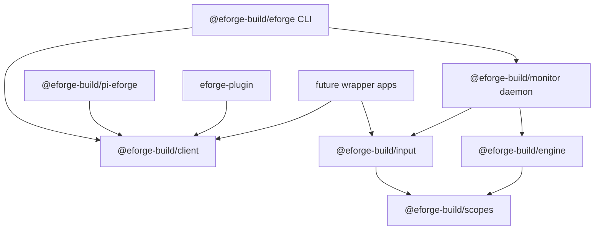

# Input package for playbooks and session planning

## Problem / Motivation

The recent playbook implementation currently lives in `packages/engine/src/playbook.ts` and is re-exported from `packages/engine/src/index.ts`, making playbooks appear as part of the engine API even though they are better understood as reusable PRD/session-plan input artifacts. `packages/engine/src/index.ts` explicitly describes itself as re-exporting "the playbook public API and shared set-resolver."

Current playbook implementation details:

- `packages/engine/src/playbook.ts` owns playbook schema, parsing, serialization, list/load/write/move/copy operations, and `playbookToSessionPlan()`.
- Daemon routes in `packages/monitor/src/server.ts` dynamically import playbook functions from `@eforge-build/engine/playbook` for list/show/save/enqueue/promote/demote/validate/copy.
- `POST /api/playbook/enqueue` already compiles a playbook to ordinary PRD body via `playbookToSessionPlan()`, then uses `enqueuePrd()` from `@eforge-build/engine/prd-queue`; this is the right conceptual boundary: input artifact -> ordinary queue entry.
- CLI code in `packages/eforge/src/cli/playbook.ts` mostly calls typed client helpers from `@eforge-build/client`; it does not need direct engine playbook imports.
- Pi native playbook command in `packages/pi-eforge/extensions/eforge/playbook-commands.ts` also uses `@eforge-build/client` helpers for list/run/promote/demote and delegates conversational create/edit flows to the skill.
- Pi and Claude plugin tools expose `eforge_playbook` as daemon-backed tool actions.

Three-tier artifact resolution is a dependency wrinkle:

- `packages/engine/src/set-resolver.ts` provides generic project-local / project-team / user tier resolution.
- It is used by playbooks and also by engine config/profile logic in `packages/engine/src/config.ts`.
- Extracting playbooks cleanly likely requires either moving `set-resolver` to a small shared package, moving it into `@eforge-build/input` and having engine depend on input for profiles (probably undesirable), or duplicating/adapting the resolver.

Session planning currently lives primarily in integration skill markdown rather than code:

- `packages/pi-eforge/skills/eforge-plan/SKILL.md` and `eforge-plugin/skills/plan/plan.md` duplicate the session-plan protocol.
- The protocol writes `.eforge/session-plans/{session-id}.md` with YAML frontmatter fields such as `session`, `topic`, `status`, `planning_type`, `planning_depth`, `required_dimensions`, `optional_dimensions`, `skipped_dimensions`, `open_questions`, and `profile`.
- Readiness rules are duplicated in skill text: every required dimension must either have substantive body content or be listed in `skipped_dimensions` with a reason; placeholder-only sections do not count.
- `/eforge:build` skills in both Pi and Claude scan `.eforge/session-plans/` and include duplicate logic for detecting active plans and checking missing dimensions before enqueueing.
- There is no current `packages/engine`, `packages/client`, or daemon API implementation for session-plan parsing/readiness; the file protocol is effectively embedded in prompt instructions.

Package/runtime structure observed:

- The monorepo uses `packages/*` via `pnpm-workspace.yaml`, so a new `packages/input` workspace package is straightforward.
- `@eforge-build/client` is a small zero/low-dependency package with route constants and daemon helpers.
- `@eforge-build/monitor` currently depends on `@eforge-build/client` and `@eforge-build/engine`; it would become the main runtime consumer of `@eforge-build/input` for playbook daemon routes.
- `@eforge-build/eforge` depends on client, engine, and monitor. Installing the CLI would transitively install input if monitor depends on it; direct CLI helpers can also depend on input if needed.
- Tests currently import playbook and set-resolver code from `@eforge-build/engine/*`, so extraction will require updating tests and package aliases/imports.

Roadmap alignment: this fits the roadmap's Integration & Maturity direction, especially provider flexibility, shared tool registry, and clearer consumer-facing integration boundaries. It also supports the strategic boundary that eForge core should remain an agentic build engine while reusable input protocols can be shared by daemon routes, integrations, and future wrapper apps.

This looks like an **architecture / deep** change because it changes package boundaries, runtime dependency direction, and public import paths across engine, monitor, CLI/client, Pi extension, Claude plugin docs/tools, tests, and documentation.

## Goal

Create a new `@eforge-build/input` package that owns reusable input-artifact mechanics (playbooks and session plans) and a new `@eforge-build/scopes` package that owns shared scope/path/resolution primitives, while keeping `@eforge-build/engine` focused on the agentic build pipeline and free of input-layer concepts.

## Approach

### Profile Signal

Recommend **Expedition**.

Rationale: this is a cross-package architecture refactor with new workspace packages, engine dependency changes, daemon route rewiring, input protocol extraction, tests, and documentation boundary work. It has natural module boundaries (`scopes`, `input/playbooks`, `input/session-plans`, engine config integration, daemon/CLI wiring, docs/tests), and config lookup behavior is important enough to benefit from decomposition and review.

### Design Decisions

- The shared resolver package should include config *lookup and ordering* but not config *meaning*. It should define canonical eForge scopes/directories and provide generic helpers for scoped resources. For `config.yaml`, it should return the existing files in merge order (`user`, then `project-team`, then `project-local`); `@eforge-build/engine` should keep the domain-specific parser, schema validation, and `mergePartialConfigs()` behavior.
- Name the shared resolver package `@eforge-build/scopes` (`packages/scopes`). The package owns scoped path/resolution primitives, not just artifacts. Named artifact sets such as profiles and playbooks are one use case; layered singleton files such as `config.yaml` are another; project-local-only session plans are a third.
- Do not add a full session-plan management API in this change. The session-plan library should still be used immediately by build-source normalization: when the CLI/daemon enqueue path receives a `.eforge/session-plans/*.md` source path, it should parse/format the session plan via `@eforge-build/input` and pass ordinary source text to the engine. `/eforge:plan` can continue to be conversational/prompt-driven until a follow-up adds richer tools for create/update/readiness.

### Architecture Impact

New package boundaries:

`@eforge-build/scopes` becomes the shared foundation for locating eForge-scoped files. It should expose canonical scope names and path helpers for:

- user scope: `~/.config/eforge/`
- project-team scope: discovered `eforge/` directory
- project-local scope: `[project]/.eforge/`

It should also expose two generic resolution modes:

1. **Layered singleton resolution** — for files like `config.yaml`, where all existing scope files are returned in merge order `user -> project-team -> project-local`. The caller owns parsing and merge semantics.
2. **Named set resolution** — for directories like `profiles/` and `playbooks/`, where same-name entries shadow lower-precedence tiers and the highest-precedence copy wins.

`@eforge-build/input` becomes the package for reusable build-input protocols. It depends on `@eforge-build/scopes` for playbook tier resolution, owns playbook/session-plan schemas and deterministic transforms, and emits ordinary build source that the daemon can enqueue.

`@eforge-build/engine` remains the build pipeline package. It depends on `@eforge-build/scopes` for config/profile file location, but it must not depend on `@eforge-build/input`. The engine continues to own config parsing, config schema validation, config merging, profile schema validation, queueing, planning, building, reviewing, and validation.

Daemon playbook routes in `@eforge-build/monitor` become the bridge: they use `@eforge-build/input` to load/compile playbooks, then use engine queue helpers to enqueue ordinary PRDs.

### Code Impact

Primary package additions:

- `packages/scopes/`
  - New `@eforge-build/scopes` package with `package.json`, `tsconfig.json`, `tsup.config.ts`, `src/index.ts`, and README.
  - Move/adapt current `packages/engine/src/set-resolver.ts` functionality here.
  - Add scope path helpers and layered singleton lookup for `config.yaml`-style resources.
- `packages/input/`
  - New `@eforge-build/input` package with `package.json`, `tsconfig.json`, `tsup.config.ts`, `src/index.ts`, likely `src/playbook.ts`, `src/session-plan.ts`, and README.
  - Move playbook implementation out of `packages/engine/src/playbook.ts`.
  - Add session-plan deterministic helpers and build-source normalization for session-plan file paths.

Primary engine changes:

- `packages/engine/src/config.ts`
  - Replace local scope/path/profile set helpers with imports from `@eforge-build/scopes` where appropriate.
  - Keep config parsing, migration behavior, `mergePartialConfigs()`, profile validation, active-profile semantics, and `resolveConfig()` in engine.
- `packages/engine/src/index.ts`
  - Remove playbook exports or add intentional compatibility exports only if a deprecation window is chosen.
  - Remove references implying playbooks are part of the engine public API.
- `packages/engine/src/playbook.ts` and `packages/engine/src/set-resolver.ts`
  - Delete or convert to thin compatibility re-export shims only if required; preferred end state is no engine-owned playbook module.

Primary daemon/CLI/integration changes:

- `packages/monitor/src/server.ts`
  - Update playbook routes to import from `@eforge-build/input`.
  - Keep enqueue bridge behavior: input compiles playbook to ordinary PRD body, monitor uses engine queue helpers.
  - Add or route build-source normalization so session-plan file paths are normalized through input before worker/engine enqueue.
- `packages/eforge/src/cli/*`
  - Update imports only if any direct engine playbook/set-resolver imports remain.
  - Ensure CLI build/enqueue path uses normalized source when session-plan paths are passed directly in foreground/in-process paths.
- `packages/client/*`
  - Likely minimal or no route-shape changes for existing playbook endpoints. Add no session-plan CRUD routes in this change unless necessary for normalization.
- `packages/pi-eforge/*` and `eforge-plugin/*`
  - Keep skill behavior mostly unchanged. Update wording only where needed to describe session plans/playbooks as input-layer artifacts and preserve parity if user-facing docs change.

Tests:

- Move/update `test/playbook.test.ts` imports to `@eforge-build/input/playbook` or package root exports.
- Move/update `test/set-resolver.test.ts` imports to `@eforge-build/scopes`.
- Add tests for layered singleton config lookup order in `@eforge-build/scopes`.
- Add tests for session-plan parsing/readiness/source formatting in `@eforge-build/input`.
- Add/update integration-ish tests for session-plan source normalization on enqueue if test harness coverage already exists for enqueue paths.

### Documentation Impact

Documentation updates are in scope and should be treated as boundary-hardening, not just import-path cleanup.

Update likely locations:

- `README.md`
  - Keep eForge positioned as an agentic build system.
  - Describe playbooks/session plans as reusable input conveniences that compile to ordinary PRD/build source.
  - Avoid language implying that the engine itself owns workflow automation.
- `docs/architecture.md`
  - Add or update package-boundary section for `@eforge-build/scopes`, `@eforge-build/input`, `@eforge-build/engine`, `@eforge-build/monitor`, and integrations.
  - State dependency direction explicitly: engine may depend on scopes, input may depend on scopes, monitor may depend on input and engine, but engine must not depend on input.
  - Clarify that daemon routes may expose input-layer conveniences while the build engine remains input-agnostic.
- `docs/config.md`
  - Update descriptions of user/project-team/project-local scope directories to reference shared scope semantics.
  - Clarify which things are layered singletons (`config.yaml`) versus named set artifacts (`profiles`, `playbooks`) versus project-local-only state/input (`session-plans`).
- `docs/roadmap.md`
  - Add/adjust guardrail that scheduling, triggers, approvals, notifications, and richer workflow orchestration belong in wrapper apps built on stable eForge APIs, not in the engine.
- Package READMEs if present/added:
  - `packages/scopes/README.md` should document scope names, directories, precedence, layered singleton lookup, and named set shadowing.
  - `packages/input/README.md` should document playbooks and session plans as input protocols that produce ordinary build source.

Acceptance should require docs to reflect the new boundary, not merely compile after import changes.

### Risks

- **Config behavior drift** — Refactoring lookup/path helpers can subtly change which config/profile files are found. Mitigate with tests for user/project-team/project-local paths, merge order, active-profile lookup, and missing-file behavior.
- **Package dependency cycles** — `engine` must depend on `scopes`, `input` must depend on `scopes`, and `monitor` may depend on both `engine` and `input`; `engine` must not depend on `input`.
- **Runtime publish/install gaps** — New packages must be included in workspace build, package dependencies, publish scripts, and runtime dependency graphs so global CLI installs include them.
- **Import breakage** — Existing tests or internal callers importing `@eforge-build/engine/playbook` or `@eforge-build/engine/set-resolver` will break unless updated or shimmed. Decide whether to intentionally break internal-only imports or provide a temporary compatibility layer.
- **Session-plan normalization ambiguity** — The input package should only normalize clear session-plan file paths, especially `.eforge/session-plans/*.md`, to avoid unexpectedly transforming arbitrary Markdown PRDs.
- **Over-expanding session-plan support** — Full session-plan CRUD/tool APIs would turn this into a larger feature. Keep this change to deterministic library logic plus build-source normalization.

## Scope

### In Scope

- Create a new workspace package for shared eForge scope/path/resolution primitives: `packages/scopes`, published as `@eforge-build/scopes`.
  - Move the generic set-artifact resolver currently in `packages/engine/src/set-resolver.ts` into this package.
  - Define the canonical eForge scope names and directories in one place:
    - `user`: `~/.config/eforge/`
    - `project-team`: discovered `eforge/` config directory
    - `project-local`: `[project]/.eforge/`
  - Preserve the existing tier precedence: project-local wins over project-team, which wins over user.
  - Provide at least two generic resolution primitives:
    - named set resolution for things like `profiles/*.yaml` and `playbooks/*.md`, where same-name entries shadow lower-precedence tiers;
    - layered singleton lookup for things like `config.yaml`, where all existing scope files are returned in merge order `user -> project-team -> project-local`.
  - Keep this package generic and low-level: no config schema, playbook schema, profile schema, daemon, queue, or engine concepts.
- Create a new workspace package `packages/input` published as `@eforge-build/input` for reusable input-artifact protocols.
  - Move playbook schema/parser/serializer/list/load/write/move/copy and playbook-to-build-source/session-plan formatting out of `@eforge-build/engine` into input.
  - Add deterministic session-plan mechanics: schema/types, parse/serialize, active session listing, readiness checks, dimension selection, skipped-dimension handling, legacy boolean-dimensions migration helper, and session-plan-to-build-source formatting.
  - Add build-source normalization that can detect a session-plan file path and convert it to ordinary PRD/build source before it reaches the engine.
  - Use the shared scopes/resolution package from `@eforge-build/input` for playbook tier resolution.
- Update `@eforge-build/engine` to import the shared scopes/resolution package for profile resolution and config-file lookup/ordering instead of carrying its own set resolver/path helpers.
- Update daemon playbook routes in `@eforge-build/monitor` to import playbook logic from `@eforge-build/input` and continue enqueuing ordinary PRDs through engine queue helpers.
- Remove playbook exports from the engine barrel or replace them with a compatibility strategy only if needed for a deprecation window.
- Update tests/imports so playbook tests target `@eforge-build/input/*` and resolver/scope tests target the shared scopes/resolution package.
- Update package dependencies and build configuration so the CLI/daemon runtime installs both packages normally.
- Update docs to harden the architecture/product boundary:
  - `@eforge-build/scopes` = where scoped eForge files live and how lookup/precedence works.
  - `@eforge-build/input` = reusable build-input protocols such as playbooks and session plans.
  - `@eforge-build/engine` = agentic build pipeline only; it consumes normalized source/PRDs and should not know whether input came from a playbook, session plan, wrapper app, CLI prompt, or file.
  - Playbooks and session plans are input-layer conveniences, not core engine capabilities.
  - Scheduling, triggers, approvals, notifications, and workflow orchestration belong to future wrapper apps, not engine/core eForge.

### Out of Scope

- Scheduling, triggers, approvals, notifications, workflow history, marketplace/sharing, or other wrapper-application behavior.
- Moving config schema semantics out of the engine. The shared scopes/resolution package may locate `config.yaml` files and return them in canonical merge order, but `@eforge-build/engine` still owns parsing, validation, and the config-specific merge function.
- Moving profile schema/config logic out of the engine. The shared package may locate profile files and active marker paths, but engine remains responsible for active-profile semantics and profile schema validation.
- Rewriting the `/eforge:plan` conversational workflow or adding full session-plan CRUD daemon/tool APIs. This change centralizes deterministic session-plan mechanics and uses them when building from a session-plan source path, while skills remain responsible for conversation and codebase exploration.
- Making `@eforge-build/engine` depend on `@eforge-build/input`.

## Acceptance Criteria

- `packages/scopes` exists and is published as `@eforge-build/scopes` with documented scope names, directory helpers, named set resolution, and layered singleton lookup.
- `packages/input` exists and is published as `@eforge-build/input` with documented playbook and session-plan input protocols.
- Playbook schema/parser/list/load/write/move/copy/validate and playbook-to-build-source logic no longer live in engine-owned implementation code; daemon playbook routes use `@eforge-build/input`.
- Session-plan deterministic logic exists in `@eforge-build/input`, including parse/serialize, dimension selection, readiness checks, skipped-dimension handling, legacy boolean-dimensions migration helper, and session-plan-to-build-source formatting.
- Passing a `.eforge/session-plans/*.md` source path through build/enqueue normalization uses `@eforge-build/input` to produce ordinary PRD/build source before reaching the engine.
- `@eforge-build/engine` uses `@eforge-build/scopes` for scoped file/path lookup where appropriate, but does not depend on `@eforge-build/input`.
- Config parsing, validation, merge semantics, profile schema validation, and active-profile semantics remain in `@eforge-build/engine`.
- Existing playbook daemon/client/CLI/Pi/plugin user-facing behavior continues to work unless explicitly documented as changed.
- Tests cover scope path/precedence behavior, named set shadowing, layered singleton lookup order, playbook behavior after extraction, and session-plan readiness/source formatting.
- `pnpm build`, `pnpm type-check`, and `pnpm test` pass.
- Documentation clearly states the package boundaries and product boundary: scopes = lookup, input = reusable build-input protocols, engine = agentic build pipeline, wrapper apps = scheduling/workflow orchestration.
