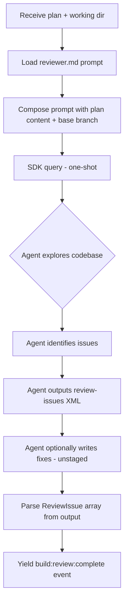

# Reviewer

## Architecture Reference

This module implements the **reviewer** agent from the architecture — a one-shot SDK `query()` that performs blind code review (no builder context), identifies issues with structured severity levels, and leaves fixes unstaged. Part of Wave 2 (parallel with planner, builder, orchestration, config).

Key constraints from architecture:
- Reviewer is blind — it receives the plan and committed code but has zero knowledge of the builder's conversation or reasoning
- One-shot `query()` call with full tool access (`permissionMode: 'bypassPermissions'`)
- Yields `ForgeEvent`s via `AsyncGenerator` — never writes to stdout
- Leaves fixes unstaged — the builder's Turn 2 (evaluator) decides what to accept/reject
- Review output must produce structured `ReviewIssue[]` that the engine can parse
- Prompt is a static `.md` file loaded at runtime via the foundation `loadPrompt()` utility
- SDK message → ForgeEvent mapping uses the foundation `mapSDKMessages()` generator

## Scope

### In Scope
- `src/engine/agents/reviewer.ts` — reviewer agent function that wraps SDK `query()`, composes the review prompt, runs the one-shot review, parses `ReviewIssue[]` from agent output, and yields `ForgeEvent`s
- `src/engine/prompts/reviewer.md` — standalone review prompt extracted and adapted from `schaake-cc-marketplace/review` plugin skills (code-review-policy criteria, severity levels, structured output format, review categories)
- Review issue XML parser — extract `<review-issues>` blocks from assistant message text into typed `ReviewIssue[]`
- Integration with foundation's `mapSDKMessages()` for agent-level event streaming
- Integration with foundation's `loadPrompt()` for prompt loading and variable substitution
- Support for standalone `forge review <planSet>` command (review existing code against plans without building)
- Support for inline review during build (called by orchestrator after builder Turn 1 commits)

### Out of Scope
- Fix evaluation (accept/reject/review of unstaged changes) — that is the builder's Turn 2, handled by the builder module with `evaluator.md` prompt
- Issue resolution / auto-fix execution — future enhancement, not part of core reviewer
- Multi-agent parallel review (scope-aware parallelization for large changesets) — the plugin supports this but forge v1 uses single-agent review per plan
- `ForgeEvent` type definitions — foundation module
- `ReviewIssue` type definition — foundation module (already defined in `events.ts`)
- CLI rendering of review events — cli module
- Orchestrator integration (when to invoke reviewer) — orchestration module

## Dependencies

| Module | Dependency Type | Notes |
|--------|-----------------|-------|
| foundation | Hard | `ForgeEvent`, `ReviewIssue`, `PlanFile`, `AgentRole`, `mapSDKMessages()`, `loadPrompt()`, `parsePlanFile()` |

### External Dependencies

| Package | Version | Purpose |
|---------|---------|---------|
| `@anthropic-ai/claude-agent-sdk` | ^0.2.74 | SDK `query()` for one-shot review agent execution |

No new npm dependencies required — all parsing uses foundation utilities.

## Implementation Approach

### Overview

Two files: the reviewer agent implementation and its prompt. The agent is a single async generator function that composes a prompt from the plan file + committed diff, runs a one-shot SDK `query()`, maps SDK messages to `ForgeEvent`s, and extracts structured `ReviewIssue[]` from the agent's output.

### Key Decisions

1. **Structured output via XML blocks** — The reviewer prompt instructs the agent to output `<review-issues>` XML containing structured issue data. This parallels how the planner uses `<clarification>` blocks. The parser extracts issues from the text rather than relying on tool calls, keeping the agent's tool access focused on codebase exploration.

2. **Blind review by design** — The reviewer receives only: (a) the plan file content, (b) the current working directory with committed code, and (c) the review prompt. It does NOT receive builder conversation history, implementation notes, or any context about how the code was written. This prevents confirmation bias.

3. **Git diff as review scope** — The reviewer prompt instructs the agent to identify changed files via `git diff` against the plan's base branch (or a provided ref). This scopes the review to what was actually changed rather than reviewing the entire codebase.

4. **Fixes left unstaged** — The prompt instructs the agent to make fixes directly to files but NOT stage them (`git add`). After the reviewer completes, the working tree has: staged = builder's commit, unstaged = reviewer's fixes. The builder's Turn 2 evaluates these.

5. **Category and severity from code-review-policy** — The review categories (Bugs, Security, Error Handling, Edge Cases, Types, DRY, Performance, Maintainability) and severity mapping (Critical, Warning, Suggestion) are extracted from the schaake-cc-marketplace `code-review-policy` SKILL.md and embedded directly in `reviewer.md`.

6. **Dual invocation paths** — The reviewer agent function supports two call patterns:
   - **Inline** (during build): receives `planId`, `worktreePath`, `baseBranch` — reviews changes in a worktree
   - **Standalone** (via `forge review`): receives `planSet` path, iterates all plans, reviews each against its branch

7. **`maxTurns` set to 30** — Matches architecture spec. The reviewer needs enough turns to explore files, read code, identify issues, and optionally write fixes. One-shot in terms of prompt (no multi-turn conversation), but the SDK may use multiple tool-use turns internally.

### Reviewer Agent Flow



### Review Issue XML Format

The reviewer agent outputs issues in a structured XML block that the parser extracts:

```xml
<review-issues>
  <issue severity="critical" category="bug" file="src/auth.ts" line="45">
    Missing null check on user object before accessing email property.
    Will throw TypeError when user is undefined.
    <fix>Add optional chaining: user?.email</fix>
  </issue>
  <issue severity="warning" category="edge-cases" file="src/utils.ts" line="23">
    No handling for empty array input. Function returns undefined instead of empty result.
  </issue>
  <issue severity="suggestion" category="performance" file="src/api/list.ts" line="78">
    N+1 query pattern — each item triggers a separate database call.
    <fix>Use batch query with WHERE id IN (...)</fix>
  </issue>
</review-issues>
```

## Files

### Create

- `src/engine/agents/reviewer.ts` — Reviewer agent implementation:
  - `runReview(options: ReviewerOptions): AsyncGenerator<ForgeEvent>` — main entry point
  - `ReviewerOptions` interface: `{ plan: PlanFile; worktreePath: string; baseBranch: string; verbose?: boolean; abortController?: AbortController }`
  - `parseReviewIssues(text: string): ReviewIssue[]` — extract `<review-issues>` XML blocks from assistant output
  - `composeReviewPrompt(plan: PlanFile, baseBranch: string): string` — load prompt template, substitute plan content and base branch
  - Internally: yields `build:review:start`, streams `agent:message`/`agent:tool_use`/`agent:tool_result` events via `mapSDKMessages()`, then yields `build:review:complete` with parsed issues

- `src/engine/prompts/reviewer.md` — Self-contained review prompt, adapted from schaake-cc-marketplace review plugin. Sections:
  - **Role**: You are a code reviewer performing a blind review
  - **Context**: Plan content (substituted via `{{plan_content}}`), base branch (`{{base_branch}}`)
  - **Scope**: Identify changed files via git diff against base branch, review only those files
  - **Review categories**: Extracted from code-review-policy (Bugs, Security, Error Handling, Edge Cases, Types, DRY, Performance, Maintainability)
  - **Severity mapping**: Critical (must fix), Warning (should fix), Suggestion (nice to have)
  - **Fix instructions**: When you identify an issue with a clear fix, apply the fix directly to the file but do NOT run `git add`. Leave all changes unstaged.
  - **Fix criteria**: Only fix issues that are objectively wrong (bugs, security, missing error handling). Do NOT refactor, rename, or change design decisions.
  - **Output format**: Output all issues in `<review-issues>` XML block with severity, category, file, line, description, and optional fix
  - **Constraints**: Do not stage changes. Do not commit. Do not modify test files (only review them). Focus on the diff, not pre-existing code.

### Modify

- `src/engine/index.ts` — Add re-export of `runReview` and `parseReviewIssues` from `agents/reviewer.ts` (barrel export)

## Testing Strategy

No test framework is configured yet. Verification will be done via type-checking and manual validation.

### Type Check
- `pnpm type-check` must pass with zero errors
- `ReviewerOptions` interface must be compatible with `PlanFile` from foundation
- `runReview()` return type must be `AsyncGenerator<ForgeEvent>`
- `parseReviewIssues()` return type must be `ReviewIssue[]`

### Manual Validation
- Verify `parseReviewIssues()` correctly extracts issues from sample XML text containing `<review-issues>` blocks
- Verify `parseReviewIssues()` handles malformed XML gracefully (returns empty array or partial results)
- Verify `parseReviewIssues()` handles text with no `<review-issues>` block (returns empty array)
- Verify `composeReviewPrompt()` correctly substitutes `{{plan_content}}` and `{{base_branch}}` in the loaded prompt
- Verify `runReview()` yields events in correct order: `build:review:start` → agent events → `build:review:complete`
- Verify `reviewer.md` prompt loads successfully via `loadPrompt('reviewer')`

### Build
- `pnpm build` must succeed — tsup bundles reviewer agent and prompt file

## Verification Criteria

- [ ] `pnpm type-check` passes with zero errors
- [ ] `pnpm build` produces `dist/cli.js` without errors
- [ ] `runReview()` is an async generator that yields `ForgeEvent`s
- [ ] `runReview()` yields `build:review:start` with the correct `planId` as the first non-agent event
- [ ] `runReview()` yields `build:review:complete` with parsed `ReviewIssue[]` as the final event
- [ ] When `verbose` option is true, `runReview()` yields `agent:message`, `agent:tool_use`, and `agent:tool_result` events from the SDK stream
- [ ] `parseReviewIssues()` correctly extracts severity, category, file, line, description, and fix from well-formed `<review-issues>` XML
- [ ] `parseReviewIssues()` maps severity values to the `ReviewIssue['severity']` union (`'critical' | 'warning' | 'suggestion'`)
- [ ] `parseReviewIssues()` returns an empty array when no `<review-issues>` block is present in the text
- [ ] `parseReviewIssues()` handles partial/malformed XML without throwing (returns what it can parse)
- [ ] `composeReviewPrompt()` loads `reviewer.md` via `loadPrompt()` and substitutes `{{plan_content}}` and `{{base_branch}}`
- [ ] `reviewer.md` prompt contains review categories matching the architecture's `ReviewIssue` category field (bug, security, error-handling, edge-case, types, dry, performance, maintainability)
- [ ] `reviewer.md` prompt explicitly instructs the agent to NOT stage changes (no `git add`)
- [ ] `reviewer.md` prompt explicitly instructs the agent to NOT commit changes
- [ ] `reviewer.md` prompt scopes review to `git diff` against the base branch (not the entire codebase)
- [ ] `reviewer.md` prompt instructs structured output in `<review-issues>` XML format
- [ ] Reviewer agent uses `permissionMode: 'bypassPermissions'` in SDK query options
- [ ] Reviewer agent sets `maxTurns: 30` in SDK query options
- [ ] All exports available via `src/engine/index.ts` barrel
