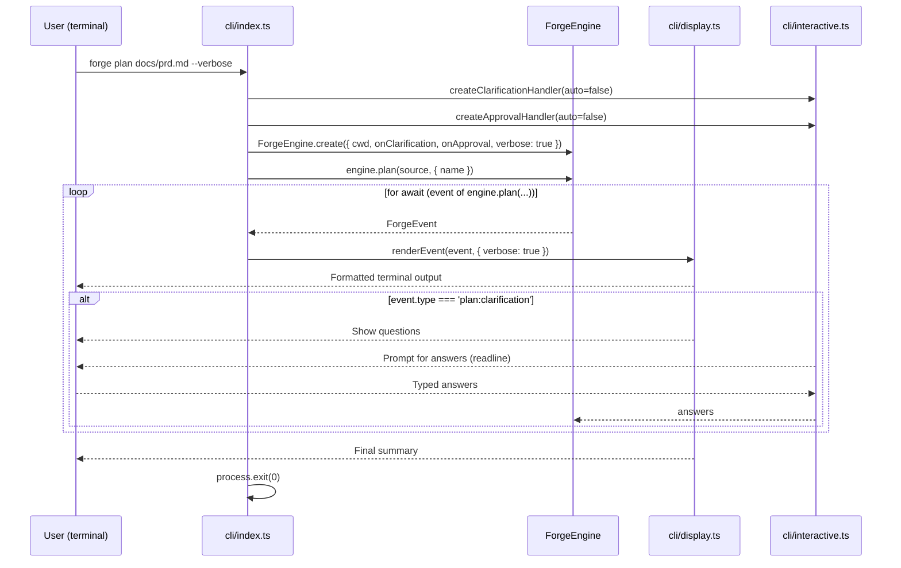

# CLI

## Architecture Context

This module implements the **cli** layer — the thin consumer that wires Commander commands to `ForgeEngine` methods, renders `ForgeEvent`s to stdout, and handles interactive prompts. Wave 4 (depends on forge-core).

Key constraints:
- Engine emits, consumers render — CLI is a pure consumer of `AsyncGenerator<ForgeEvent>`
- Callbacks for interaction — CLI provides `onClarification` and `onApproval` via `readline/promises`
- CLI is thin — no business logic, only wiring and rendering
- Architecture specifies three subfiles: `index.ts`, `display.ts`, `interactive.ts`
- Flags: `--auto`, `--verbose`, `--dry-run`

## Implementation

### Key Decisions

1. **Single `renderEvent()` with exhaustive switch** — TypeScript `never` default ensures all event types handled.
2. **Spinner lifecycle tied to event pairs** — `Map<string, Ora>` keyed by composite ID. Start events create spinners; complete/failed stop them.
3. **Verbose is a display concern** — engine always emits agent events; display filters.
4. **Interactive callbacks return promises** — auto mode returns defaults; interactive mode uses `readline/promises`.
5. **Process exit is explicit** — exit 0 on success, 1 on failure, 130 on SIGINT.
6. **Dry-run is CLI-only** — validates plan set and displays execution plan without creating engine.
7. **Status is synchronous** — renders `ForgeStatus` as formatted table.
8. **Module-scoped display state** — active spinners, verbose flag, event counts.
9. **Color palette** — green=success, red=failure, yellow=warning, blue=info, cyan=identifiers, magenta=waves, dim=verbose.
10. **Readline cleanup** — interfaces created per prompt, closed immediately after.

### CLI Command Flow

## Scope

### In Scope
- Commander program with `plan`, `build`, `review`, `status` commands
- `renderEvent()` — exhaustive ForgeEvent switch with color/spinner rendering
- `renderStatus()` — formatted plan status table
- `renderDryRun()` — execution plan display
- `createClarificationHandler()` — auto-mode stubs or readline prompts
- `createApprovalHandler()` — auto-mode stubs or y/n readline prompt
- Signal handling (SIGINT/SIGTERM → abort, cleanup, exit 130)
- Exit code management
- Refactor `src/cli.ts` to thin entry point
- Add `chalk` and `ora` dependencies

### Out of Scope
- ForgeEngine implementation — forge-core
- Agent implementations — engine modules
- TUI/web UI — future consumers

## Files

### Create

- `src/cli/index.ts` — `createProgram()`, `run()`. Commands: `plan <source>`, `build <planSet>`, `review <planSet>`, `status`. Signal handlers.
- `src/cli/display.ts` — `initDisplay()`, `renderEvent()`, `renderStatus()`, `renderDryRun()`, `stopAllSpinners()`. Internal state: spinners map, verbose flag, startTime, event counts.
- `src/cli/interactive.ts` — `createClarificationHandler(auto)`, `createApprovalHandler(auto)`. Auto mode returns defaults; interactive mode uses `readline/promises`.

### Modify

- `src/cli.ts` — Refactor to: `#!/usr/bin/env node\nimport { run } from './cli/index.js';\nrun();`
- `package.json` — Add `chalk` (^5.x) and `ora` (^8.x) to dependencies

## Verification

- [ ] `pnpm type-check` passes with zero errors
- [ ] `pnpm build` produces `dist/cli.js` without errors
- [ ] `src/cli.ts` is thin entry point importing `run()` from `src/cli/index.ts`
- [ ] Commander defines `plan`, `build`, `review`, `status` commands with correct args/options
- [ ] `plan` accepts `<source>`, `--auto`, `--verbose`, `--name <name>`
- [ ] `build` accepts `<planSet>`, `--auto`, `--verbose`, `--dry-run`, `--parallelism <n>`
- [ ] `review` accepts `<planSet>`, `--auto`, `--verbose`
- [ ] `status` takes no arguments
- [ ] Each command creates `ForgeEngine` and iterates event stream through `renderEvent()`
- [ ] `renderEvent()` handles all ForgeEvent variants (exhaustive switch with `never` check)
- [ ] `renderEvent()` skips agent events when verbose=false, renders dimmed when verbose=true
- [ ] `forge:start` renders banner with command, run ID, plan set
- [ ] `forge:end` renders summary with status icon and elapsed time
- [ ] Plan events control spinner lifecycle
- [ ] Build events control per-plan spinners
- [ ] `build:review:complete` shows issue summary by severity
- [ ] `build:evaluate:complete` shows accept/reject counts
- [ ] Wave events print headers and completion
- [ ] Merge events control merge spinners
- [ ] `renderStatus()` shows "No active builds" when empty
- [ ] `renderStatus()` shows plan status table with icons
- [ ] `renderDryRun()` shows waves, plans, dependencies, merge order
- [ ] `--dry-run` validates plan set and exits without creating engine
- [ ] `createClarificationHandler(true)` returns defaults without prompting
- [ ] `createClarificationHandler(false)` prompts via readline
- [ ] `createApprovalHandler(true)` always returns true
- [ ] `createApprovalHandler(false)` prompts y/N
- [ ] Readline interfaces closed after each prompt
- [ ] SIGINT/SIGTERM stop spinners, abort engine, exit 130
- [ ] Graceful shutdown timeout (5s) forces exit
- [ ] Success exits 0, failure exits 1
- [ ] `chalk` and `ora` added to dependencies
- [ ] `stopAllSpinners()` exported and called on errors/signals
- [ ] All CLI files bundled correctly by tsup (ESM compatible)
